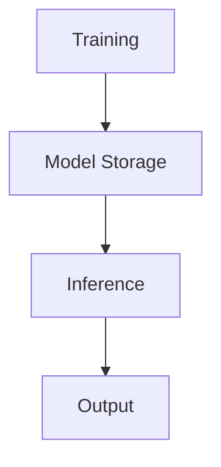

# Introduction to EIGEN
EIGEN is a project for high-fidelity information extraction from document images, utilizing a joint learning aggregation approach.

## Overview
The EIGEN project involves training a model using a labeling function and storing the trained model and pickle files in the Paths directory. It also includes demo notebooks for running inference on CORDS and NH data.

## Key Components / Concepts
The key components of the EIGEN project include:
* Joint learning aggregation approach
* Labeling function
* Trained model and pickle files
* Demo notebooks for inference

## How it Works
The EIGEN project works by:
1. Training a model using a labeling function
2. Storing the trained model and pickle files in the Paths directory
3. Using demo notebooks to run inference on CORDS and NH data

## Example(s)
An example of the EIGEN project in action is the `nh_demo.ipynb` notebook, which performs Optical Character Recognition (OCR) on images and extracts text and bounding box coordinates from the output.

## Diagram(s)

Caption: EIGEN Project Workflow

## References
* [README.md](README.md)
* [train.py](train.py)
* [nh_demo.ipynb](nh_demo.ipynb)
* [Cage_cords.ipynb](Cage_cords.ipynb)