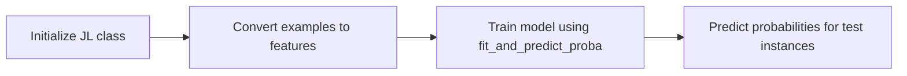

# Model Training and Integration
## Overview
The EIGEN project involves training a model using a labeling function and storing the trained model and pickle files in the `Paths` directory, specifically in `eigen/paths/`. The project requires a CORDS receipt dataset, which is loaded from `eigen/data/cords`, and uses the CAGE model to perform information extraction.

## Key Components / Concepts
The key components of the model training and integration process include:
* The `JL` class, which is a joint learning model that combines feature-based classification and graphical models for classification tasks, defined in `eigen/models/jl.py`.
* The `convert_examples_to_featuresz` function, which converts a list of examples into a format suitable for input to a semantic search model, implemented in `eigen/utils/data_utils.py`.
* The `fit_and_predict_proba` function, which trains a model on labeled and unlabeled instances and predicts probabilities for test instances, defined in `eigen/models/jl.py`.

## How it Works
The model training and integration process works as follows:
1. The `JL` class is initialized with a JSON file path, number of labelling functions, number of features, feature model type, and number of hidden nodes.
2. The `convert_examples_to_featuresz` function is used to convert the input data into a format suitable for a transformer-based model.
3. The `fit_and_predict_proba` function is used to train the model on labeled and unlabeled instances and predict probabilities for test instances.

## Example(s)
An example of how to use the `JL` class and the `fit_and_predict_proba` function can be found in the `eigen/notebooks/Cage_cords.ipynb` and `eigen/notebooks/NH_cage.ipynb` files.

## Diagram(s)

Caption: Model training and integration process

## References
* `eigen/notebooks/Cage_cords.ipynb`
* `eigen/notebooks/NH_cage.ipynb`
* `eigen/train.py`
* `eigen/utils/data_utils.py`