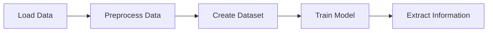

# Demo Notebooks and Inference
## Overview
The EIGEN project provides several demo notebooks to demonstrate the usage of the project's code and models. These notebooks include `cords_demo.ipynb` and `nh_demo.ipynb`, which showcase the project's capabilities in information extraction from document images.

## Key Components / Concepts
The demo notebooks utilize various components and concepts, such as:
* `CordDataset` class: a custom dataset class for semantic search tasks
* `convert_examples_to_features` function: converts examples into a format suitable for input to a semantic search model
* LayoutLM model: a pre-trained model for information extraction from document images

## How it Works
The demo notebooks work by loading the required libraries and models, preprocessing the input data, and then using the pre-trained models to extract information from the document images.

## Example(s)
For example, the `cords_demo.ipynb` notebook demonstrates how to create a dataset class `CordDataset` for a text classification task and use it to train a model for semantic search.

## Diagram(s)

Caption: Flowchart of the demo notebook's workflow.

## References
* `cords_demo.ipynb`: a demo notebook for semantic search tasks
* `nh_demo.ipynb`: a demo notebook for information extraction from document images
* `README.md`: the project's README file, which provides an overview of the project and its requirements
* `requirements.txt`: the project's requirements file, which lists the dependencies required to run the project's code.