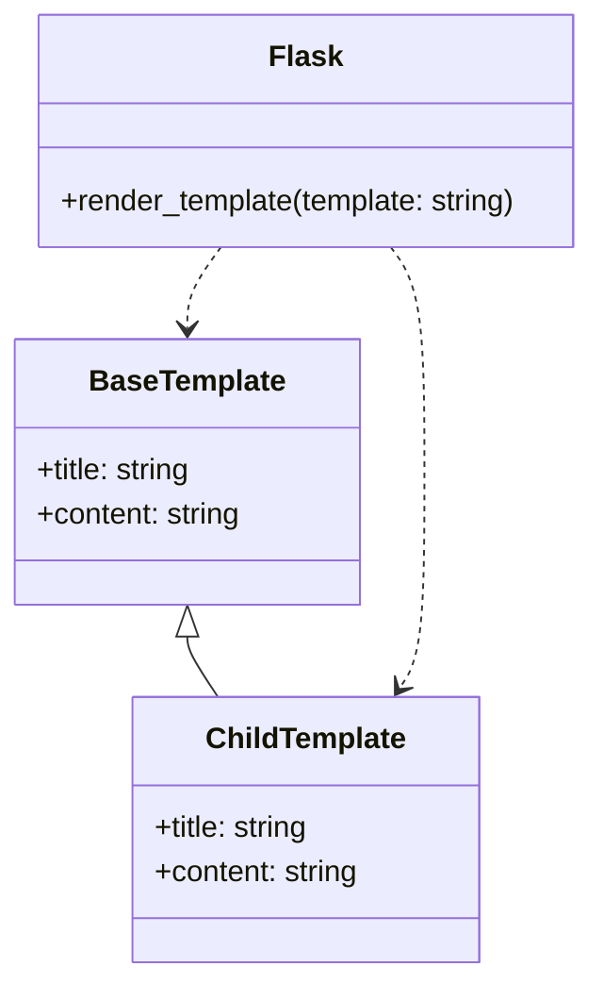

# Template Inheritance
## Overview
Template inheritance is a powerful feature in Flask that allows developers to build reusable HTML layouts using the Jinja2 templating engine. This feature enables the creation of a base template that can be extended by other templates, promoting code reuse and reducing duplication. In this section, we will delve into the world of template inheritance, exploring its key components, how it works, and providing examples to illustrate its usage. Template inheritance is particularly useful when building complex web applications with multiple pages that share a common layout.

## Key Components / Concepts
To understand template inheritance, it's essential to familiarize yourself with the following key components:

* **Base template**: The base template is the parent template that contains the common HTML structure and elements that will be shared among multiple templates. The base template typically includes the basic HTML structure, such as the `DOCTYPE` declaration, `html`, `head`, and `body` tags.
* **Child template**: The child template is the template that extends the base template, inheriting its structure and elements. The child template can override specific blocks of the base template, adding its own content or modifying the existing one.
* **Blocks**: Blocks are sections of the template that can be overridden by child templates. They are defined using the `` tag. Blocks can contain any type of content, including HTML, CSS, and JavaScript.
* **Super**: The `super` function is used to call the parent block, allowing child templates to extend the parent's content. The `super` function is useful when you want to add content to a block without overriding the entire block.

## How it Works
Template inheritance works by allowing child templates to extend a base template, inheriting its structure and elements. The child template can then override specific blocks of the base template, adding its own content or modifying the existing one. When a template is rendered, Flask will first render the base template and then override the blocks with the content from the child template. This process allows you to create a hierarchy of templates, where each template builds upon the previous one.

The template inheritance process involves the following steps:

1. The base template is rendered, and its blocks are defined.
2. The child template extends the base template and overrides the desired blocks.
3. The child template is rendered, and its blocks are merged with the base template's blocks.
4. The final rendered template is returned to the client.

## Example(s)
Let's consider an example where we have a base template called `base.html` that contains a basic HTML structure:
```html
<!-- base.html -->
<!DOCTYPE html>
<html>
  <head>
    <title>My Website</title>
  </head>
  <body>
    <header>
      <nav>
        <ul>
          <li><a href="#">Home</a></li>
          <li><a href="#">About</a></li>
        </ul>
      </nav>
    </header>
    <main>
      
    </main>
    <footer>
      &copy; 2023 My Website
    </footer>
  </body>
</html>
```
We can then create a child template called `index.html` that extends the `base.html` template:
```html
<!-- index.html -->


Home Page


  <h1>Welcome to my website!</h1>
  <p>This is the home page.</p>

```
When we render the `index.html` template, Flask will first render the `base.html` template and then override the `title` and `content` blocks with the content from the `index.html` template.

We can also create another child template called `about.html` that extends the `base.html` template:
```html
<!-- about.html -->


About Page


  <h1>About us</h1>
  <p>This is the about page.</p>

```
In this example, we have two child templates (`index.html` and `about.html`) that extend the same base template (`base.html`). Each child template overrides the `title` and `content` blocks, providing its own content.

## Diagram(s)

This class diagram illustrates the relationship between the base template, child template, and Flask. The base template and child template are connected through inheritance, while Flask is responsible for rendering the templates.

We can also use a flowchart to illustrate the template inheritance process:
```mermaid
flowchart
  A[Base Template] -->|Render|> B[Blocks Defined]
  B -->|Child Template Extends|> C[Child Template]
  C -->|Override Blocks|> D[Blocks Merged]
  D -->|Render Final Template|> E[Final Rendered Template]
```
This flowchart shows the steps involved in the template inheritance process, from rendering the base template to rendering the final template.

## References
* `tests/test_templating.py`: This file contains examples of template rendering and inheritance.
* `tests/test_blueprints.py`: This file demonstrates the use of blueprints and template inheritance.
* `src/flask/templating.py`: This file contains the implementation of the Jinja2 templating engine in Flask.
* `docs/patterns/templateinheritance.rst`: This file provides documentation on template inheritance in Flask.
* `examples/templates/base.html`: This file provides an example of a base template that can be extended by child templates.