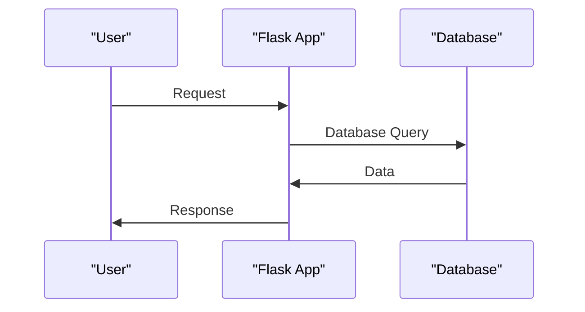

# Introduction to Examples
## Overview
The Flask Wiki repository provides a comprehensive set of examples to demonstrate the usage and capabilities of the Flask framework. These examples are designed to help developers understand how to build robust and scalable web applications using Flask. In this section, we will introduce the different types of examples available in the repository and provide an overview of their purpose and functionality. The examples are organized in a logical and structured manner, making it easy for developers to navigate and find the information they need.

The repository includes a wide range of examples, from simple tutorials to advanced applications, and covers various aspects of Flask development, such as routing, templating, database integration, authentication, and caching. Each example is a self-contained Flask application that can be run independently, allowing developers to experiment with different features and techniques. The examples also include documentation and comments to explain how the code works and why certain design decisions were made.

## Key Components / Concepts
The examples in the Flask Wiki repository are organized into several categories, including:

* **Tutorial examples**: These examples provide a step-by-step guide to building a simple web application using Flask. They cover the basics of routing, templating, and database integration. For instance, the `examples/tutorial` directory contains a simple web application that demonstrates how to build a blog using Flask. The application includes routes for displaying a list of blog posts, creating new posts, and editing existing posts.
* **Advanced examples**: These examples demonstrate more complex features of Flask, such as authentication, authorization, and caching. The `examples/advanced` directory contains an example of a Flask application that uses authentication and authorization to restrict access to certain routes.
* **Integration examples**: These examples show how to integrate Flask with other frameworks and libraries, such as Celery and JavaScript. The `examples/celery` directory contains an example of a Flask application that uses Celery to run background tasks, while the `examples/javascript` directory contains an example of a Flask application that uses JavaScript to create a dynamic user interface.
* **Best practices examples**: These examples illustrate how to follow best practices when building Flask applications, such as using secure password storage and validating user input. The `examples/best_practices` directory contains an example of a Flask application that demonstrates how to use secure password storage and validate user input.

## How it Works
Each example in the repository is a self-contained Flask application that can be run independently. The examples are designed to be easy to understand and modify, allowing developers to experiment with different features and techniques. The examples also include documentation and comments to explain how the code works and why certain design decisions were made.

To run an example, simply navigate to the example directory and run the `flask run` command. This will start the Flask development server, and you can access the application in your web browser. You can also modify the example code to experiment with different features and techniques.

## Example(s)
For example, the `examples/tutorial` directory contains a simple web application that demonstrates how to build a blog using Flask. The application includes routes for displaying a list of blog posts, creating new posts, and editing existing posts. The example also includes a database schema and sample data to illustrate how to use Flask's database integration features.

Another example is the `examples/advanced` directory, which contains an example of a Flask application that uses authentication and authorization to restrict access to certain routes. This example demonstrates how to use Flask's built-in authentication and authorization features to secure your application.

## Diagram(s)
```mermaid
flowchart LR
    A[User] -->|Request|> B[Flask App]
    B -->|Route|> C[View Function]
    C -->|Database Query|> D[Database]
    D -->|Data|> C
    C -->|Render Template|> E[Template]
    E -->|HTML|> B
    B -->|Response|> A
```
This diagram illustrates the basic flow of a Flask application, from receiving a request from the user to sending a response back to the user.


This sequence diagram illustrates the interaction between the user, the Flask application, and the database.

## References
* `examples/celery/README.md`: This file provides an overview of the Celery example, including how to install and run the application.
* `examples/javascript/README.rst`: This file provides an overview of the JavaScript example, including how to install and run the application.
* `tests/test_basic.py`: This file contains a simple Flask application that demonstrates how to build a basic web application using Flask.
* `tests/test_helpers.py`: This file contains a set of helper functions that can be used to test Flask applications.
* `docs/conf.py`: This file contains configuration settings for building the Flask Wiki documentation using Sphinx.