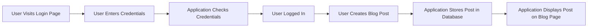

# Tutorial Application Details
## Overview
The tutorial application is a Flask-based web application that demonstrates key concepts such as authentication, blog routes, and database handling. This application is designed to provide a comprehensive example of how to build a web application using Flask, covering aspects such as user authentication, routing, and data storage.

## Key Components / Concepts
The tutorial application consists of several key components, including:
* Authentication: The application includes a basic authentication system, allowing users to log in and out.
* Blog Routes: The application defines routes for creating, reading, updating, and deleting blog posts.
* Database Handling: The application uses a database to store blog posts and user information.

## How it Works
The application works as follows:
1. A user visits the login page and enters their credentials.
2. The application checks the credentials against the stored user information in the database.
3. If the credentials are valid, the user is logged in and their session is established.
4. The user can then create, read, update, and delete blog posts.
5. The application stores the blog posts in the database and retrieves them as needed.

## Example(s)
For example, to create a new blog post, the user would:
1. Log in to the application.
2. Click on the "Create Post" button.
3. Enter the title and content of the post.
4. Click the "Submit" button to save the post.
5. The application would then store the post in the database and display it on the blog page.

## Diagram(s)

Caption: Tutorial Application Flowchart

## References
* `examples/tutorial/flaskr/auth.py`: This file contains the authentication logic for the application.
* `examples/tutorial/flaskr/blog.py`: This file defines the routes and logic for creating, reading, updating, and deleting blog posts.
* `examples/tutorial/flaskr/db.py`: This file contains the database handling logic for the application.
* `tests/test_cli.py`: This file contains tests for the application's command-line interface.
* `tests/test_blueprints.py`: This file contains tests for the application's blueprints.