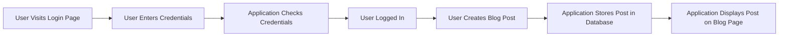
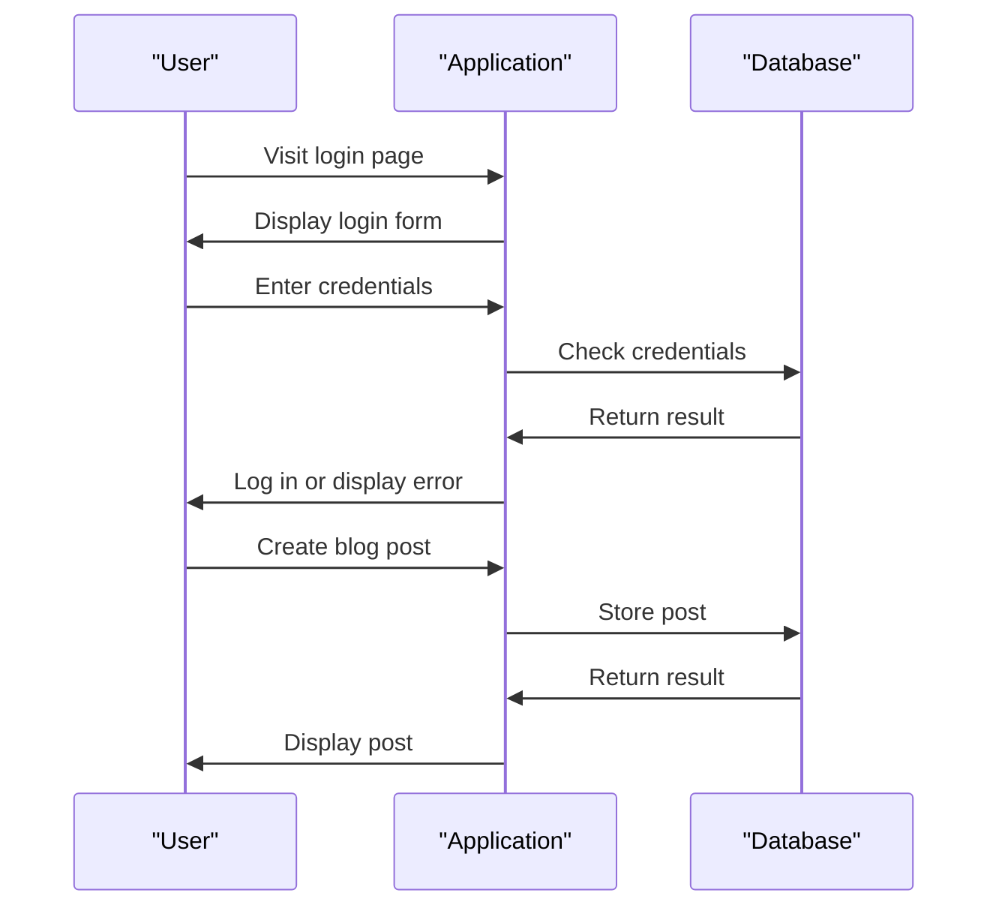

# Tutorial Application Details
## Overview
The tutorial application is a Flask-based web application that demonstrates key concepts such as authentication, blog routes, and database handling. This application is designed to provide a comprehensive example of how to build a web application using Flask, covering aspects such as user authentication, routing, and data storage. The application is structured in a modular fashion, with separate modules for authentication, blog routes, and database handling. This modularity makes it easier to understand and maintain the application.

The tutorial application is a valuable resource for developers who want to learn how to build web applications using Flask. It provides a realistic example of how to implement common features such as user authentication and data storage. The application is also well-documented, making it easier for developers to understand how the different components work together.

## Key Components / Concepts
The tutorial application consists of several key components, including:
* **Authentication**: The application includes a basic authentication system, allowing users to log in and out. The authentication system uses a database to store user credentials and checks these credentials when a user attempts to log in.
* **Blog Routes**: The application defines routes for creating, reading, updating, and deleting blog posts. These routes are implemented using Flask's routing system, which provides a flexible way to map URLs to application endpoints.
* **Database Handling**: The application uses a database to store blog posts and user information. The database is accessed using Flask's database extension, which provides a convenient way to interact with the database.

In addition to these key components, the tutorial application also demonstrates several important concepts, including:
* **Modular design**: The application is structured in a modular fashion, with separate modules for authentication, blog routes, and database handling. This modularity makes it easier to understand and maintain the application.
* **Routing**: The application uses Flask's routing system to map URLs to application endpoints. This provides a flexible way to define the application's URL structure.
* **Database interactions**: The application uses Flask's database extension to interact with the database. This provides a convenient way to store and retrieve data.

## How it Works
The application works as follows:
1. A user visits the login page and enters their credentials.
2. The application checks the credentials against the stored user information in the database.
3. If the credentials are valid, the user is logged in and their session is established.
4. The user can then create, read, update, and delete blog posts.
5. The application stores the blog posts in the database and retrieves them as needed.

When a user creates a new blog post, the application performs the following steps:
1. The user clicks on the "Create Post" button.
2. The application displays a form for the user to enter the title and content of the post.
3. The user enters the title and content of the post and clicks the "Submit" button.
4. The application stores the post in the database and displays it on the blog page.

When a user updates an existing blog post, the application performs the following steps:
1. The user clicks on the "Edit Post" button.
2. The application displays a form for the user to edit the title and content of the post.
3. The user edits the title and content of the post and clicks the "Submit" button.
4. The application updates the post in the database and displays the updated post on the blog page.

## Example(s)
For example, to create a new blog post, the user would:
1. Log in to the application.
2. Click on the "Create Post" button.
3. Enter the title and content of the post.
4. Click the "Submit" button to save the post.
5. The application would then store the post in the database and display it on the blog page.

Another example is updating an existing blog post. To do this, the user would:
1. Log in to the application.
2. Click on the "Edit Post" button.
3. Edit the title and content of the post.
4. Click the "Submit" button to save the changes.
5. The application would then update the post in the database and display the updated post on the blog page.

## Diagram(s)

Caption: Tutorial Application Flowchart

Caption: Tutorial Application Sequence Diagram

## References
* `examples/tutorial/flaskr/auth.py`: This file contains the authentication logic for the application.
* `examples/tutorial/flaskr/blog.py`: This file defines the routes and logic for creating, reading, updating, and deleting blog posts.
* `examples/tutorial/flaskr/db.py`: This file contains the database handling logic for the application.
* `tests/test_cli.py`: This file contains tests for the application's command-line interface.
* `tests/test_blueprints.py`: This file contains tests for the application's blueprints.