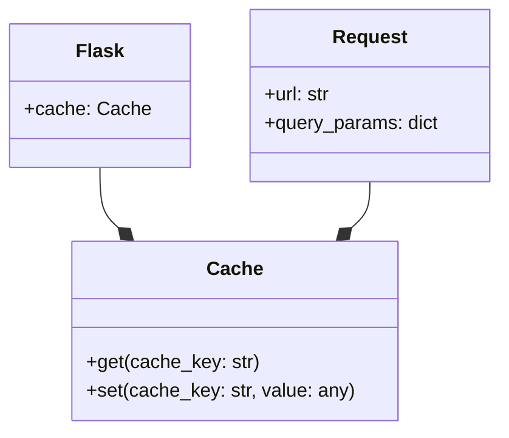

# Caching Patterns
## Overview
Caching is a crucial aspect of web development, as it enables the storage and reuse of frequently accessed data, reducing the load on the application and improving performance. In Flask, caching can be implemented using various strategies, including built-in helpers and third-party libraries. This section will explore the different caching patterns available in Flask, their implementation, and best practices. Caching is particularly useful in scenarios where data is expensive to compute or retrieve, such as database queries or external API calls.

## Key Components / Concepts
To implement caching in Flask, several key components and concepts need to be understood:
* **Cache**: A cache is a temporary storage area that holds frequently accessed data. In Flask, caches can be implemented using various backends, such as memory, file system, or database. The choice of cache backend depends on the specific requirements of the application, such as the size of the cache, the frequency of cache hits, and the performance characteristics of the backend.
* **Cache key**: A cache key is a unique identifier used to store and retrieve cached data. In Flask, cache keys are typically generated based on the request URL, query parameters, and other relevant factors. The cache key should be designed to uniquely identify the cached data, while also being efficient to compute and store.
* **Cache expiration**: Cache expiration refers to the time period after which cached data is considered stale and needs to be refreshed. In Flask, cache expiration can be configured using various strategies, such as time-to-live (TTL) or cache invalidation. The choice of cache expiration strategy depends on the specific requirements of the application, such as the frequency of data updates and the tolerance for stale data.

## How it Works
Flask provides several built-in helpers for implementing caching, including:
* **`flask.cache`**: The `flask.cache` module provides a simple caching interface that can be used to store and retrieve cached data. This module supports various cache backends, including memory, file system, and database.
* **`flask.g`**: The `flask.g` object is a global object that can be used to store cached data that is shared across requests. This object is useful for storing data that is expensive to compute or retrieve, and can be shared across multiple requests.

To implement caching in Flask, the following steps can be taken:
1. Choose a cache backend: Flask supports various cache backends, including memory, file system, and database. The choice of cache backend depends on the specific requirements of the application, such as the size of the cache, the frequency of cache hits, and the performance characteristics of the backend.
2. Configure the cache: The cache can be configured using various strategies, such as TTL or cache invalidation. The choice of cache expiration strategy depends on the specific requirements of the application, such as the frequency of data updates and the tolerance for stale data.
3. Generate a cache key: A cache key is generated based on the request URL, query parameters, and other relevant factors. The cache key should be designed to uniquely identify the cached data, while also being efficient to compute and store.
4. Store cached data: The cached data is stored in the cache using the generated cache key. The cached data can be stored in various formats, such as JSON or binary data.
5. Retrieve cached data: The cached data is retrieved from the cache using the generated cache key. If the cached data is found, it is returned directly; otherwise, the data is computed or retrieved from the original source and stored in the cache for future use.

## Example(s)
Here is an example of how to implement caching in Flask using the `flask.cache` module:
```python
from flask import Flask, render_template
from flask.cache import Cache

app = Flask(__name__)
cache = Cache(app, config={'CACHE_TYPE': 'simple'})

@app.route('/')
@cache.cached(timeout=60)  # cache for 1 minute
def index():
    return render_template('index.html')
```
In this example, the `index` function is decorated with the `@cache.cached` decorator, which caches the response for 1 minute. The `@cache.cached` decorator takes several arguments, including `timeout`, `key_prefix`, and `query_string`. The `timeout` argument specifies the time period after which the cached data is considered stale and needs to be refreshed. The `key_prefix` argument specifies a prefix for the cache key, which can be used to group related cache entries. The `query_string` argument specifies whether the query string should be included in the cache key.

Another example is using the `flask.g` object to store cached data that is shared across requests:
```python
from flask import Flask, g

app = Flask(__name__)

@app.before_request
def before_request():
    g.cache = {}  # initialize cache

@app.route('/')
def index():
    if 'data' not in g.cache:
        g.cache['data'] = expensive_computation()  # compute and store data
    return g.cache['data']
```
In this example, the `before_request` function initializes the `g.cache` object, which is used to store cached data that is shared across requests. The `index` function checks if the cached data is available; if not, it computes the data using the `expensive_computation` function and stores it in the cache.

## Diagram(s)
```mermaid
flowchart LR
    A[Request] -->|cache key|> B{Cache}
    B -->|hit|> C[Return cached data]
    B -->|miss|> D[Generate cache key]
    D -->|store|> E[Store cached data]
    E -->|return|> C
```
This diagram illustrates the caching workflow in Flask. The request is first directed to the cache, where it is checked if the cached data is available. If the cached data is found, it is returned directly; otherwise, the data is computed or retrieved from the original source and stored in the cache for future use.


This diagram illustrates the relationships between the `Flask`, `Cache`, and `Request` objects. The `Flask` object has a `cache` attribute, which is an instance of the `Cache` class. The `Request` object has `url` and `query_params` attributes, which are used to generate the cache key.

## References
* `tests/test_basic.py`: This file contains examples of how to use the `flask.cache` module to implement caching in Flask.
* `tests/test_templating.py`: This file contains examples of how to use the `flask.g` object to store cached data that is shared across requests.
* `src/flask/helpers.py`: This file contains the implementation of the `flask.cache` module and other caching-related helpers.
* `docs/patterns/caching.rst`: This file contains documentation on caching patterns in Flask, including examples and best practices.
* `examples/caching_example.py`: This file contains an example of how to implement caching in Flask using the `flask.cache` module and the `flask.g` object.