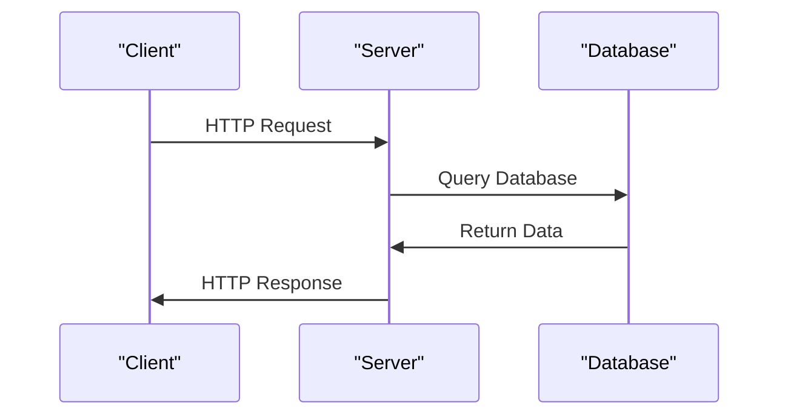

# Tutorial Example
## Overview
The tutorial example provided in the repository is a comprehensive guide to building a Flask application. It covers various aspects of the framework, including routing, templating, and database interactions. This example is designed to help new developers understand the basics of Flask and how to build a fully functional web application. The tutorial example is well-structured and easy to follow, making it an ideal resource for developers who are new to Flask.

The tutorial example consists of several files and directories, including `tests`, `examples`, and `tutorial`. The `tests` directory contains unit tests for the application, while the `examples` directory contains example code for building a Flask application. The `tutorial` directory contains the actual tutorial example, which includes files such as `app.py`, `models.py`, and `templates`.

## Key Components / Concepts
The tutorial example consists of several key components, including:

* Routing: The example demonstrates how to define routes for a Flask application using the `@app.route()` decorator. Routing is a crucial aspect of any web application, as it determines how the application responds to different HTTP requests. In the tutorial example, routes are defined in the `app.py` file.
* Templating: The example shows how to use Jinja2 templating to render HTML templates with dynamic data. Templating is a powerful feature of Flask that allows developers to separate presentation logic from application logic. In the tutorial example, templating is used to render HTML pages with dynamic data.
* Database interactions: The example demonstrates how to interact with a database using Flask-SQLAlchemy. Database interactions are a critical aspect of any web application, as they determine how the application stores and retrieves data. In the tutorial example, database interactions are handled using Flask-SQLAlchemy.
* Authentication and authorization: The example shows how to implement authentication and authorization using Flask-Login and Flask-Principal. Authentication and authorization are essential features of any web application, as they determine who can access the application and what actions they can perform. In the tutorial example, authentication and authorization are handled using Flask-Login and Flask-Principal.

## How it Works
The tutorial example works by defining a series of routes that handle different HTTP requests. Each route is associated with a specific function that handles the request and returns a response. The example also uses templating to render HTML pages with dynamic data.

When a client sends an HTTP request to the server, the server uses the routing system to determine which function should handle the request. The function then uses templating to render an HTML page with dynamic data, and returns the rendered template as a response. The client then receives the response and displays the rendered HTML page.

The tutorial example also uses database interactions to store and retrieve data. When a client sends an HTTP request to the server, the server uses the database interactions system to retrieve data from the database. The server then uses the retrieved data to render an HTML page with dynamic data, and returns the rendered template as a response.

## Example(s)
For example, the `index` function in `tests/test_blueprints.py` renders the `template_test.html` page with a context variable `value` set to `False`. This function takes no parameters and returns the rendered template as a response.

```python
def index():
    return flask.render_template("template_test.html", value=False)
```

Another example is the `login` function in `examples/tutorial/flaskr/auth.py`, which handles HTTP POST requests to the `/login` route. This function takes a `username` and `password` as parameters, and returns a redirect to the `/index` route if the login is successful.

```python
def login():
    if request.method == 'POST':
        username = request.form['username']
        password = request.form['password']
        user = User.query.filter_by(username=username).first()
        if user and user.check_password(password):
            login_user(user)
            return redirect(url_for('index'))
    return render_template('login.html')
```

## Diagram(s)
```mermaid
flowchart
    participant Client as "Client"
    participant Server as "Server"
    participant Database as "Database"

    note "Client sends HTTP request to Server"
    Client->>Server: HTTP Request
    Server->>Database: Query Database
    Database->>Server: Return Data
    Server->>Client: HTTP Response
```
This flowchart shows the interaction between the client, server, and database in the tutorial example.


This sequence diagram shows the sequence of events that occurs when a client sends an HTTP request to the server.

## References
* `tests/test_views.py`: This file contains the `OtherView` class, which handles HTTP POST requests.
* `tests/test_templating.py`: This file contains the `test_add_template_test_with_template` function, which tests the templating functionality.
* `examples/tutorial/flaskr/auth.py`: This file contains the authentication logic for the tutorial example.
* `examples/tutorial/flaskr/blog.py`: This file contains the blog functionality for the tutorial example.
* `examples/tutorial/flaskr/db.py`: This file contains the database interactions for the tutorial example.