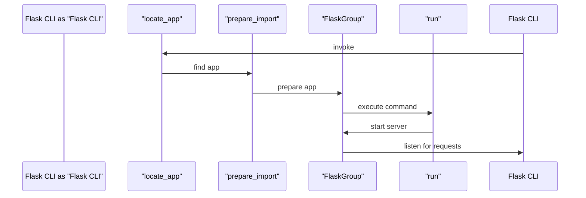

# CLI and Application Startup
## Overview
The Flask command-line interface (CLI) is a powerful tool for managing and running Flask applications. It provides a simple and intuitive way to perform various tasks, such as running the development server, creating database tables, and executing custom commands. In this section, we will explore how the Flask CLI discovers and launches an application. The CLI is an essential component of the Flask framework, and understanding how it works is crucial for building and deploying Flask applications.

The Flask CLI is built on top of the Click framework, which provides a flexible and extensible way to build command-line interfaces. The CLI is designed to be highly customizable, allowing developers to add their own custom commands and extensions. This makes it an ideal tool for managing complex Flask applications.

## Key Components / Concepts
The Flask CLI relies on several key components to function properly. These include:

* `FlaskGroup`: a custom command group that provides the foundation for the Flask CLI. The `FlaskGroup` class is responsible for defining the available commands and handling the execution of those commands.
* `ScriptInfo`: an object that contains information about the application, such as its name and import path. The `ScriptInfo` object is used to store metadata about the application, which is then used by the CLI to determine how to launch the application.
* `locate_app`: a function that attempts to find the application instance based on the provided import path. The `locate_app` function is responsible for searching for the application instance in the specified import path and returning the instance if found.
* `prepare_import`: a function that prepares the application instance for import. The `prepare_import` function is responsible for setting up the application instance and making it available for import.

In addition to these components, the Flask CLI also relies on several other key concepts, including:

* **Application discovery**: the process of finding the application instance based on the provided import path. The application discovery process involves searching for the application instance in the specified import path and returning the instance if found.
* **Command execution**: the process of executing the desired command. The command execution process involves invoking the specified command and passing any required arguments or options.

## How it Works
When the Flask CLI is invoked, it uses the `locate_app` function to find the application instance. This function takes the import path as input and attempts to find the application instance. If the application instance is found, it is then prepared for import using the `prepare_import` function.

The `prepare_import` function sets up the application instance and makes it available for import. This function is responsible for creating the application instance if it does not already exist. The `prepare_import` function also sets up any necessary configuration and logging for the application.

Once the application instance is prepared, the Flask CLI uses the `FlaskGroup` command group to execute the desired command. The `FlaskGroup` command group provides a set of built-in commands, such as `run` and `shell`, that can be used to manage the application.

The `run` command is used to start the development server, while the `shell` command is used to start an interactive shell. The `FlaskGroup` command group also provides a way to add custom commands, which can be used to perform tasks such as database migrations or data imports.

## Example(s)
Here is an example of how to use the Flask CLI to run a development server:
```bash
flask run
```
This command will start the development server and make the application available at `http://localhost:5000`.

To run the application with a custom host and port, you can use the following command:
```bash
flask run --host=0.0.0.0 --port=5001
```
This command will start the development server and make the application available at `http://0.0.0.0:5001`.

You can also use the `shell` command to start an interactive shell:
```bash
flask shell
```
This command will start an interactive shell, where you can execute Python code and interact with the application.

## Diagram(s)
```mermaid
flowchart LR
    A[Flask CLI] -->|invoke|> B[locate_app]
    B -->|find app|> C[prepare_import]
    C -->|prepare app|> D[FlaskGroup]
    D -->|execute command|> E[run development server]
    E -->|start server|> F[development server]
    F -->|listen for requests|> G[handle requests]
```
This diagram illustrates the flow of the Flask CLI when invoked. The `locate_app` function is used to find the application instance, which is then prepared for import using the `prepare_import` function. The `FlaskGroup` command group is then used to execute the desired command.


This sequence diagram illustrates the interaction between the different components of the Flask CLI. The `Flask CLI` invokes the `locate_app` function, which finds the application instance and passes it to the `prepare_import` function. The `prepare_import` function prepares the application instance and passes it to the `FlaskGroup` command group, which executes the desired command.

## References
* `tests/test_cli.py`: This file contains tests for the Flask CLI, including tests for the `locate_app` and `prepare_import` functions.
* `tests/test_apps/cliapp/inner1/__init__.py`: This file contains an example of how to create a Flask application instance using the `Flask` class.
* `src/flask/cli.py`: This file contains the implementation of the Flask CLI, including the `FlaskGroup` command group and the `locate_app` and `prepare_import` functions.
* `src/flask/__main__.py`: This file contains the entry point for the Flask CLI, which invokes the `FlaskGroup` command group to execute the desired command.
* `docs/cli.rst`: This file contains documentation for the Flask CLI, including information on how to use the CLI and how to add custom commands.