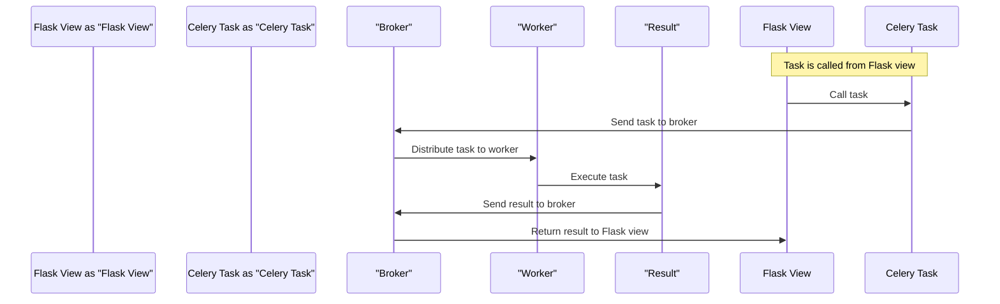

# Celery Example
## Overview
The Celery example provided in the repository demonstrates how to integrate Celery, a distributed task queue, with a Flask web application. This example showcases the basic setup and usage of Celery in a Flask project, including defining tasks, creating a Celery application instance, and configuring it to work with a Flask app. The integration of Celery with Flask enables the execution of tasks asynchronously, which can improve the performance and responsiveness of the web application.

To understand the Celery example, it is essential to have a basic knowledge of Flask and Celery. Flask is a micro web framework that provides a lightweight and flexible way to build web applications. Celery, on the other hand, is a distributed task queue that allows you to run tasks asynchronously in the background. The combination of Flask and Celery provides a powerful tool for building scalable and efficient web applications.

## Key Components / Concepts
To understand the Celery example, it's essential to grasp the key components involved:
- **Celery Application**: The core of Celery, responsible for managing tasks and workers. The Celery application instance is created and configured in `examples/celery/src/task_app/__init__.py`.
- **Tasks**: Functions that are executed by Celery workers. In the context of the example, tasks are defined in `examples/celery/src/task_app/tasks.py`. Tasks can perform any operation, such as database queries, file processing, or API calls.
- **Flask Application**: The web application framework used to build the web interface and API. The example integrates Celery with a Flask app defined in `examples/celery/src/task_app/views.py`.
- **Broker**: A message broker (like RabbitMQ or Redis) that Celery uses to store and manage task messages. The example likely uses a broker to facilitate communication between the Celery application and its workers. The broker is responsible for storing task messages and delivering them to available workers.

## How it Works
1. **Task Definition**: Tasks are defined as Python functions using the `@app.task` decorator, where `app` is an instance of the Celery application. These tasks can perform any operation, such as database queries, file processing, or API calls. The tasks are defined in `tasks.py` and can be called from Flask views.
2. **Celery Application Setup**: The Celery application instance is created and configured. This involves setting up the broker, result backend, and other parameters necessary for Celery to operate. The Celery application instance is created in `__init__.py` and configured to use a broker and result backend.
3. **Task Execution**: When a task is called, it is sent to the broker, which then distributes it to an available worker. The worker executes the task and sends the result back to the broker. The task execution is asynchronous, meaning that the Flask view can return immediately without waiting for the task to complete.
4. **Result Retrieval**: The result of the task execution can be retrieved from the broker or result backend, depending on the configuration. The result can be retrieved using the task ID, which is returned by the `delay` method.

## Example(s)
Consider a simple task defined in `tasks.py` that adds two numbers:
```python
from celery import Celery

app = Celery('tasks', broker='amqp://guest@localhost//')

@app.task
def add(x, y):
    return x + y
```
This task can be called from a Flask view, like so:
```python
from flask import Flask, jsonify
from tasks import add

app = Flask(__name__)

@app.route('/add/<int:x>/<int:y>', methods=['GET'])
def view_add(x, y):
    result = add.delay(x, y)
    return jsonify({'id': result.id})
```
The `add.delay(x, y)` call sends the task to the broker without blocking, allowing the Flask view to return immediately. The task ID is returned by the `delay` method and can be used to retrieve the result of the task execution.

Another example is a task that sends an email:
```python
from celery import Celery
from flask_mail import Mail, Message

app = Celery('tasks', broker='amqp://guest@localhost//')
mail = Mail()

@app.task
def send_email(to, subject, body):
    msg = Message(subject, sender='sender@example.com', recipients=[to])
    msg.body = body
    mail.send(msg)
```
This task can be called from a Flask view, like so:
```python
from flask import Flask, jsonify
from tasks import send_email

app = Flask(__name__)

@app.route('/send_email/<string:to>/<string:subject>/<string:body>', methods=['GET'])
def view_send_email(to, subject, body):
    result = send_email.delay(to, subject, body)
    return jsonify({'id': result.id})
```
The `send_email.delay(to, subject, body)` call sends the task to the broker without blocking, allowing the Flask view to return immediately.

## Diagram(s)
```mermaid
flowchart LR
    A[Flask View] -->|Calls Task|> B[Celery Task]
    B -->|Sends to Broker|> C[Broker]
    C -->|Distributes to Worker|> D[Worker]
    D -->|Executes Task|> E[Result]
    E -->|Sends Result to Broker|> C
    C -->|Returns Result|> A
```
Caption: Overview of the Celery task execution flow in a Flask application.


Caption: Sequence diagram of the Celery task execution flow in a Flask application.

## References
- `examples/celery/src/task_app/__init__.py`: Initializes the Celery application instance.
- `examples/celery/src/task_app/tasks.py`: Defines tasks that can be executed by Celery workers.
- `examples/celery/src/task_app/views.py`: Contains Flask views that interact with Celery tasks.
- `README.md`: Provides an overview of the Flask framework and its capabilities.
- `requirements.txt`: Lists the dependencies required to run the Celery example.