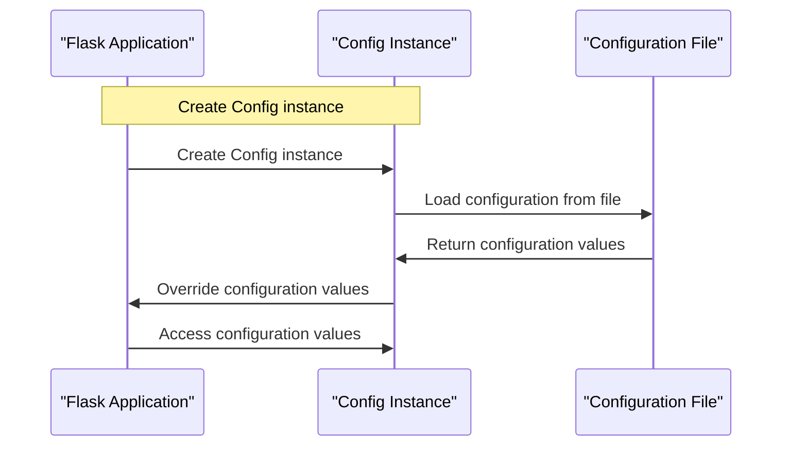

# Configuration Management
## Overview
Configuration management is a crucial aspect of any web application, including those built with Flask. It involves loading, accessing, and overriding configuration values to customize the application's behavior. In Flask, this is achieved through the `Config` class, which provides a centralized location for storing and managing configuration data. The `Config` class is a subclass of `flask.Config` and is designed to handle configuration settings for a Flask application. It does not define any specific behaviors but relies on the inherited properties and methods from `flask.Config`.

Configuration management is essential in Flask because it allows developers to separate configuration from code, making it easier to manage and maintain applications. This separation also enables developers to switch between different environments, such as development, testing, and production, without modifying the code. Additionally, configuration management provides a way to override default values, allowing developers to customize the application's behavior without modifying the underlying code.

## Key Components / Concepts
The key components of configuration management in Flask include:

* **Configuration files**: Flask supports loading configuration from various file formats, such as Python files, JSON files, and TOML files. Configuration files are used to store configuration values in a centralized location, making it easier to manage and maintain applications.
* **Environment variables**: Configuration values can be loaded from environment variables, allowing for easy switching between different environments. Environment variables are useful for storing sensitive information, such as database credentials or API keys, without hardcoding them in the code.
* **Configuration objects**: Configuration values can be loaded from objects, such as dictionaries or custom configuration classes. Configuration objects provide a way to store configuration values in a structured and organized manner, making it easier to access and override them.

Other key concepts in configuration management include:

* **Configuration inheritance**: Flask provides a way to inherit configuration values from parent configurations, allowing developers to create a hierarchy of configurations.
* **Configuration overriding**: Flask provides a way to override configuration values, allowing developers to customize the application's behavior without modifying the underlying code.
* **Configuration validation**: Flask provides a way to validate configuration values, ensuring that they are valid and consistent.

## How it Works
The configuration management process in Flask involves the following steps:

1. **Creating a Config instance**: A `Config` instance is created, either directly or indirectly, when a Flask application is instantiated. The `Config` instance is used to store and manage configuration data.
2. **Loading configuration values**: Configuration values are loaded from various sources, such as files, environment variables, or objects. Flask provides several methods for loading configuration values, including `from_pyfile`, `from_envvar`, and `from_object`.
3. **Overriding configuration values**: Configuration values can be overridden using various methods, such as the `from_object` method or the `from_envvar` method. Overriding configuration values allows developers to customize the application's behavior without modifying the underlying code.
4. **Accessing configuration values**: Configuration values can be accessed using the `config` attribute of the Flask application instance. The `config` attribute provides a way to access configuration values in a centralized and organized manner.

## Example(s)
Here is an example of loading configuration values from a Python file:
```python
app = Flask(__name__)
app.config.from_pyfile('config.py')
```
And here is an example of loading configuration values from an environment variable:
```python
app = Flask(__name__)
app.config.from_envvar('CONFIG_FILE')
```
Additionally, here is an example of loading configuration values from a dictionary:
```python
config_dict = {
    'DEBUG': True,
    'SECRET_KEY': 'secret_key'
}
app = Flask(__name__)
app.config.from_mapping(config_dict)
```
## Diagram(s)
```mermaid
flowchart
    participant Flask as "Flask Application"
    participant Config as "Config Instance"
    participant File as "Configuration File"
    participant EnvVar as "Environment Variable"
    participant Object as "Configuration Object"

    Flask->>Config: Create Config instance
    Config->>File: Load configuration from file
    Config->>EnvVar: Load configuration from environment variable
    Config->>Object: Load configuration from object
    Config->>Flask: Override configuration values
    Flask->>Config: Access configuration values
```
Configuration Management Flowchart


Configuration Management Sequence Diagram

## References
* `tests/test_config.py`: This file contains various tests for configuration management in Flask, including tests for loading configuration from files, environment variables, and objects.
* `src/flask/config.py`: This file contains the implementation of the `Config` class, which is used for configuration management in Flask.
* `tests/test_apps/.env`: This file contains an example of a configuration file in the `.env` format, which can be used to load configuration values into a Flask application.
* `docs/configuration.rst`: This file contains documentation on configuration management in Flask, including examples and best practices.
* `examples/config_example.py`: This file contains an example of a Flask application that uses configuration management to load configuration values from a file.