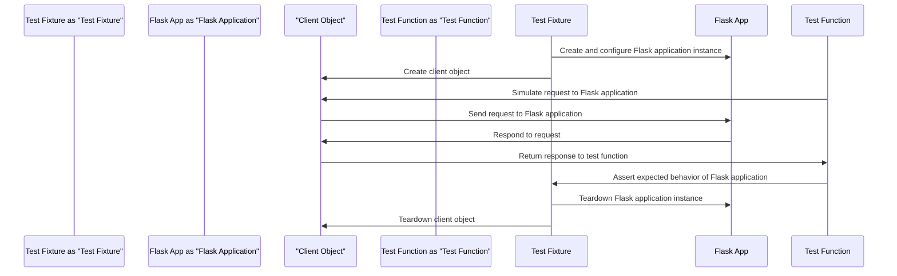

# Testing Strategy
## Overview
The testing strategy for Flask core and example applications utilizes pytest, a popular testing framework for Python. This approach enables developers to write and run tests efficiently, ensuring the reliability and stability of the Flask framework. The tests cover various aspects of Flask, including environment defaults, client behavior, request context, and error handling. By leveraging pytest, developers can take advantage of its robust features, such as test discovery, fixtures, and parameterization, to create comprehensive and maintainable tests.

The testing strategy is designed to be flexible and adaptable to the evolving needs of the Flask framework. As new features are added or existing ones are modified, the testing strategy is updated to ensure that all aspects of the framework are thoroughly tested. This includes testing for compatibility with different Python versions, web servers, and databases.

## Key Components / Concepts
The key components involved in the testing strategy are:
* **pytest**: The testing framework used to write and run tests for Flask. Pytest provides a rich set of features, including test discovery, fixtures, and parameterization, that make it an ideal choice for testing Flask applications.
* **Flask application instance**: The instance of the Flask application being tested. This instance is created and configured using test fixtures, which provide a consistent environment for testing.
* **Client object**: The object used to simulate requests to the Flask application. The client object is used to test the application's behavior under different request scenarios, such as GET, POST, and PUT requests.
* **Test fixtures**: Pre-defined setup and teardown functions that provide a consistent environment for testing. Test fixtures are used to create and configure the Flask application instance, as well as to set up and tear down the test environment.

## How it Works
The testing process involves the following steps:
1. **Setup**: The test fixture sets up the Flask application instance and client object. This includes creating and configuring the application instance, as well as setting up the test environment.
2. **Test execution**: The test function executes the test case, using the client object to simulate requests to the Flask application. The test function asserts the expected behavior of the application, including the response status code, headers, and body.
3. **Assertion**: The test function asserts the expected behavior of the Flask application. This includes checking the response status code, headers, and body, as well as verifying that the application behaves correctly under different request scenarios.
4. **Teardown**: The test fixture tears down the Flask application instance and client object. This includes closing any open connections, deleting temporary files, and restoring the test environment to its original state.

The testing process is designed to be efficient and effective, with a focus on testing the most critical aspects of the Flask framework. By using pytest and test fixtures, developers can write and run tests quickly and easily, ensuring that the framework is reliable and stable.

## Example(s)
For example, the `test_environ_defaults_from_config` function in `tests/test_testing.py` tests the environment defaults of a Flask application:
```python
def test_environ_defaults_from_config(app, client):
    app.config["SERVER_NAME"] = "example.com:1234"
    app.config["APPLICATION_ROOT"] = "/foo"

    @app.route("/")
    def index():
        return flask.request.url

    ctx = app.test_request_context()
    assert ctx.request.url == "http://example.com:1234/foo/"

    rv = client.get("/")
    assert rv.data == b"http://example.com:1234/foo/"
```
This test function sets up the Flask application instance with specific configuration values, defines a route, and then asserts the expected behavior of the application. The test function uses the client object to simulate a GET request to the application, and then checks the response status code, headers, and body.

Another example is the `test_config_from_pyfile` function in `tests/test_config.py`, which tests the configuration of a Flask application from a Python file:
```python
def test_config_from_pyfile(app, client):
    app.config.from_pyfile("config.py")

    @app.route("/")
    def index():
        return app.config["SECRET_KEY"]

    rv = client.get("/")
    assert rv.data == b"secret_key"
```
This test function sets up the Flask application instance with a configuration file, defines a route, and then asserts the expected behavior of the application. The test function uses the client object to simulate a GET request to the application, and then checks the response status code, headers, and body.

## Diagram(s)
```mermaid
flowchart
    participant Flask as "Flask Application"
    participant Pytest as "Pytest Framework"
    participant Client as "Client Object"

    Pytest->>Flask: Setup test fixture
    Flask->>Client: Create client object
    Client->>Flask: Simulate request
    Flask->>Client: Respond to request
    Client->>Pytest: Assert expected behavior
    Pytest->>Flask: Teardown test fixture
```
This flowchart illustrates the interaction between the pytest framework, the Flask application instance, and the client object during the testing process. The flowchart shows how the test fixture sets up the Flask application instance and client object, how the test function executes the test case, and how the test function asserts the expected behavior of the application.


This sequence diagram illustrates the interaction between the test fixture, the Flask application instance, the client object, and the test function during the testing process. The sequence diagram shows how the test fixture sets up the Flask application instance and client object, how the test function simulates a request to the Flask application, and how the test function asserts the expected behavior of the application.

## References
* `tests/test_testing.py`: This file contains test functions for Flask, including `test_environ_defaults_from_config`.
* `tests/conftest.py`: This file contains test fixtures for Flask, including the `app` function that creates and configures a Flask application instance.
* `tests/test_config.py`: This file contains test functions for Flask configuration, including `test_config_from_pyfile`.
* `tests/test_blueprints.py`: This file contains test functions for Flask blueprints, including `test_blueprint_specific_error_handling`.
* `tests/test_basic.py`: This file contains test functions for basic Flask functionality, including `test_error_handling`.