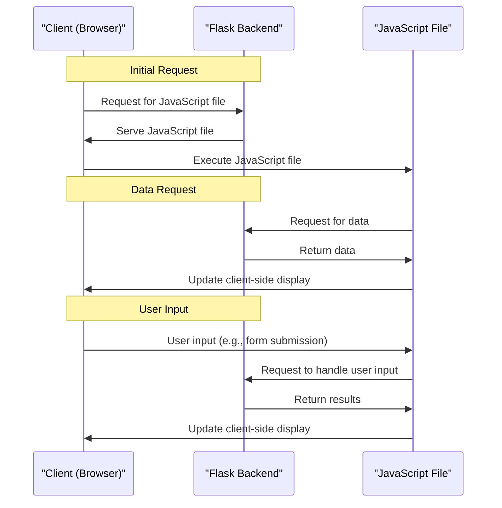

# JavaScript Example
## Overview
The JavaScript example provided in the repository is a comprehensive demonstration of how to integrate JavaScript with a Flask web application. This example is crucial for understanding how to handle client-side scripting in a Flask project, enabling developers to create dynamic and interactive web applications. The example consists of a simple Flask application that serves a JavaScript file, which in turn interacts with the Flask backend to perform certain actions, such as retrieving data, updating the display, and handling user input.

The integration of JavaScript with Flask is a key aspect of modern web development, as it allows developers to create rich and interactive user interfaces. The example provided in the repository showcases the basics of this integration, including how to serve JavaScript files, handle requests from JavaScript code, and update the client-side display based on server-side data.

## Key Components / Concepts
The key components of this example include:
- A Flask application that serves a JavaScript file, which is responsible for handling client-side logic and interacting with the Flask backend.
- A JavaScript file that interacts with the Flask backend, making requests to retrieve data, update the display, and handle user input.
- Routes defined in the Flask application to handle requests from the JavaScript file, including routes for retrieving data, handling form submissions, and updating the display.
- Template rendering to display the results of the JavaScript-Flask interaction, using templates to separate presentation logic from application logic.

The main concepts involved in this example are:
- Client-side scripting using JavaScript, which allows developers to create dynamic and interactive user interfaces.
- Server-side rendering using Flask, which enables developers to generate dynamic content on the server-side and serve it to the client.
- Interaction between client-side and server-side code, which is crucial for creating dynamic and interactive web applications.
- Template rendering, which allows developers to separate presentation logic from application logic and create reusable templates.

## How it Works
The JavaScript example works as follows:
1. The Flask application serves a JavaScript file to the client, which is executed by the client's web browser.
2. The JavaScript file makes requests to the Flask backend to perform certain actions, such as retrieving data or handling user input.
3. The Flask backend processes the requests and returns the results to the JavaScript file, which updates the client-side display based on the received data.
4. The JavaScript file continues to interact with the Flask backend, making requests and updating the display as needed, to create a dynamic and interactive user interface.

The example also demonstrates how to handle errors and exceptions, including how to catch and handle errors on the client-side and server-side, and how to display error messages to the user.

## Example(s)
For example, consider a simple JavaScript file that makes a request to the Flask backend to retrieve some data, such as a list of items or a user's profile information. The Flask backend processes the request, retrieves the data, and returns it to the JavaScript file, which updates the client-side display to show the retrieved data.

Another example is a JavaScript file that handles user input, such as a form submission or a button click. The JavaScript file makes a request to the Flask backend to handle the user input, and the Flask backend processes the request and returns the results to the JavaScript file, which updates the client-side display based on the received data.

## Diagram(s)
```mermaid
flowchart
    participant Client as "Client (Browser)"
    participant Flask as "Flask Backend"
    participant JavaScript as "JavaScript File"

    Client->>Flask: Request for JavaScript file
    Flask->>Client: Serve JavaScript file
    Client->>JavaScript: Execute JavaScript file
    JavaScript->>Flask: Request for data
    Flask->>JavaScript: Return data
    JavaScript->>Client: Update client-side display
```
This flowchart illustrates the interaction between the client, Flask backend, and JavaScript file, showcasing the basic steps involved in integrating JavaScript with a Flask web application.


This sequence diagram provides a more detailed illustration of the interaction between the client, Flask backend, and JavaScript file, showcasing the different steps involved in handling user input and updating the client-side display.

## References
- `examples/javascript/js_example/__init__.py`: This file contains the initialization code for the JavaScript example, including the definition of the Flask application and the routes for handling requests from the JavaScript file.
- `examples/javascript/js_example/views.py`: This file contains the view functions for the JavaScript example, which handle requests from the JavaScript file and return the results to the client.
- `examples/javascript/tests/test_js_example.py`: This file contains tests for the JavaScript example, which verify that the example works as expected and that the interaction between the client, Flask backend, and JavaScript file is correct.
- `tests/test_blueprints.py`: This file contains examples of how to use Flask blueprints, which can be useful for organizing the code for the JavaScript example and creating a more modular and reusable application.
- `tests/test_apps/helloworld/hello.py`: This file contains a simple "Hello World" example using Flask, which can be used as a starting point for creating the JavaScript example and demonstrating the basics of Flask web development.