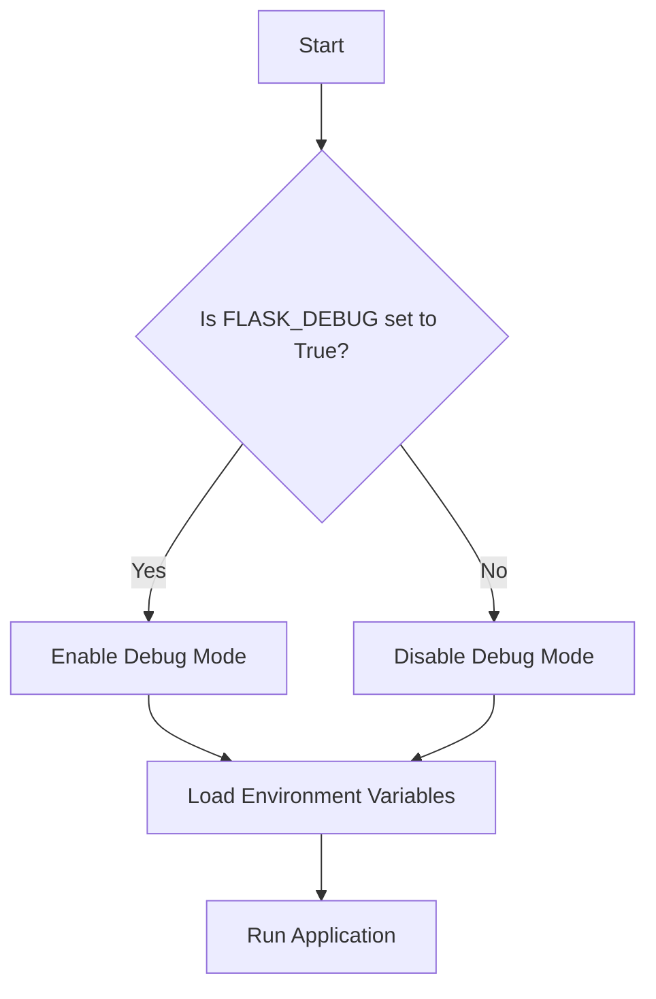

# Debug and Environment Helpers
## Overview
Debug and environment helpers are crucial components in the development and deployment of Flask applications. These utilities enable debug mode, handle errors, and provide environment-based configuration, making it easier to identify and fix issues during the development process. In this section, we will delve into the details of these helpers, exploring their architecture, design decisions, and usage examples.

## Key Components / Concepts
The key components involved in debug and environment helpers include:
* `get_debug_flag`: a function that checks the `FLASK_DEBUG` environment variable to determine if debug mode is enabled.
* `load_dotenv`: a function that loads environment variables from a `.flaskenv` file.
* `TestHelpers`: a class that provides helper methods for testing purposes, including testing the `get_debug_flag` function and the `make_response` function from Flask.
* `dotenv_not_available`: a function that checks if the `dotenv` library is available for import.

## How it Works
The debug and environment helpers work together to provide a seamless development experience. When the `FLASK_DEBUG` environment variable is set to `True`, the `get_debug_flag` function returns `True`, enabling debug mode. In debug mode, the application provides more detailed error messages and automatically reloads templates when changes are detected.

The `load_dotenv` function loads environment variables from a `.flaskenv` file, allowing developers to configure their application's environment variables easily. The `TestHelpers` class provides helper methods for testing purposes, making it easier to write unit tests for Flask applications.

## Example(s)
Here's an example of how to use the `get_debug_flag` function:
```python
from flask import Flask
app = Flask(__name__)

if get_debug_flag():
    print("Debug mode is enabled")
else:
    print("Debug mode is disabled")
```
Another example is using the `load_dotenv` function to load environment variables from a `.flaskenv` file:
```python
from flask import Flask
from dotenv import load_dotenv

load_dotenv()

app = Flask(__name__)
```
## Diagram(s)

This flowchart illustrates the process of enabling or disabling debug mode based on the `FLASK_DEBUG` environment variable.

## References
* `tests/test_helpers.py`
* `tests/test_cli.py`
* `src/flask/debughelpers.py`
* `src/flask/helpers.py`