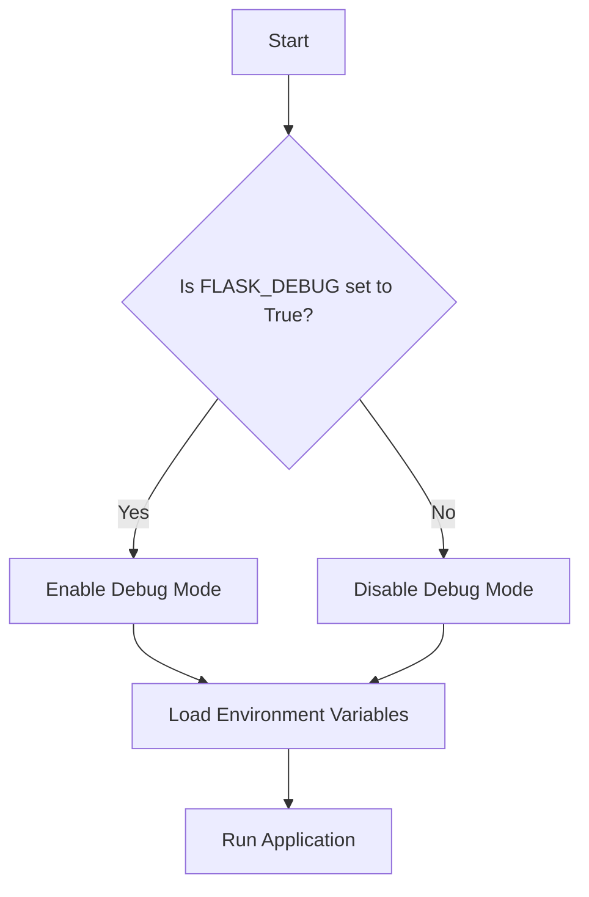
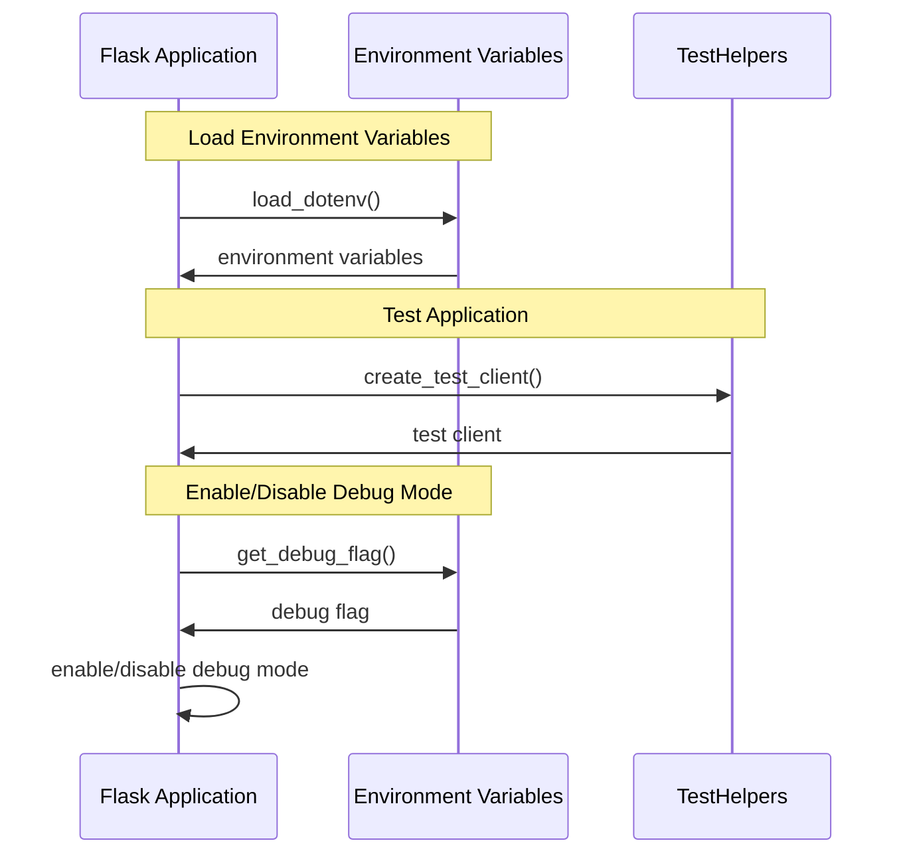

# Debug and Environment Helpers
## Overview
Debug and environment helpers are crucial components in the development and deployment of Flask applications. These utilities enable debug mode, handle errors, and provide environment-based configuration, making it easier to identify and fix issues during the development process. In this section, we will delve into the details of these helpers, exploring their architecture, design decisions, and usage examples. The importance of debug and environment helpers cannot be overstated, as they provide a foundation for building robust, scalable, and maintainable applications.

The development process of a Flask application involves multiple stages, including coding, testing, and deployment. Debug and environment helpers play a vital role in each of these stages, ensuring that the application is properly configured and functions as expected. By leveraging these helpers, developers can focus on writing high-quality code, rather than worrying about the underlying infrastructure.

## Key Components / Concepts
The key components involved in debug and environment helpers include:
* `get_debug_flag`: a function that checks the `FLASK_DEBUG` environment variable to determine if debug mode is enabled. This function is essential in controlling the behavior of the application, as it allows developers to toggle debug mode on and off.
* `load_dotenv`: a function that loads environment variables from a `.flaskenv` file. This function provides a convenient way to manage environment variables, making it easier to configure the application for different environments.
* `TestHelpers`: a class that provides helper methods for testing purposes, including testing the `get_debug_flag` function and the `make_response` function from Flask. This class is invaluable in ensuring that the application is properly tested, as it provides a set of reusable test helpers.
* `dotenv_not_available`: a function that checks if the `dotenv` library is available for import. This function is necessary to ensure that the application can handle cases where the `dotenv` library is not installed.

In addition to these components, there are several other key concepts that are relevant to debug and environment helpers. These include:
* Environment variables: these are values that are set outside of the application code, and are used to configure the application. Environment variables are essential in managing the behavior of the application, as they provide a way to customize the application without modifying the code.
* Debug mode: this is a mode of operation that provides more detailed error messages and automatically reloads templates when changes are detected. Debug mode is essential in the development process, as it allows developers to quickly identify and fix issues.
* Testing: this is the process of verifying that the application functions as expected. Testing is critical in ensuring that the application is reliable and stable, as it helps to identify and fix defects.

## How it Works
The debug and environment helpers work together to provide a seamless development experience. When the `FLASK_DEBUG` environment variable is set to `True`, the `get_debug_flag` function returns `True`, enabling debug mode. In debug mode, the application provides more detailed error messages and automatically reloads templates when changes are detected.

The `load_dotenv` function loads environment variables from a `.flaskenv` file, allowing developers to configure their application's environment variables easily. The `TestHelpers` class provides helper methods for testing purposes, making it easier to write unit tests for Flask applications.

Here is a step-by-step overview of how the debug and environment helpers work:
1. The `get_debug_flag` function checks the `FLASK_DEBUG` environment variable to determine if debug mode is enabled.
2. If debug mode is enabled, the application provides more detailed error messages and automatically reloads templates when changes are detected.
3. The `load_dotenv` function loads environment variables from a `.flaskenv` file, allowing developers to configure their application's environment variables easily.
4. The `TestHelpers` class provides helper methods for testing purposes, making it easier to write unit tests for Flask applications.

## Example(s)
Here's an example of how to use the `get_debug_flag` function:
```python
from flask import Flask
app = Flask(__name__)

if get_debug_flag():
    print("Debug mode is enabled")
else:
    print("Debug mode is disabled")
```
Another example is using the `load_dotenv` function to load environment variables from a `.flaskenv` file:
```python
from flask import Flask
from dotenv import load_dotenv

load_dotenv()

app = Flask(__name__)
```
Additionally, here is an example of how to use the `TestHelpers` class to test the `get_debug_flag` function:
```python
from flask import Flask
from test_helpers import TestHelpers

app = Flask(__name__)
test_helpers = TestHelpers(app)

def test_get_debug_flag():
    test_helpers.set_debug_flag(True)
    assert get_debug_flag() == True
    test_helpers.set_debug_flag(False)
    assert get_debug_flag() == False
```
## Diagram(s)

This flowchart illustrates the process of enabling or disabling debug mode based on the `FLASK_DEBUG` environment variable.


This sequence diagram illustrates the interaction between the Flask application, environment variables, and test helpers.

## References
* `tests/test_helpers.py`
* `tests/test_cli.py`
* `src/flask/debughelpers.py`
* `src/flask/helpers.py`
* `examples/debug_mode_example.py`