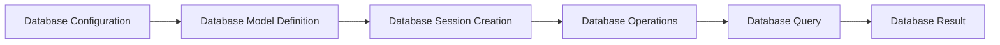

# Database Management
## Overview
Database management is a critical aspect of the Flask Wiki repository, as it enables the storage and retrieval of data in a structured and efficient manner. The repository utilizes Flask, a micro web framework, to interact with the database. In this section, we will delve into the key components, concepts, and workflows involved in database management within the Flask Wiki repository.

## Key Components / Concepts
The Flask Wiki repository employs several key components and concepts to facilitate database management. These include:

* **Flask-SQLAlchemy**: An ORM (Object-Relational Mapping) tool that provides a high-level interface for interacting with the database.
* **Database Models**: These are classes that define the structure and relationships of the data stored in the database.
* **Database Sessions**: These are objects that manage the connection to the database and provide a context for executing database operations.

## How it Works
The database management workflow in the Flask Wiki repository involves the following steps:

1. **Database Configuration**: The database is configured using the `SQLALCHEMY_DATABASE_URI` environment variable, which specifies the connection string to the database.
2. **Database Model Definition**: The database models are defined as classes that inherit from `db.Model`. These classes define the structure and relationships of the data stored in the database.
3. **Database Session Creation**: A database session is created using the `db.session` object, which provides a context for executing database operations.
4. **Database Operations**: Database operations, such as creating, reading, updating, and deleting data, are executed using the database session.

## Example(s)
Here is an example of how to define a database model and perform basic database operations:
```python
from flask import Flask
from flask_sqlalchemy import SQLAlchemy

app = Flask(__name__)
app.config["SQLALCHEMY_DATABASE_URI"] = "sqlite:///example.db"
db = SQLAlchemy(app)

class User(db.Model):
    id = db.Column(db.Integer, primary_key=True)
    name = db.Column(db.String(100), nullable=False)
    email = db.Column(db.String(100), nullable=False, unique=True)

# Create a new user
user = User(name="John Doe", email="john@example.com")
db.session.add(user)
db.session.commit()

# Retrieve a user by email
user = User.query.filter_by(email="john@example.com").first()
print(user.name)  # Output: John Doe
```
## Diagram(s)

This flowchart illustrates the database management workflow in the Flask Wiki repository.

## References
* `examples/tutorial/flaskr/db.py`: This file contains the database configuration and model definitions for the Flask Wiki repository.
* `examples/tutorial/flaskr/schema.sql`: This file contains the database schema for the Flask Wiki repository.
* `examples/tutorial/tests/test_db.py`: This file contains tests for the database operations in the Flask Wiki repository.
* `tests/test_json_tag.py`: This file contains tests for the JSON tag functionality in the Flask Wiki repository.
* `tests/test_cli.py`: This file contains tests for the command-line interface in the Flask Wiki repository.