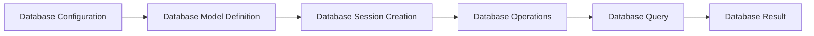

# Database Management
## Overview
Database management is a critical aspect of the Flask Wiki repository, as it enables the storage and retrieval of data in a structured and efficient manner. The repository utilizes Flask, a micro web framework, to interact with the database. In this section, we will delve into the key components, concepts, and workflows involved in database management within the Flask Wiki repository. The database management system is designed to provide a scalable and reliable way to store and retrieve data, and it is a crucial component of the Flask Wiki repository.

The Flask Wiki repository uses a relational database management system, which provides a structured way to store and retrieve data. The database is designed to support a wide range of data types, including integers, strings, and dates. The database also supports relationships between tables, which allows for complex queries and data retrieval.

## Key Components / Concepts
The Flask Wiki repository employs several key components and concepts to facilitate database management. These include:

* **Flask-SQLAlchemy**: An ORM (Object-Relational Mapping) tool that provides a high-level interface for interacting with the database. Flask-SQLAlchemy provides a simple and intuitive way to define database models, create database sessions, and execute database operations.
* **Database Models**: These are classes that define the structure and relationships of the data stored in the database. Database models are used to create tables in the database and to define the relationships between tables. For example, a `User` model might have a relationship with a `Post` model, where a user can have many posts.
* **Database Sessions**: These are objects that manage the connection to the database and provide a context for executing database operations. Database sessions are used to create, read, update, and delete data in the database.

In addition to these key components, the Flask Wiki repository also uses several other concepts to facilitate database management. These include:

* **Database Transactions**: These are used to ensure that database operations are executed in a consistent and reliable way. Database transactions provide a way to group multiple database operations together and to ensure that either all or none of the operations are executed.
* **Database Connections**: These are used to connect to the database and to execute database operations. Database connections are managed by the database session, which provides a way to create, read, update, and delete data in the database.

## How it Works
The database management workflow in the Flask Wiki repository involves the following steps:

1. **Database Configuration**: The database is configured using the `SQLALCHEMY_DATABASE_URI` environment variable, which specifies the connection string to the database. The connection string includes the database type, username, password, host, and port.
2. **Database Model Definition**: The database models are defined as classes that inherit from `db.Model`. These classes define the structure and relationships of the data stored in the database. For example, a `User` model might have columns for `id`, `name`, and `email`.
3. **Database Session Creation**: A database session is created using the `db.session` object, which provides a context for executing database operations. The database session is used to create, read, update, and delete data in the database.
4. **Database Operations**: Database operations, such as creating, reading, updating, and deleting data, are executed using the database session. For example, a `User` object might be created and added to the database using the `db.session.add()` method.

The database management workflow is designed to provide a scalable and reliable way to store and retrieve data. The workflow is also designed to be flexible, allowing for a wide range of database operations and queries.

## Example(s)
Here is an example of how to define a database model and perform basic database operations:
```python
from flask import Flask
from flask_sqlalchemy import SQLAlchemy

app = Flask(__name__)
app.config["SQLALCHEMY_DATABASE_URI"] = "sqlite:///example.db"
db = SQLAlchemy(app)

class User(db.Model):
    id = db.Column(db.Integer, primary_key=True)
    name = db.Column(db.String(100), nullable=False)
    email = db.Column(db.String(100), nullable=False, unique=True)

# Create a new user
user = User(name="John Doe", email="john@example.com")
db.session.add(user)
db.session.commit()

# Retrieve a user by email
user = User.query.filter_by(email="john@example.com").first()
print(user.name)  # Output: John Doe
```
This example demonstrates how to define a `User` model and perform basic database operations, such as creating and retrieving a user.

In addition to this example, the Flask Wiki repository also provides several other examples of database management, including examples of how to define relationships between models and how to execute complex queries.

## Diagram(s)

This flowchart illustrates the database management workflow in the Flask Wiki repository. The workflow involves configuring the database, defining database models, creating a database session, executing database operations, and retrieving database results.

In addition to this flowchart, the Flask Wiki repository also provides several other diagrams, including diagrams of the database schema and diagrams of the relationships between models.

## References
* `examples/tutorial/flaskr/db.py`: This file contains the database configuration and model definitions for the Flask Wiki repository.
* `examples/tutorial/flaskr/schema.sql`: This file contains the database schema for the Flask Wiki repository.
* `examples/tutorial/tests/test_db.py`: This file contains tests for the database operations in the Flask Wiki repository.
* `tests/test_json_tag.py`: This file contains tests for the JSON tag functionality in the Flask Wiki repository.
* `tests/test_cli.py`: This file contains tests for the command-line interface in the Flask Wiki repository.