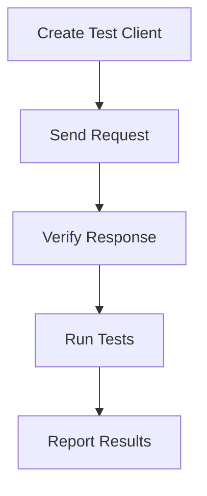

# Testing Utilities
## Overview
Testing utilities in Flask are crucial for ensuring the reliability and stability of web applications. These utilities provide a comprehensive set of tools for creating test clients, CLI test runners, and request builders, facilitating the testing process. The primary goal of these utilities is to simulate real-world scenarios, allowing developers to test their applications' behavior and responses to different requests in a controlled environment.

## Key Components / Concepts
The key components of Flask's testing utilities include:
- **Test Client**: A test client is an object that simulates a web client, allowing developers to send requests to their application and verify the responses. The `client` function in `tests/conftest.py` creates a test client for a given application.
- **CLI Test Runner**: A CLI test runner is a utility that enables running tests from the command line. The `runner` function in `tests/test_cli.py` creates and returns an instance of `CliRunner`.
- **Request Builder**: A request builder is a utility that helps construct requests for testing purposes. The `EnvironBuilder` class in `src/flask/testing.py` is an example of a request builder.

## How it Works
The testing utilities in Flask work by providing a simulated environment for testing web applications. Here's a step-by-step overview of the process:
1. **Creating a Test Client**: A test client is created using the `client` function, which takes an application object as input and returns a test client object.
2. **Sending Requests**: The test client is used to send requests to the application, simulating real-world scenarios.
3. **Verifying Responses**: The responses from the application are verified to ensure they match the expected behavior.
4. **Running Tests**: Tests are run using a CLI test runner, which executes the test cases and reports the results.

## Example(s)
Here's an example of using the `client` function to create a test client and send a request to an application:
```python
def test_reuse_client(client):
    c = client

    with c:
        assert client.get("/").status_code == 404

    with c:
        assert client.get("/").status_code == 404
```
This example demonstrates how to create a test client, send a GET request to the root URL, and verify that the status code is 404.

## Diagram(s)

This flowchart illustrates the process of creating a test client, sending requests, verifying responses, running tests, and reporting results.

## References
- `tests/conftest.py`: This file contains the `client` function, which creates a test client for a given application.
- `tests/test_testing.py`: This file contains test cases for the testing utilities, including the `test_reuse_client` function.
- `src/flask/testing.py`: This file contains the `EnvironBuilder` class, which is a request builder utility.
- `src/flask/cli.py`: This file contains the `CliRunner` class, which is a CLI test runner utility.
- `tests/test_cli.py`: This file contains the `runner` function, which creates and returns an instance of `CliRunner`.