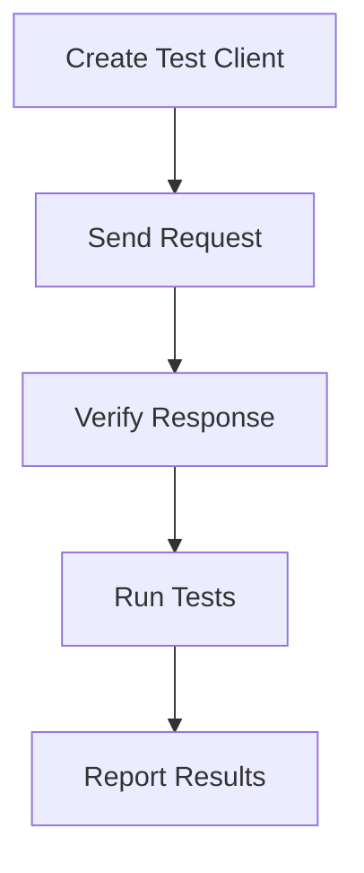
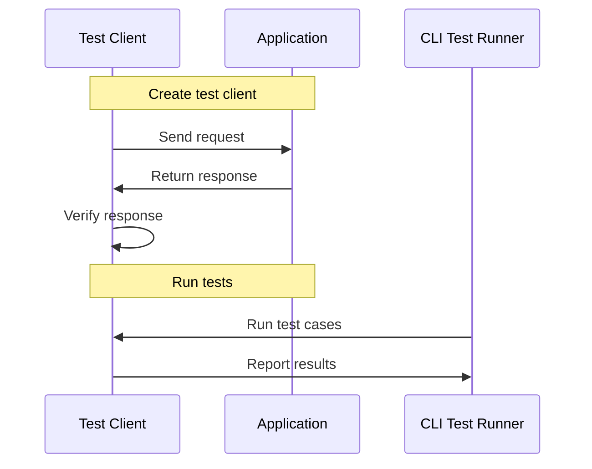

# Testing Utilities
## Overview
Testing utilities in Flask are crucial for ensuring the reliability and stability of web applications. These utilities provide a comprehensive set of tools for creating test clients, CLI test runners, and request builders, facilitating the testing process. The primary goal of these utilities is to simulate real-world scenarios, allowing developers to test their applications' behavior and responses to different requests in a controlled environment. This is particularly important in web development, where applications are often subject to a wide range of inputs and scenarios that must be accounted for to prevent errors and ensure a smooth user experience.

In Flask, the testing utilities are designed to be flexible and adaptable, allowing developers to easily integrate them into their existing testing frameworks and workflows. This includes support for popular testing libraries such as Pytest and Unittest, as well as built-in support for testing Flask applications using the `client` object. By leveraging these utilities, developers can write more comprehensive and effective tests, ensuring that their applications are thoroughly vetted and reliable.

## Key Components / Concepts
The key components of Flask's testing utilities include:
- **Test Client**: A test client is an object that simulates a web client, allowing developers to send requests to their application and verify the responses. The `client` function in `tests/conftest.py` creates a test client for a given application. This client object provides a range of methods for sending different types of requests, including GET, POST, PUT, and DELETE, as well as support for setting headers, cookies, and other request attributes.
- **CLI Test Runner**: A CLI test runner is a utility that enables running tests from the command line. The `runner` function in `tests/test_cli.py` creates and returns an instance of `CliRunner`. This allows developers to easily run their tests using a simple command-line interface, making it easier to integrate testing into their development workflow.
- **Request Builder**: A request builder is a utility that helps construct requests for testing purposes. The `EnvironBuilder` class in `src/flask/testing.py` is an example of a request builder. This class provides a range of methods for setting request attributes, such as the request method, path, and headers, making it easier to construct complex requests for testing purposes.

## How it Works
The testing utilities in Flask work by providing a simulated environment for testing web applications. Here's a step-by-step overview of the process:
1. **Creating a Test Client**: A test client is created using the `client` function, which takes an application object as input and returns a test client object. This client object is then used to send requests to the application.
2. **Sending Requests**: The test client is used to send requests to the application, simulating real-world scenarios. This can include sending requests with different methods (e.g. GET, POST), headers, cookies, and other attributes.
3. **Verifying Responses**: The responses from the application are verified to ensure they match the expected behavior. This can include checking the status code, response headers, and response body.
4. **Running Tests**: Tests are run using a CLI test runner, which executes the test cases and reports the results. This can include running individual tests, test suites, or entire test suites.

In addition to these basic steps, Flask's testing utilities also provide a range of other features and tools to support more advanced testing scenarios. For example, the `client` object provides support for testing application routes, including support for testing route parameters, query strings, and other route attributes. The `EnvironBuilder` class provides support for constructing complex requests, including support for setting request headers, cookies, and other attributes.

## Example(s)
Here's an example of using the `client` function to create a test client and send a request to an application:
```python
def test_reuse_client(client):
    c = client

    with c:
        assert client.get("/").status_code == 404

    with c:
        assert client.get("/").status_code == 404
```
This example demonstrates how to create a test client, send a GET request to the root URL, and verify that the status code is 404. The `with` statement is used to ensure that the client is properly cleaned up after each test, preventing any side effects or interference between tests.

Another example is using the `EnvironBuilder` class to construct a complex request:
```python
from flask.testing import EnvironBuilder

def test_complex_request():
    builder = EnvironBuilder(path="/", method="GET")
    builder.headers = [("Accept", "application/json")]
    builder.query_string = {"param1": "value1", "param2": "value2"}
    env = builder.get_environ()
    # Use the env object to send the request
```
This example demonstrates how to use the `EnvironBuilder` class to construct a complex request, including setting the request method, path, headers, and query string.

## Diagram(s)

This flowchart illustrates the process of creating a test client, sending requests, verifying responses, running tests, and reporting results.


This sequence diagram illustrates the interaction between the test client, application, and CLI test runner, including the process of creating a test client, sending requests, verifying responses, running tests, and reporting results.

## References
- `tests/conftest.py`: This file contains the `client` function, which creates a test client for a given application.
- `tests/test_testing.py`: This file contains test cases for the testing utilities, including the `test_reuse_client` function.
- `src/flask/testing.py`: This file contains the `EnvironBuilder` class, which is a request builder utility.
- `src/flask/cli.py`: This file contains the `CliRunner` class, which is a CLI test runner utility.
- `tests/test_cli.py`: This file contains the `runner` function, which creates and returns an instance of `CliRunner`.