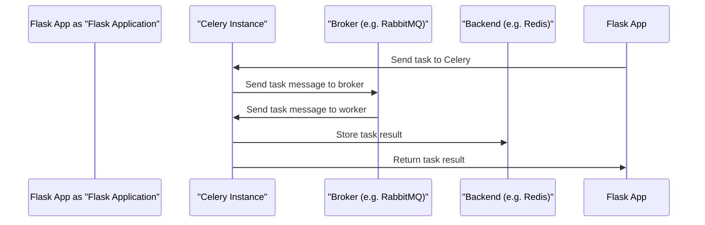

# Celery Integration
## Overview
Celery is a distributed task queue that can be integrated with Flask to run tasks asynchronously in the background. This allows for more efficient use of resources and improved performance.

## Key Components / Concepts
The key components of Celery integration with Flask include:
* A Celery instance
* A Flask application
* A broker (e.g. RabbitMQ, Redis) to handle task messages
* A backend (e.g. Redis, Database) to store task results

## How it Works
Here is a high-level overview of how Celery integration with Flask works:

## Example(s)
An example of using Celery with Flask can be found in the `examples/celery` directory.

## Diagram(s)
Here is a more detailed diagram of the Celery architecture:
```mermaid
flowchart LR
    A[Flask App] -->|send task|> B[Celery]
    B -->|send task message|> C[Broker]
    C -->|send task message|> D[Worker]
    D -->|execute task|> E[Result]
    E -->|store result|> F[Backend]
    F -->|return result|> A
```
## References
* `examples/celery/make_celery.py`
* `examples/celery/src/task_app/__init__.py`
* `examples/celery/src/task_app/tasks.py`