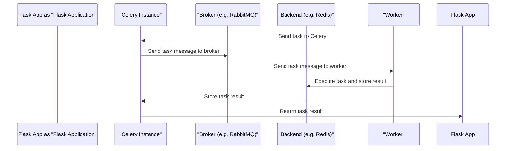

# Celery Integration
## Overview
Celery is a distributed task queue that can be integrated with Flask to run tasks asynchronously in the background, allowing for more efficient use of resources and improved performance. This integration is crucial for handling tasks that are time-consuming or require significant computational resources, thus preventing them from blocking the main thread of the Flask application.

## Key Components / Concepts
The key components of Celery integration with Flask include:
* A Celery instance, which is the core of the task queue system
* A Flask application, which is the web framework that utilizes Celery for asynchronous task execution
* A broker (e.g., RabbitMQ, Redis) to handle task messages, acting as an intermediary for task distribution
* A backend (e.g., Redis, Database) to store task results, providing a centralized location for result retrieval

## How it Works
Here is a high-level overview of how Celery integration with Flask works:

## Example(s)
An example of using Celery with Flask can be found in the `examples/celery` directory, which includes a basic setup for integrating Celery with a Flask application. This example demonstrates how to define tasks, configure the Celery instance, and use the Celery backend to store and retrieve task results.

## Diagram(s)
Here is a more detailed diagram of the Celery architecture:
```mermaid
flowchart LR
    A[Flask App] -->|send task|> B[Celery]
    B -->|send task message|> C[Broker]
    C -->|send task message|> D[Worker]
    D -->|execute task|> E[Task Execution]
    E -->|store result|> F[Backend]
    F -->|return result|> B
    B -->|return result|> A
```
## References
* `examples/celery/make_celery.py`
* `examples/celery/src/task_app/__init__.py`
* `examples/celery/src/task_app/tasks.py`
* `docs/backend_systems/celery_integration.md`