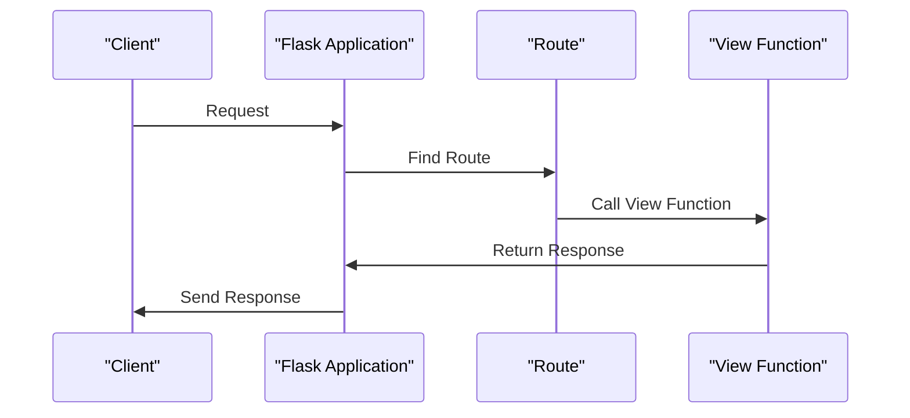

# Flask Application
## Overview
The Flask application is a lightweight WSGI-based Python web framework that allows developers to quickly create web applications by defining routes and returning responses. It does not impose a fixed project structure or mandatory dependencies, giving developers the freedom to choose the tools and libraries they want to use.

## Key Components / Concepts
The key components of a Flask application include:
* The Flask instance, which is the core of the application
* Routes, which map URLs to specific functions in the application
* View functions, which handle HTTP requests and return responses
* Templates, which are used to render dynamic content
* Configuration, which is used to customize the application's behavior

## How it Works
A Flask application works by creating a Flask instance, defining routes and view functions, and running the application using the `flask run` command. The application can be configured using the `config` object, and templates can be rendered using the `render_template` function.

## Example(s)
Here is an example of a simple Flask application:
```python
from flask import Flask

app = Flask(__name__)

@app.route("/")
def hello():
    return "Hello, World!"

if __name__ == "__main__":
    app.run()
```
This application creates a Flask instance, defines a single route for the root URL, and runs the application using the `app.run` method.

## Diagram(s)

This sequence diagram shows the flow of a request through a Flask application, from the client's initial request to the application's response.

## References
* `tests/test_cli.py`: This file contains examples of creating Flask applications using different methods, including the `app` method and the `create_app` function.
* `tests/test_apps/cliapp/inner1/__init__.py`: This file initializes a Flask application by importing Flask and creating a global `application` instance.
* `tests/test_apps/helloworld/hello.py`: This file defines a minimal Flask web application that serves a single route at the root URL.
* `tests/conftest.py`: This file contains a simple Flask application factory that creates and configures a Flask instance for testing purposes.