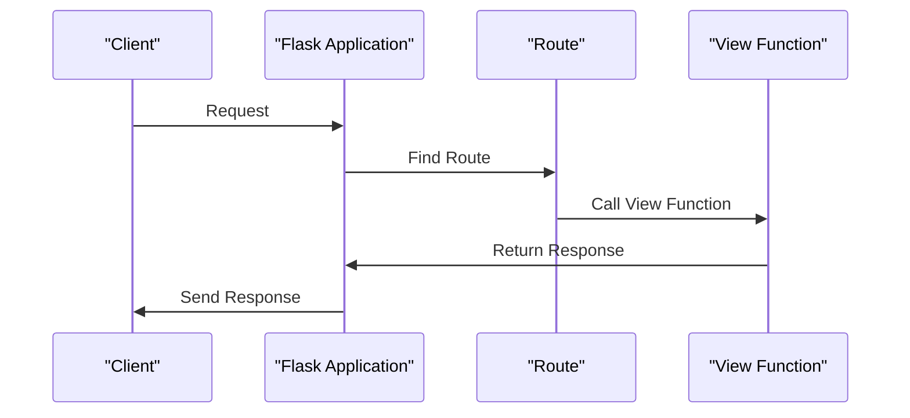
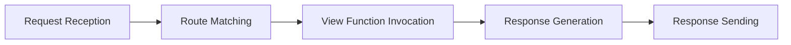

# Flask Application
## Overview
The Flask application is a lightweight WSGI-based Python web framework that allows developers to quickly create web applications by defining routes and returning responses. It does not impose a fixed project structure or mandatory dependencies, giving developers the freedom to choose the tools and libraries they want to use. This flexibility makes Flask an ideal choice for building small to medium-sized web applications, prototyping, and proof-of-concept development. Additionally, Flask's minimalistic approach enables developers to focus on writing application code rather than dealing with the complexities of a full-featured framework.

Flask's core philosophy is centered around the concept of a microframework, which means it provides only the essential components for building web applications, leaving the choice of additional libraries and tools to the developer. This approach allows developers to keep their applications lean and efficient, reducing the overhead of unnecessary features and dependencies. Furthermore, Flask's extensive collection of third-party extensions and libraries makes it easy to add functionality as needed, ensuring that developers can build robust and scalable applications.

## Key Components / Concepts
The key components of a Flask application include:
* The Flask instance, which is the core of the application and is responsible for managing the application's configuration, routes, and other essential components.
* Routes, which map URLs to specific functions in the application, allowing developers to define custom handlers for different HTTP requests.
* View functions, which handle HTTP requests and return responses, providing a way to encapsulate the logic for handling requests and generating responses.
* Templates, which are used to render dynamic content, enabling developers to separate presentation logic from application logic and create reusable templates for rendering data.
* Configuration, which is used to customize the application's behavior, allowing developers to define settings, such as database connections, API keys, and other environment-specific variables.

In addition to these core components, Flask also provides a range of other features and tools, including support for internationalization and localization, a built-in debugger, and a testing framework. These features make it easier for developers to build robust, scalable, and maintainable applications.

## How it Works
A Flask application works by creating a Flask instance, defining routes and view functions, and running the application using the `flask run` command. The application can be configured using the `config` object, and templates can be rendered using the `render_template` function. When a request is received, Flask uses the route mapping to determine which view function to call, and then invokes that function to handle the request and generate a response.

The process of handling a request in Flask involves several key steps:
1. **Request Reception**: Flask receives an HTTP request from a client, such as a web browser.
2. **Route Matching**: Flask uses the route mapping to determine which view function to call to handle the request.
3. **View Function Invocation**: Flask invokes the view function associated with the matched route, passing any relevant parameters or data.
4. **Response Generation**: The view function generates a response, which may involve rendering a template, querying a database, or performing other application-specific logic.
5. **Response Sending**: Flask sends the generated response back to the client, completing the request-response cycle.

## Example(s)
Here is an example of a simple Flask application:
```python
from flask import Flask

app = Flask(__name__)

@app.route("/")
def hello():
    return "Hello, World!"

if __name__ == "__main__":
    app.run()
```
This application creates a Flask instance, defines a single route for the root URL, and runs the application using the `app.run` method. When a request is made to the root URL, the `hello` view function is called, and it returns a simple "Hello, World!" response.

Another example demonstrates how to use templates to render dynamic content:
```python
from flask import Flask, render_template

app = Flask(__name__)

@app.route("/")
def index():
    name = "John Doe"
    return render_template("index.html", name=name)

if __name__ == "__main__":
    app.run()
```
In this example, the `index` view function uses the `render_template` function to render an `index.html` template, passing a `name` variable to the template for display.

## Diagram(s)

This sequence diagram shows the flow of a request through a Flask application, from the client's initial request to the application's response.

Additionally, the following flowchart illustrates the process of handling a request in Flask:

This flowchart highlights the key steps involved in handling a request in Flask, from receiving the request to sending the response.

## References
* `tests/test_cli.py`: This file contains examples of creating Flask applications using different methods, including the `app` method and the `create_app` function.
* `tests/test_apps/cliapp/inner1/__init__.py`: This file initializes a Flask application by importing Flask and creating a global `application` instance.
* `tests/test_apps/helloworld/hello.py`: This file defines a minimal Flask web application that serves a single route at the root URL.
* `tests/conftest.py`: This file contains a simple Flask application factory that creates and configures a Flask instance for testing purposes.
* `app.py`: This file demonstrates a more complex Flask application with multiple routes, templates, and configuration settings.