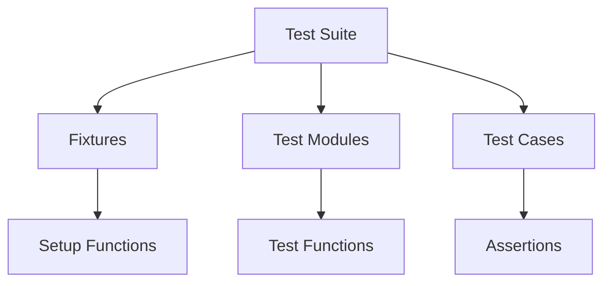

# Test Suite Overview
## Overview
The test suite for Flask is a comprehensive collection of tests designed to ensure the framework's functionality and reliability. It includes a wide range of tests, from basic functionality to advanced features, and is structured to provide a clear and organized approach to testing.

## Key Components / Concepts
The test suite is composed of several key components, including:
* **Fixtures**: These are setup functions that provide a fixed baseline for tests, allowing for consistent and reliable testing.
* **Test modules**: These are individual files that contain related tests, such as tests for specific features or components of the framework.
* **Test cases**: These are individual tests within a test module, each designed to test a specific aspect of the framework's functionality.

## How it Works
The test suite works by utilizing the Pytest framework, which provides a flexible and customizable testing environment. Tests are written using the Pytest API, and are typically organized into separate files or modules based on the feature or component being tested.

When a test is run, Pytest will execute the test function, which will typically involve setting up a test environment, executing the code being tested, and then asserting that the expected results are obtained. If the assertions pass, the test is considered successful; otherwise, it will fail and an error message will be displayed.

## Example(s)
For example, the `test_environ_defaults_from_config` function in `tests/test_testing.py` tests the environment defaults for a Flask application, including the `SERVER_NAME` and `APPLICATION_ROOT` configuration variables.

```python
def test_environ_defaults_from_config(app, client):
    app.config["SERVER_NAME"] = "example.com:1234"
    app.config["APPLICATION_ROOT"] = "/foo"

    @app.route("/")
    def index():
        return flask.request.url

    ctx = app.test_request_context()
    assert ctx.request.url == "http://example.com:1234/foo/"

    rv = client.get("/")
    assert rv.data == b"http://example.com:1234/foo/"
```

## Diagram(s)

This flowchart illustrates the overall structure of the test suite, including the relationships between fixtures, test modules, and test cases.

## References
* `tests/conftest.py`: This file contains setup functions and fixtures for the test suite.
* `tests/test_basic.py`: This file contains tests for basic Flask functionality, such as routing and request dispatching.
* `tests/test_views.py`: This file contains tests for Flask views, including basic views and method-based views.
* `tests/test_helpers.py`: This file contains helper functions and classes for testing Flask applications.
* `tests/test_testing.py`: This file contains tests for various aspects of Flask, including environment defaults and client behavior.