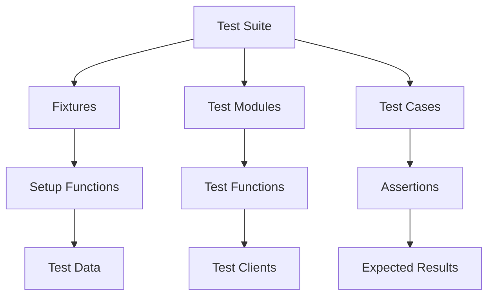

# Test Suite Overview
## Overview
The test suite for Flask is a comprehensive collection of tests designed to ensure the framework's functionality and reliability. It includes a wide range of tests, from basic functionality to advanced features, and is structured to provide a clear and organized approach to testing. The test suite is an essential component of the Flask framework, as it allows developers to verify that changes to the codebase do not introduce bugs or break existing functionality.

The test suite is composed of numerous tests, each designed to test a specific aspect of the framework's functionality. These tests are organized into separate files or modules based on the feature or component being tested, making it easy to locate and run specific tests. The test suite also includes a set of setup functions and fixtures that provide a fixed baseline for tests, allowing for consistent and reliable testing.

## Key Components / Concepts
The test suite is composed of several key components, including:
* **Fixtures**: These are setup functions that provide a fixed baseline for tests, allowing for consistent and reliable testing. Fixtures can be used to set up test data, configure the application, or create test clients.
* **Test modules**: These are individual files that contain related tests, such as tests for specific features or components of the framework. Test modules are typically organized into separate files based on the feature or component being tested.
* **Test cases**: These are individual tests within a test module, each designed to test a specific aspect of the framework's functionality. Test cases typically involve setting up a test environment, executing the code being tested, and then asserting that the expected results are obtained.
* **Test clients**: These are objects that simulate a client requesting a resource from the application. Test clients are used to test the application's response to different types of requests.
* **Assertions**: These are statements that verify that the expected results are obtained. Assertions are used to check that the application's behavior is correct and that the expected output is produced.

## How it Works
The test suite works by utilizing the Pytest framework, which provides a flexible and customizable testing environment. Tests are written using the Pytest API, and are typically organized into separate files or modules based on the feature or component being tested.

When a test is run, Pytest will execute the test function, which will typically involve:
1. Setting up a test environment: This may involve creating a test client, configuring the application, or setting up test data.
2. Executing the code being tested: This may involve sending a request to the application, calling a function, or executing a piece of code.
3. Asserting that the expected results are obtained: This may involve checking the response from the application, verifying that the expected output is produced, or checking that the application's behavior is correct.

If the assertions pass, the test is considered successful; otherwise, it will fail and an error message will be displayed. The test suite also includes a set of setup functions and fixtures that provide a fixed baseline for tests, allowing for consistent and reliable testing.

## Example(s)
For example, the `test_environ_defaults_from_config` function in `tests/test_testing.py` tests the environment defaults for a Flask application, including the `SERVER_NAME` and `APPLICATION_ROOT` configuration variables.

```python
def test_environ_defaults_from_config(app, client):
    app.config["SERVER_NAME"] = "example.com:1234"
    app.config["APPLICATION_ROOT"] = "/foo"

    @app.route("/")
    def index():
        return flask.request.url

    ctx = app.test_request_context()
    assert ctx.request.url == "http://example.com:1234/foo/"

    rv = client.get("/")
    assert rv.data == b"http://example.com:1234/foo/"
```

This test function sets up a test environment, executes the code being tested, and then asserts that the expected results are obtained. The test function uses a test client to send a request to the application and verifies that the expected output is produced.

Another example is the `test_route_decorator` function in `tests/test_basic.py`, which tests the route decorator.

```python
def test_route_decorator(app, client):
    @app.route("/test")
    def test():
        return "Test"

    rv = client.get("/test")
    assert rv.data == b"Test"
```

This test function sets up a test environment, executes the code being tested, and then asserts that the expected results are obtained. The test function uses a test client to send a request to the application and verifies that the expected output is produced.

## Diagram(s)

This flowchart illustrates the overall structure of the test suite, including the relationships between fixtures, test modules, and test cases. The flowchart also shows the setup functions, test functions, and assertions that are used in the test suite.

## References
* `tests/conftest.py`: This file contains setup functions and fixtures for the test suite.
* `tests/test_basic.py`: This file contains tests for basic Flask functionality, such as routing and request dispatching.
* `tests/test_views.py`: This file contains tests for Flask views, including basic views and method-based views.
* `tests/test_helpers.py`: This file contains helper functions and classes for testing Flask applications.
* `tests/test_testing.py`: This file contains tests for various aspects of Flask, including environment defaults and client behavior.