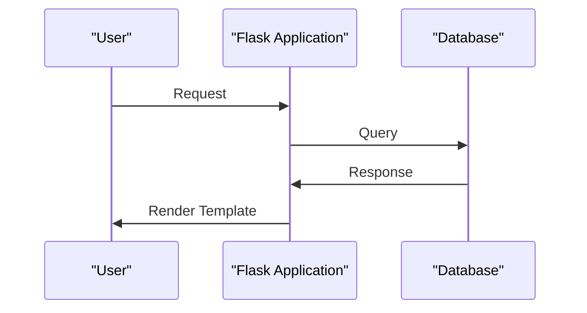

# Flaskr Tutorial Overview
## Overview
The Flaskr tutorial is an example blog application that demonstrates the key features of the Flask web framework, including routing, database handling, authentication, and templates. This tutorial provides a comprehensive overview of how to build a web application using Flask, covering the basics of routing, templating, and database interactions. The tutorial is designed to be a hands-on guide, with a series of examples and exercises that help developers learn and practice the skills needed to build a web application using Flask.

The Flaskr tutorial is a valuable resource for developers who are new to Flask, as well as those who are looking to improve their skills and knowledge of the framework. The tutorial covers a range of topics, from the basics of routing and templating to more advanced topics such as database interactions and authentication. By working through the examples and exercises in the tutorial, developers can gain a deep understanding of how to build a web application using Flask, and can develop the skills and knowledge needed to create their own web applications.

## Key Components / Concepts
The Flaskr tutorial consists of several key components, including:
* Routing: Flask provides a flexible routing system that allows developers to map URLs to specific application endpoints. This is achieved through the use of the `@app.route()` decorator, which is used to define routes for the application. For example, the following code defines a route for the blog index page:
```python
@app.route('/')
def index():
    return render_template('index.html')
```
This code defines a route for the root URL of the application, and returns an HTML template for the index page.

* Database handling: Flask supports a variety of databases, including SQLite, PostgreSQL, and MySQL, and provides a range of tools and libraries for interacting with these databases. The tutorial demonstrates how to use the Flask-SQLAlchemy library to interact with a database, and how to define models and tables using the library.
* Authentication: Flask provides a range of tools and libraries for handling user authentication, including support for login and logout functionality, user registration, and password hashing. The tutorial demonstrates how to use the Flask-Login library to handle user authentication, and how to define login and logout routes for the application.
* Templating: Flask provides support for a range of templating engines, including Jinja2, which allows developers to separate presentation logic from application logic. The tutorial demonstrates how to use the Jinja2 templating engine to define templates for the application, and how to render templates using the `render_template()` function.

## How it Works
The Flaskr tutorial works by providing a series of examples and exercises that demonstrate how to build a web application using Flask. The tutorial covers the basics of routing, templating, and database interactions, and provides a range of examples and exercises to help developers learn and practice these skills. The tutorial is designed to be a hands-on guide, with a focus on practical examples and exercises that help developers develop the skills and knowledge needed to build a web application using Flask.

The tutorial is structured around a series of examples and exercises, each of which demonstrates a specific aspect of building a web application using Flask. The examples and exercises are designed to be worked through in sequence, with each example building on the previous one to provide a comprehensive overview of how to build a web application using Flask. By working through the examples and exercises in the tutorial, developers can gain a deep understanding of how to build a web application using Flask, and can develop the skills and knowledge needed to create their own web applications.

## Example(s)
One example of how the Flaskr tutorial demonstrates the key features of Flask is through the use of routes. In the `blog.py` file, for example, the following code defines a route for the blog index page:
```python
@app.route('/')
def index():
    return render_template('index.html')
```
This code defines a route for the root URL of the application, and returns an HTML template for the index page. The tutorial also demonstrates how to define routes for other pages in the application, such as the login and logout pages, and how to use the `url_for()` function to generate URLs for the application.

Another example of how the Flaskr tutorial demonstrates the key features of Flask is through the use of templates. In the `templates` directory, for example, the following code defines a template for the index page:
```html
<!DOCTYPE html>
<html>
  <head>
    <title>Flaskr Tutorial</title>
  </head>
  <body>
    <h1>Welcome to the Flaskr Tutorial</h1>
  </body>
</html>
```
This code defines a basic HTML template for the index page, with a title and a heading. The tutorial demonstrates how to use the Jinja2 templating engine to define templates for the application, and how to render templates using the `render_template()` function.

## Diagram(s)
```mermaid
flowchart LR
    A[User Request] -->|URL|> B[Flask Route]
    B -->|Template|> C[Render Template]
    C -->|HTML|> D[User Response]
```
This diagram shows the flow of a user request through the Flask application, from the initial request to the final response. The diagram illustrates how the application uses routes to map URLs to specific application endpoints, and how the application uses templates to render HTML responses to the user.


This sequence diagram shows the interaction between the user, the Flask application, and the database. The diagram illustrates how the user makes a request to the application, how the application queries the database, and how the application renders a template to the user.

## References
* `examples/tutorial/flaskr/__init__.py`: This file provides an example of how to initialize a Flask application.
* `examples/tutorial/flaskr/blog.py`: This file provides an example of how to define routes and templates for a blog application.
* `examples/tutorial/flaskr/auth.py`: This file provides an example of how to handle user authentication in a Flask application.
* `tests/test_apps/cliapp/inner1/inner2/flask.py`: This file provides an example of how to create a basic Flask application.
* `tests/test_blueprints.py`: This file provides an example of how to use blueprints in a Flask application.