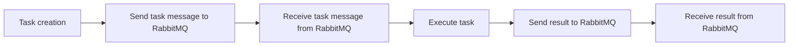

# Celery Worker
## Overview
The Celery worker is a crucial component in the Flask Wiki repository, responsible for handling asynchronous tasks and providing a scalable solution for managing background jobs. This page provides an in-depth look at the Celery worker, its architecture, key components, and how it works. The Celery worker is designed to work seamlessly with the Flask application, allowing developers to run tasks in the background and improve the overall performance of the application.

The Celery worker is built on top of the Celery library, which is a popular asynchronous task queue for Python. Celery provides a flexible and scalable way to run tasks in the background, making it an ideal choice for large-scale applications. The Celery worker is also designed to work with RabbitMQ, a message broker that handles task messages and provides a scalable solution for managing task queues.

## Key Components / Concepts
The Celery worker relies on several key components to function effectively:
* **Celery**: An asynchronous task queue that allows you to run tasks in the background. Celery provides a flexible and scalable way to run tasks, making it an ideal choice for large-scale applications.
* **RabbitMQ**: A message broker that handles task messages and provides a scalable solution for managing task queues. RabbitMQ is designed to handle high volumes of messages, making it an ideal choice for large-scale applications.
* **Worker nodes**: These are the machines that run the Celery worker and execute tasks. Worker nodes can be scaled up or down as needed, making it easy to handle changes in workload.
* **Task queues**: These are the queues that hold tasks that need to be executed. Task queues can be configured to handle different types of tasks, making it easy to prioritize tasks and manage workload.
* **Task results**: These are the results of tasks that have been executed. Task results can be stored in a database or file system, making it easy to retrieve and process results.

## How it Works
The Celery worker works by receiving task messages from the message broker (RabbitMQ) and executing them in the background. Here's a high-level overview of the process:
1. A task is sent to the message broker (RabbitMQ) by the Flask application. The task is serialized and sent as a message to the message broker.
2. The Celery worker connects to the message broker and receives the task message. The Celery worker uses a connection pool to connect to the message broker, making it efficient and scalable.
3. The Celery worker executes the task and sends the result back to the message broker. The task is executed in a separate process, making it easy to handle long-running tasks and improve performance.
4. The result is then retrieved by the Flask application and processed accordingly. The result can be stored in a database or file system, making it easy to retrieve and process results.

The Celery worker also provides a number of features that make it easy to manage and monitor tasks, including:
* **Task retries**: The Celery worker can retry tasks that fail, making it easy to handle transient errors and improve reliability.
* **Task timeouts**: The Celery worker can timeout tasks that take too long to execute, making it easy to handle long-running tasks and improve performance.
* **Task queues**: The Celery worker can use multiple task queues to handle different types of tasks, making it easy to prioritize tasks and manage workload.

## Example(s)
To illustrate how the Celery worker works, let's consider an example where we want to send a welcome email to a new user. We can create a task that sends the email and run it in the background using the Celery worker.

```python
from celery import Celery
from flask import Flask

app = Flask(__name__)
celery = Celery(app.name, broker='amqp://guest@localhost//')

@celery.task
def send_welcome_email(user_id):
    # Send welcome email to user
    pass
```

In this example, we define a task `send_welcome_email` that takes a `user_id` as an argument. The task is decorated with the `@celery.task` decorator, which tells Celery to run the task in the background.

We can then call the task from the Flask application, passing in the `user_id` as an argument:
```python
from flask import Flask, request

app = Flask(__name__)

@app.route('/welcome', methods=['POST'])
def welcome():
    user_id = request.json['user_id']
    send_welcome_email.delay(user_id)
    return 'Welcome email sent!'
```

In this example, we define a route `/welcome` that accepts a `POST` request with a `user_id` in the request body. We then call the `send_welcome_email` task, passing in the `user_id` as an argument, and return a success message to the client.

## Diagram(s)
Here's a sequence diagram that illustrates the interaction between the Flask application, Celery worker, and message broker:
```mermaid
sequenceDiagram
    participant Flask App as "Flask Application"
    participant Celery Worker as "Celery Worker"
    participant RabbitMQ as "RabbitMQ"

    Note over Flask App,Celery Worker,RabbitMQ: Task creation
    Flask App->>RabbitMQ: Send task message
    RabbitMQ->>Celery Worker: Receive task message
    Celery Worker->>Celery Worker: Execute task
    Celery Worker->>RabbitMQ: Send result
    RabbitMQ->>Flask App: Receive result
```

Here's a flowchart that illustrates the workflow of the Celery worker:


## References
* `examples/celery/make_celery.py`: This file provides an example of how to create a Celery instance and configure it to work with the Flask application.
* `examples/celery/src/task_app/tasks.py`: This file contains example tasks that can be run using the Celery worker.
* `tests/test_views.py`: This file contains tests for the Flask application's views, which can be used to verify that the Celery worker is working correctly.
* `tests/test_blueprints.py`: This file contains tests for the Flask application's blueprints, which can be used to verify that the Celery worker is working correctly in different scenarios.
* `docs/celery.rst`: This file provides documentation on how to use Celery with the Flask application, including examples and configuration options.