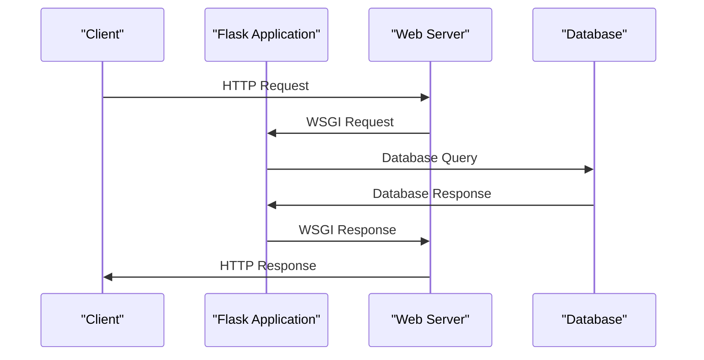

# Introduction to Flask
## Overview
Flask is a lightweight WSGI web application framework designed to make getting started quick and easy. It is a flexible framework that allows developers to build web applications without imposing a fixed project structure or mandatory dependencies. Flask offers suggestions, but it is up to the developer to choose the tools and libraries they want to use. This flexibility makes Flask an ideal choice for small to medium-sized applications, prototyping, and proof-of-concept projects. Additionally, Flask's minimalistic approach allows developers to focus on writing code rather than configuring the framework.

Flask's core philosophy is to keep the framework small and simple, while providing the necessary tools and features to build robust web applications. This approach has led to a large and active community of developers who contribute to the framework, provide support, and create third-party extensions. As a result, Flask has become one of the most popular Python web frameworks, used by companies such as Pinterest, LinkedIn, and Netflix.

## Key Components / Concepts
The key components of Flask include the Flask application object, routes, view functions, and templates. The Flask application object is the core of the framework, and it is used to configure the application and define routes. Routes are used to map URLs to view functions, which are responsible for handling HTTP requests and returning responses. Templates are used to render dynamic content in HTML pages.

The Flask application object is an instance of the `Flask` class, which is created by passing the current module name as an argument. This object provides methods and attributes for configuring the application, such as setting the debug mode, defining routes, and registering templates.

Routes are defined using the `@app.route()` decorator, which takes a URL pattern as an argument. The decorator is applied to a view function, which is responsible for handling the HTTP request and returning a response. View functions can return a variety of responses, including strings, templates, and JSON data.

Templates are used to render dynamic content in HTML pages. Flask uses the Jinja2 templating engine, which provides a powerful and flexible way to render templates. Templates can be used to display data, render forms, and create dynamic content.

## How it Works
Flask works by using the WSGI (Web Server Gateway Interface) protocol to communicate with web servers. When a request is made to a Flask application, the application uses the WSGI protocol to receive the request and send a response back to the client. The application uses routes to determine which view function to call to handle the request, and the view function returns a response that is sent back to the client.

The WSGI protocol provides a standard interface between web servers and web applications. It allows web servers to pass requests to web applications and receive responses, which are then sent back to the client. Flask's WSGI implementation provides a flexible and efficient way to handle requests and responses.

Here is a step-by-step overview of how Flask handles a request:

1. The client sends an HTTP request to the web server.
2. The web server receives the request and passes it to the Flask application using the WSGI protocol.
3. The Flask application receives the request and uses the routes to determine which view function to call.
4. The view function is called, and it handles the request and returns a response.
5. The response is sent back to the client through the web server.

## Example(s)
Here is an example of a simple Flask application:
```python
from flask import Flask

app = Flask(__name__)

@app.route("/")
def hello():
    return "Hello, World!"
```
This application defines a single route for the root URL ("/") and returns the string "Hello, World!" when that route is accessed.

Here is a more complex example that demonstrates how to use templates and routes:
```python
from flask import Flask, render_template

app = Flask(__name__)

@app.route("/")
def index():
    return render_template("index.html")

@app.route("/about")
def about():
    return render_template("about.html")
```
This application defines two routes, one for the root URL ("/") and one for the "/about" URL. Each route renders a template using the `render_template()` function.

## Diagram(s)
```mermaid
flowchart
    participant Client as "Client"
    participant Flask as "Flask Application"
    participant Server as "Web Server"

    Client->>Flask: Request
    Flask->>Server: WSGI Request
    Server->>Flask: WSGI Response
    Flask->>Client: Response
```
This diagram shows the flow of a request through a Flask application.


This diagram shows the flow of a request through a Flask application that uses a database.

## References
* [README.md](README.md)
* [tests/test_apps/cliapp/app.py](tests/test_apps/cliapp/app.py)
* [tests/test_apps/helloworld/hello.py](tests/test_apps/helloworld/hello.py)
* [docs/configuration.rst](docs/configuration.rst)