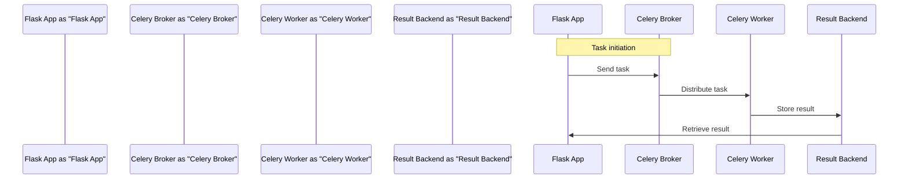

# Celery Background Task Example
## Overview
The Celery Background Task Example demonstrates how to configure Celery with Flask, define asynchronous tasks, and create HTTP endpoints for task management. This example is crucial for understanding how to offload computationally expensive tasks from the main application thread, improving overall system responsiveness and scalability. By leveraging Celery's distributed task queue capabilities, developers can design more efficient and scalable web applications.

## Key Components / Concepts
- **Celery**: A distributed task queue that allows running time-consuming tasks asynchronously in the background. Celery provides a flexible and scalable way to manage tasks, making it an ideal choice for large-scale web applications.
- **Flask**: A micro web framework for building web applications. Flask's lightweight and modular design makes it an excellent choice for building web applications that require asynchronous task processing.
- **Celery Worker**: The component responsible for executing tasks. Celery workers can be run on multiple machines, allowing for horizontal scaling and improved task processing efficiency.
- **Broker**: The message broker (e.g., RabbitMQ, Redis) that handles task messages. The broker plays a critical role in Celery's architecture, as it is responsible for routing tasks to available workers.

## How it Works
1. **Task Definition**: Tasks are defined in a separate module (e.g., `tasks.py`) using the `@app.task` decorator provided by Celery. This decorator allows developers to define tasks that can be executed asynchronously by Celery workers.
2. **Celery Configuration**: Celery is configured with Flask by creating a Celery instance and passing the Flask application instance to it. This configuration step is essential, as it allows Celery to integrate with the Flask application and leverage its configuration settings.
3. **Task Execution**: When a task is called, it is sent to the broker, which then distributes it to a Celery worker for execution. The worker executes the task and stores the result in a backend (e.g., Redis, database) for later retrieval.
4. **Result Storage**: Task results can be stored in a backend (e.g., Redis, database) for later retrieval. This allows developers to retrieve task results and update the application state accordingly.

## Example(s)
Consider a simple example where we have a Flask application that uses Celery to run a background task. The task simulates a long-running operation.

```python
from flask import Flask
from celery import Celery

app = Flask(__name__)
app.config['CELERY_BROKER_URL'] = 'redis://localhost:6379/0'
app.config['CELERY_RESULT_BACKEND'] = 'redis://localhost:6379/0'

celery = Celery(app.name, broker=app.config['CELERY_BROKER_URL'])
celery.conf.update(app.config)

@celery.task
def long_running_task():
    # Simulate a long-running task
    import time
    time.sleep(10)
    return "Task completed"

@app.route('/run-task', methods=['GET'])
def run_task():
    task = long_running_task.apply_async()
    return f"Task ID: {task.id}"

@app.route('/task-status/<task_id>', methods=['GET'])
def task_status(task_id):
    task = long_running_task.AsyncResult(task_id)
    if task.state == 'PENDING':
        response = {
            'state': task.state,
            'status': 'Pending...'
        }
    elif task.state != 'FAILURE':
        response = {
            'state': task.state,
            'status': task.info
        }
    else:
        # something went wrong in the background job
        response = {
            'state': task.state,
            'status': str(task.info),  # this is the exception raised
        }
    return response
```

This example demonstrates how to define a task using the `@celery.task` decorator, configure Celery with Flask, and create HTTP endpoints for task management. The `long_running_task` function simulates a long-running operation, and the `run_task` and `task_status` functions provide a way to initiate and monitor the task, respectively.

## Diagram(s)
```mermaid
flowchart LR
    A[Flask App] -->|Send Task|> B[Celery Broker]
    B -->|Distribute Task|> C[Celery Worker]
    C -->|Execute Task|> D[Task Result]
    D -->|Store Result|> E[Result Backend]
    E -->|Retrieve Result|> A
```
Caption: Overview of the Celery Background Task workflow with Flask.


Caption: Sequence diagram of the Celery Background Task workflow with Flask.

## References
- `examples/celery/make_celery.py`: An example of how to create a Celery instance with Flask.
- `examples/celery/src/task_app/tasks.py`: Defines tasks that can be executed by Celery.
- `examples/celery/src/task_app/views.py`: Demonstrates how to integrate Celery tasks with Flask views.
- `tests/test_async.py`: Provides examples of testing asynchronous routes and error handling in Flask applications.
- `docs/configuration.rst`: Documentation on configuring Celery with Flask.