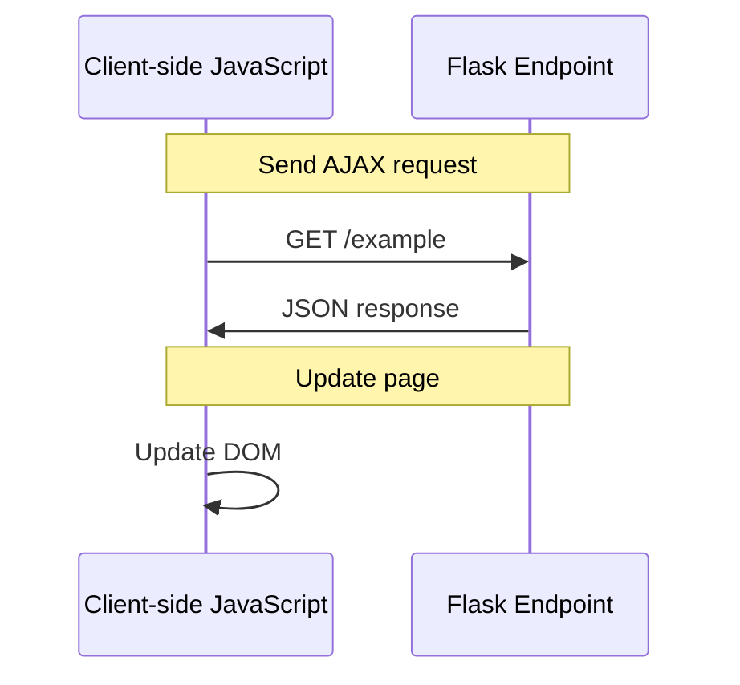

# JavaScript AJAX Example
## Overview
The JavaScript AJAX example demonstrates how to use client-side AJAX interactions to call Flask endpoints. This is achieved using the `fetch` API, jQuery, and XMLHttpRequest (XHR). The example showcases how to send requests to Flask endpoints and handle responses. AJAX (Asynchronous JavaScript and XML) is a technique used for creating dynamic web applications, allowing for asynchronous communication between the client and server. In the context of Flask, a micro web framework written in Python, AJAX can be used to create interactive web pages that can update dynamically without requiring a full page reload.

## Key Components / Concepts
The key components involved in this example are:
* **Flask endpoints**: These are the server-side functions that handle requests and return responses. In Flask, endpoints are defined using the `@app.route()` decorator, which maps a URL to a specific function.
* **Client-side JavaScript**: This is used to send requests to the Flask endpoints using AJAX. Client-side JavaScript code runs on the client's web browser and can be used to create dynamic effects, animate graphics, and respond to user interactions.
* **AJAX libraries/frameworks**: These include the `fetch` API, jQuery, and XHR, which provide a way to send asynchronous requests to the server. The `fetch` API is a modern JavaScript API for fetching resources across the network, while jQuery is a popular JavaScript library that provides a simple way to send AJAX requests. XHR (XMLHttpRequest) is a legacy API that was used for sending AJAX requests before the introduction of the `fetch` API.

## How it Works
The process works as follows:
1. **The client-side JavaScript code sends an AJAX request to a Flask endpoint**: The client-side JavaScript code uses an AJAX library or framework to send a request to a Flask endpoint. The request can be sent using the `GET`, `POST`, `PUT`, or `DELETE` method, depending on the type of action being performed.
2. **The Flask endpoint handles the request and returns a response**: The Flask endpoint receives the request and processes it accordingly. The endpoint can return a response in various formats, such as JSON, HTML, or plain text.
3. **The client-side JavaScript code receives the response and updates the page accordingly**: The client-side JavaScript code receives the response from the Flask endpoint and updates the page dynamically. This can involve updating the DOM, displaying a message to the user, or triggering another AJAX request.

## Example(s)
For example, consider a Flask endpoint that returns a JSON response:
```python
from flask import jsonify

@app.route('/example', methods=['GET'])
def example():
    return jsonify({'message': 'Hello, World!'})
```
The client-side JavaScript code can use the `fetch` API to send a request to this endpoint:
```javascript
fetch('/example')
  .then(response => response.json())
  .then(data => console.log(data));
```
This will log the JSON response to the console.

Another example is using jQuery to send an AJAX request to a Flask endpoint:
```javascript
$.ajax({
  type: 'GET',
  url: '/example',
  dataType: 'json',
  success: function(data) {
    console.log(data);
  }
});
```
This will also log the JSON response to the console.

## Diagram(s)
```mermaid
flowchart LR
    A[Client-side JavaScript] -->|Send AJAX request|> B[Flask Endpoint]
    B -->|Return response|> A
    A -->|Update page|> C[Web Page]
```
This flowchart shows the process of sending an AJAX request from the client-side JavaScript code to a Flask endpoint and receiving a response.


This sequence diagram shows the sequence of events involved in sending an AJAX request from the client-side JavaScript code to a Flask endpoint and receiving a response.

## References
* `tests/test_blueprints.py`: This file contains examples of Flask endpoints that can be used with AJAX requests.
* `tests/test_basic.py`: This file contains examples of basic Flask endpoints that can be used with AJAX requests.
* `examples/javascript/js_example/views.py`: This file contains examples of Flask endpoints that can be used with AJAX requests in a JavaScript context.
* `examples/javascript/js_example/templates/fetch.html`: This file contains an example of using the `fetch` API to send an AJAX request to a Flask endpoint.
* `examples/javascript/js_example/templates/jquery.html`: This file contains an example of using jQuery to send an AJAX request to a Flask endpoint.