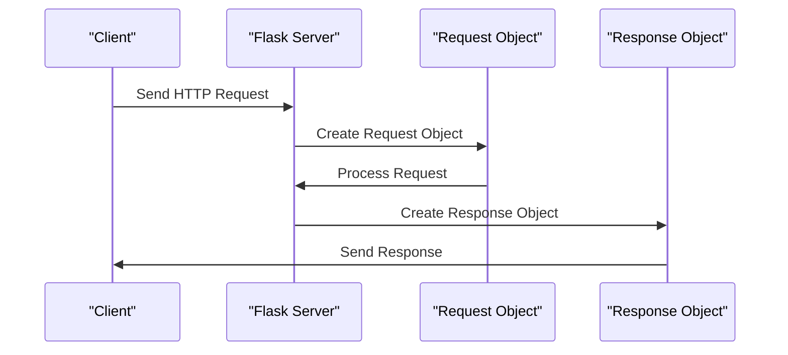

# Request and Response Objects
## Overview
Flask provides a request object to handle HTTP requests and a response object to handle HTTP responses. These objects are crucial in building web applications as they enable the interaction between the client and the server. The request object contains information about the HTTP request, such as the method, headers, and data, while the response object contains the data to be sent back to the client. Understanding how to work with these objects is essential for any Flask developer, as it allows them to handle different types of requests, validate user input, and return appropriate responses.

The request object is an instance of the `Request` class, which is a subclass of the `WebRequest` class from the Werkzeug library. This class provides a range of attributes and methods that can be used to access information about the request, such as the request method, headers, and body. The response object, on the other hand, is an instance of the `Response` class, which is a subclass of the `Response` class from the Werkzeug library. This class provides a range of attributes and methods that can be used to customize the response, such as setting the status code, headers, and body.

## Key Components / Concepts
The key components of the request and response objects in Flask are:
- `flask.request`: This object contains information about the current HTTP request. It provides attributes such as `method`, `headers`, `args`, `form`, and `get_json()`, which can be used to access information about the request.
- `flask.Response`: This object represents the HTTP response to be sent back to the client. It provides attributes such as `status_code`, `headers`, and `response`, which can be used to customize the response.
- `flask.jsonify`: This function generates a response with a JSON payload. It is a convenient way to return JSON data from a view function.
- `flask.request.context`: This object provides information about the request context, such as the current user and the request method.
- `flask.g`: This object is used to store data that should be available for the duration of the request. It is a convenient way to share data between different parts of the application.

## How it Works
When a client sends an HTTP request to the server, Flask creates a request object that contains information about the request. The developer can then access this information using the `flask.request` object. After processing the request, the developer creates a response object using the `flask.Response` class or the `flask.jsonify` function. The response object is then sent back to the client.

Here is a step-by-step overview of how the request and response objects work in Flask:
1. The client sends an HTTP request to the server.
2. Flask creates a request object that contains information about the request.
3. The developer accesses the request object using `flask.request`.
4. The developer processes the request and creates a response object using `flask.Response` or `flask.jsonify`.
5. The response object is sent back to the client.

## Example(s)
Here's an example of how to use the request and response objects in Flask:
```python
from flask import Flask, request, jsonify

app = Flask(__name__)

@app.route('/example', methods=['GET', 'POST'])
def example():
    if request.method == 'GET':
        # Handle GET request
        return jsonify({'message': 'This is a GET request'})
    elif request.method == 'POST':
        # Handle POST request
        data = request.get_json()
        return jsonify({'message': 'This is a POST request', 'data': data})

if __name__ == '__main__':
    app.run()
```
In this example, the `example` function handles both GET and POST requests. It uses the `flask.request` object to determine the request method and the `flask.jsonify` function to create a response with a JSON payload.

Another example is handling file uploads. Here's an example of how to handle file uploads using the request object:
```python
from flask import Flask, request

app = Flask(__name__)

@app.route('/upload', methods=['POST'])
def upload():
    file = request.files['file']
    # Process the file
    return 'File uploaded successfully'

if __name__ == '__main__':
    app.run()
```
In this example, the `upload` function handles file uploads. It uses the `request.files` attribute to access the uploaded file.

## Diagram(s)
```mermaid
flowchart LR
    A[Client] -->|HTTP Request|> B[Flask Server]
    B -->|Create Request Object|> C[Request Object]
    C -->|Process Request|> D[Response Object]
    D -->|Send Response|> A
```
This flowchart illustrates the process of handling an HTTP request in Flask. The client sends an HTTP request to the Flask server, which creates a request object. The request object is then processed, and a response object is created. Finally, the response object is sent back to the client.

Another diagram that illustrates the request and response objects in Flask is the following:

This sequence diagram illustrates the interaction between the client, the Flask server, the request object, and the response object.

## References
- `tests/test_basic.py`: This file contains examples of how to use the request and response objects in Flask.
- `tests/test_views.py`: This file contains examples of how to handle different HTTP request methods using the request object.
- `docs/reqcontext.rst`: This file provides documentation on the request context in Flask.
- `docs/views.rst`: This file provides documentation on views in Flask.
- `docs/server.rst`: This file provides documentation on the Flask server.