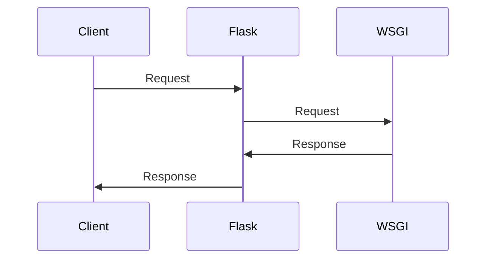

# Flask Overview
## Overview
Flask is a lightweight web application framework designed to make getting started quick and easy, with the ability to scale up to complex applications. It takes in Python code as input and outputs a web application, allowing developers to choose their own tools and libraries. A key behavior of Flask is its flexibility, offering suggestions but not enforcing dependencies or project layout, and its extensibility through community-provided extensions. By using Flask, developers can create web applications with custom functionality and layouts. This flexibility is a major advantage of Flask, as it allows developers to work with a wide range of libraries and tools, and to structure their projects in a way that makes sense for their specific needs.

Flask's flexibility is also reflected in its lack of strict requirements for project structure. Unlike some other frameworks, Flask does not require a specific directory layout or project organization. This makes it easy for developers to get started with Flask, as they can simply create a new Python file and start writing code. However, this flexibility can also make it more difficult for developers to find their way around a large Flask project, as there is no standard structure to follow.

In addition to its flexibility, Flask is also designed to be highly extensible. The framework provides a number of built-in features and functions, but it also allows developers to add their own custom functionality through the use of extensions. These extensions can provide a wide range of features, from simple utilities like caching and authentication, to complex systems like database integration and API connectivity. By using extensions, developers can add the features they need to their Flask applications, without having to write the code themselves.

## Key Components / Concepts
The core components of Flask include the application instance, routes, templates, and extensions. The application instance is the central object of a Flask application, and it is created by instantiating the `Flask` class. Routes are used to map URLs to specific functions in the application, and templates are used to render dynamic content. Extensions are libraries that provide additional functionality to Flask applications.

The application instance is the heart of a Flask application, and it is responsible for managing the application's configuration, routes, and other components. The application instance is created by instantiating the `Flask` class, and it is typically stored in a variable named `app`. The `app` variable is then used to access the application's components and functions, such as the route mapper and the template engine.

Routes are a critical component of Flask, as they allow developers to map URLs to specific functions in the application. Routes are defined using the `@app.route()` decorator, which takes a URL pattern as an argument. When a request is made to a URL that matches the pattern, the function associated with the route is called, and its return value is used to generate the response. Routes can also be used to handle different types of requests, such as GET, POST, and PUT.

Templates are another important component of Flask, as they allow developers to render dynamic content in their applications. Templates are defined using a templating engine, such as Jinja2, and they can be used to render a wide range of content, from simple HTML pages to complex data-driven interfaces. Templates are typically stored in a separate directory from the application's Python code, and they are loaded into the application using the `render_template()` function.

Extensions are libraries that provide additional functionality to Flask applications. They can be used to add a wide range of features, from simple utilities like caching and authentication, to complex systems like database integration and API connectivity. Extensions are typically installed using pip, and they are imported into the application using the `import` statement.

## How it Works
Flask works by using the Web Server Gateway Interface (WSGI) to handle HTTP requests and responses. When a request is made to a Flask application, the application instance is created, and the route for the requested URL is determined. The function associated with the route is then called, and its return value is used to generate the response. Flask also provides a number of built-in functions and classes for tasks such as handling forms, working with databases, and authenticating users.

The WSGI interface is a standard interface for web servers and web frameworks, and it allows Flask to work with a wide range of web servers, from simple development servers like the built-in `flask run` command, to complex production servers like Apache and Nginx. The WSGI interface is responsible for handling the low-level details of HTTP requests and responses, such as parsing the request headers and sending the response back to the client.

When a request is made to a Flask application, the application instance is created, and the route for the requested URL is determined. This is done by checking the URL against the route patterns defined in the application, and selecting the first route that matches. The function associated with the route is then called, and its return value is used to generate the response.

Flask also provides a number of built-in functions and classes for tasks such as handling forms, working with databases, and authenticating users. These functions and classes are designed to make it easy for developers to perform common tasks, and they are typically used in conjunction with the application instance and the route mapper.

## Example(s)
Here is a simple example of a Flask application:
```python
from flask import Flask

app = Flask(__name__)

@app.route("/")
def hello():
    return "Hello, World!"

if __name__ == "__main__":
    app.run()
```
This application creates a single route for the root URL ("/") and returns the string "Hello, World!" when that route is accessed.

Here is a more complex example of a Flask application, which uses templates and routes to render a dynamic web page:
```python
from flask import Flask, render_template

app = Flask(__name__)

@app.route("/")
def index():
    return render_template("index.html")

@app.route("/about")
def about():
    return render_template("about.html")

if __name__ == "__main__":
    app.run()
```
This application creates two routes, one for the root URL ("/") and one for the "/about" URL. Each route renders a separate template, using the `render_template()` function.

## Diagram(s)
```mermaid
flowchart LR
    A[Request] -->|URL|> B{Route}
    B -->|Match|> C[Function]
    C -->|Return|> D[Response]
    D -->|Send|> E[Client]
```
This flowchart shows the basic flow of a Flask application, from receiving a request to sending a response.


This sequence diagram shows the interaction between the client, Flask, and the WSGI interface.

## References
* `README.md`: This file provides an overview of the Flask framework, including its features and usage.
* `tests/test_blueprints.py`: This file contains examples of using Flask blueprints to organize and structure applications.
* `src/flask/__init__.py`: This file contains the core implementation of the Flask framework.
* `docs/configuration.rst`: This file provides documentation on configuring Flask applications.
* `examples/minimal_app.py`: This file provides a minimal example of a Flask application.