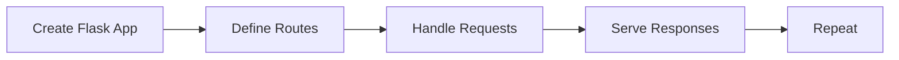

# Introduction to Flask
Flask is a lightweight WSGI web application framework designed to make getting started quick and easy, with the ability to scale up to complex applications.

## Overview
Flask offers suggestions, but doesn't enforce any dependencies or project layout. It is up to the developer to choose the tools and libraries they want to use. There are many extensions provided by the community that make adding new functionality easy.

## Key Components / Concepts
The key components of Flask include the application instance, routes, and templates. The application instance is the core of the Flask application, and routes are used to map URLs to specific functions. Templates are used to render dynamic content.

## How it Works
Flask works by creating a new instance of the Flask class, passing the current module name as an argument. This instance is then used to define routes, handle requests, and serve responses.

## Example(s)
A simple example of a "Hello, World!" application can be created using the following code:
```python
from flask import Flask

app = Flask(__name__)

@app.route("/")
def hello():
    return "Hello, World!"
```

## Diagram(s)

This flowchart shows the basic flow of a Flask application, from creating the app to serving responses.

## References
* [README.md](README.md)
* [tests/test_apps/cliapp/app.py](tests/test_apps/cliapp/app.py)
* [tests/test_apps/cliapp/inner1/__init__.py](tests/test_apps/cliapp/inner1/__init__.py)
* [tests/test_apps/cliapp/inner1/inner2/flask.py](tests/test_apps/cliapp/inner1/inner2/flask.py)