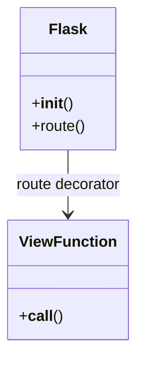

# Introduction to Flask
## Overview
Flask is a lightweight WSGI web application framework designed to make getting started quick and easy, with the ability to scale up to complex applications. It began as a simple wrapper around Werkzeug and Jinja, and has become one of the most popular Python web application frameworks. Flask offers suggestions, but doesn't enforce any dependencies or project layout, giving developers the freedom to choose the tools and libraries they want to use.

## Key Components / Concepts
The core components of Flask include the Flask application instance, routes, and view functions. The application instance is the central object that represents the Flask application, and is typically created using the `Flask` class. Routes are used to map URLs to specific view functions, which handle the request and return a response. View functions can be decorated with route decorators, such as `@app.route()`, to associate them with specific routes.

## How it Works
When a request is made to a Flask application, the following process occurs:
1. The request is received by the WSGI server, which passes it to the Flask application instance.
2. The Flask application instance uses the route decorators to determine which view function to call.
3. The view function is called, and it handles the request and returns a response.
4. The response is passed back to the WSGI server, which sends it to the client.

```mermaid
flowchart LR
    A[Client] -->|Request|> B[WSGI Server]
    B -->|Request|> C[Flask Application]
    C -->|Route Decorator|> D[View Function]
    D -->|Response|> C
    C -->|Response|> B
    B -->|Response|> A
```
Caption: Request flow in a Flask application

## Example(s)
A simple example of a Flask application is:
```python
from flask import Flask

app = Flask(__name__)

@app.route("/")
def hello():
    return "Hello, World!"
```
This application defines a single route, `/`, which maps to the `hello` view function. When a request is made to this route, the `hello` function is called, and it returns the string "Hello, World!".

## Diagram(s)

Caption: Class diagram of Flask application components

## References
* [README.md](README.md)
* [tests/test_apps/cliapp/app.py](tests/test_apps/cliapp/app.py)
* [tests/test_apps/cliapp/inner1/__init__.py](tests/test_apps/cliapp/inner1/__init__.py)
* [tests/test_apps/helloworld/hello.py](tests/test_apps/helloworld/hello.py)
* [tests/test_cli.py](tests/test_cli.py)