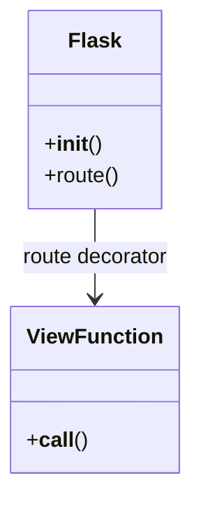
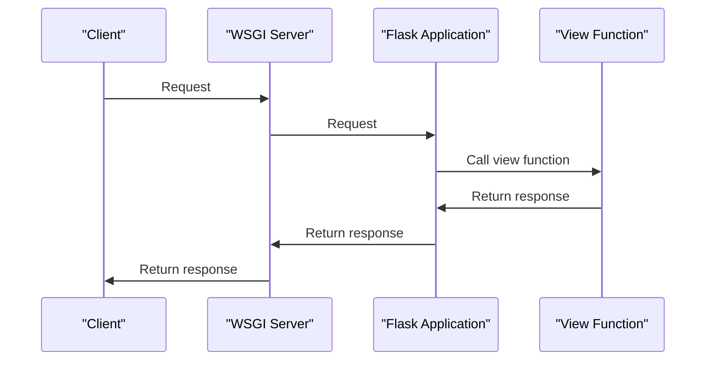

# Introduction to Flask
## Overview
Flask is a lightweight WSGI web application framework designed to make getting started quick and easy, with the ability to scale up to complex applications. It began as a simple wrapper around Werkzeug and Jinja, and has become one of the most popular Python web application frameworks. Flask offers suggestions, but doesn't enforce any dependencies or project layout, giving developers the freedom to choose the tools and libraries they want to use. This flexibility is one of the key reasons why Flask has become a favorite among developers, as it allows them to structure their projects in a way that best suits their needs.

Flask's core philosophy is to keep the core framework small and flexible, while providing a rich set of extensions and libraries that can be used to add functionality as needed. This approach has led to a thriving ecosystem of third-party libraries and tools that can be used to build complex web applications. Some of the key features of Flask include support for unit testing, internationalization, and a flexible routing system.

## Key Components / Concepts
The core components of Flask include the Flask application instance, routes, and view functions. The application instance is the central object that represents the Flask application, and is typically created using the `Flask` class. Routes are used to map URLs to specific view functions, which handle the request and return a response. View functions can be decorated with route decorators, such as `@app.route()`, to associate them with specific routes.

In addition to these core components, Flask also provides a number of other key concepts, including templates, request and response objects, and a flexible configuration system. Templates are used to render dynamic content, and are typically written using the Jinja2 templating engine. Request and response objects are used to handle HTTP requests and responses, and provide a flexible way to interact with the client. The configuration system allows developers to customize the behavior of the Flask application, and provides a flexible way to manage settings and options.

## How it Works
When a request is made to a Flask application, the following process occurs:
1. The request is received by the WSGI server, which passes it to the Flask application instance.
2. The Flask application instance uses the route decorators to determine which view function to call.
3. The view function is called, and it handles the request and returns a response.
4. The response is passed back to the WSGI server, which sends it to the client.

This process is illustrated in the following Mermaid diagram:
```mermaid
flowchart LR
    A[Client] -->|Request|> B[WSGI Server]
    B -->|Request|> C[Flask Application]
    C -->|Route Decorator|> D[View Function]
    D -->|Response|> C
    C -->|Response|> B
    B -->|Response|> A
```
Caption: Request flow in a Flask application

## Example(s)
A simple example of a Flask application is:
```python
from flask import Flask

app = Flask(__name__)

@app.route("/")
def hello():
    return "Hello, World!"
```
This application defines a single route, `/`, which maps to the `hello` view function. When a request is made to this route, the `hello` function is called, and it returns the string "Hello, World!".

This example illustrates the basic structure of a Flask application, and demonstrates how to define a route and a view function. In a real-world application, you would typically want to handle more complex requests and responses, and would use a combination of routes, view functions, and templates to render dynamic content.

## Diagram(s)
The following Mermaid diagram illustrates the class structure of a Flask application:

Caption: Class diagram of Flask application components

In addition to this class diagram, the following sequence diagram illustrates the request flow in a Flask application:

Caption: Sequence diagram of request flow in a Flask application

## References
* [README.md](README.md)
* [tests/test_apps/cliapp/app.py](tests/test_apps/cliapp/app.py)
* [tests/test_apps/cliapp/inner1/__init__.py](tests/test_apps/cliapp/inner1/__init__.py)
* [tests/test_apps/helloworld/hello.py](tests/test_apps/helloworld/hello.py)