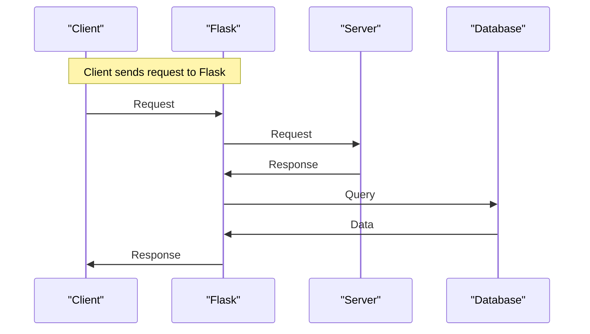

# Project Overview
## Overview
Flask is a lightweight web application framework designed to make getting started quick and easy, with the ability to scale up to complex applications. It takes in Python code as input and outputs a web application, allowing developers to choose their own tools and libraries. A key behavior of Flask is its flexibility, offering suggestions but not enforcing dependencies or project layout, and its extensibility through community-provided extensions. This flexibility is a major advantage of Flask, as it allows developers to structure their applications in a way that best suits their needs.

Flask's core philosophy is to keep the core framework small and simple, while providing a rich set of extensions and libraries that can be used to add functionality as needed. This approach allows developers to start with a minimal application and add features and complexity only as required. The result is a framework that is well-suited to a wide range of applications, from small, simple web services to large, complex web applications.

## Key Components / Concepts
The core components of Flask include the application instance, routes, templates, and request and response objects. The application instance is the central object in Flask, and it is used to configure the application and register routes. Routes are used to map URLs to specific functions in the application, and templates are used to render dynamic content. Request and response objects are used to handle HTTP requests and responses.

The application instance is created by instantiating the `Flask` class, and it is used to configure the application and register routes. Routes are registered using the `@app.route()` decorator, which maps a URL to a specific function in the application. Templates are used to render dynamic content, and are typically stored in a separate directory within the application.

Request and response objects are used to handle HTTP requests and responses. The request object contains information about the incoming request, such as the URL, headers, and query parameters. The response object contains information about the outgoing response, such as the status code, headers, and body.

## How it Works
Flask works by using the WSGI (Web Server Gateway Interface) standard to interface with web servers. When a request is made to the application, Flask uses the route mappings to determine which function to call. The function is then called with the request object as an argument, and it returns a response object. Flask then uses the response object to generate the HTTP response.

The process of handling a request in Flask can be broken down into several steps:

1. The web server receives the incoming request and passes it to the WSGI interface.
2. The WSGI interface passes the request to the Flask application instance.
3. The Flask application instance uses the route mappings to determine which function to call.
4. The function is called with the request object as an argument, and it returns a response object.
5. The Flask application instance uses the response object to generate the HTTP response.
6. The HTTP response is returned to the web server, which sends it back to the client.

## Example(s)
A simple example of a Flask application is:
```python
from flask import Flask

app = Flask(__name__)

@app.route("/")
def hello():
    return "Hello, World!"
```
This application defines a single route for the root URL ("/") and returns the string "Hello, World!" when that route is accessed.

A more complex example might include multiple routes, templates, and a database. For example:
```python
from flask import Flask, render_template
from flask_sqlalchemy import SQLAlchemy

app = Flask(__name__)
app.config["SQLALCHEMY_DATABASE_URI"] = "sqlite:///example.db"
db = SQLAlchemy(app)

class User(db.Model):
    id = db.Column(db.Integer, primary_key=True)
    name = db.Column(db.String(100), nullable=False)

@app.route("/")
def index():
    users = User.query.all()
    return render_template("index.html", users=users)

@app.route("/user/<int:user_id>")
def user(user_id):
    user = User.query.get(user_id)
    return render_template("user.html", user=user)
```
This application defines two routes, one for the root URL ("/") and one for a specific user ID. The root URL route queries the database for all users and renders an HTML template with the list of users. The user ID route queries the database for a specific user and renders an HTML template with the user's information.

## Diagram(s)
```mermaid
flowchart
    participant Client as "Client"
    participant Flask as "Flask"
    participant Server as "Server"
    participant Database as "Database"

    Client->>Flask: Request
    Flask->>Server: Request
    Server->>Flask: Response
    Flask->>Database: Query
    Database->>Flask: Data
    Flask->>Client: Response
```
This diagram shows the basic flow of a request through a Flask application, including the interaction with a database.


This sequence diagram shows the same flow as the previous diagram, but with a focus on the sequence of events.

## References
* [README.md](README.md)
* [tests/test_blueprints.py](tests/test_blueprints.py)
* [tests/test_basic.py](tests/test_basic.py)
* [CHANGES.rst](CHANGES.rst)
* [docs/configuration.rst](docs/configuration.rst)