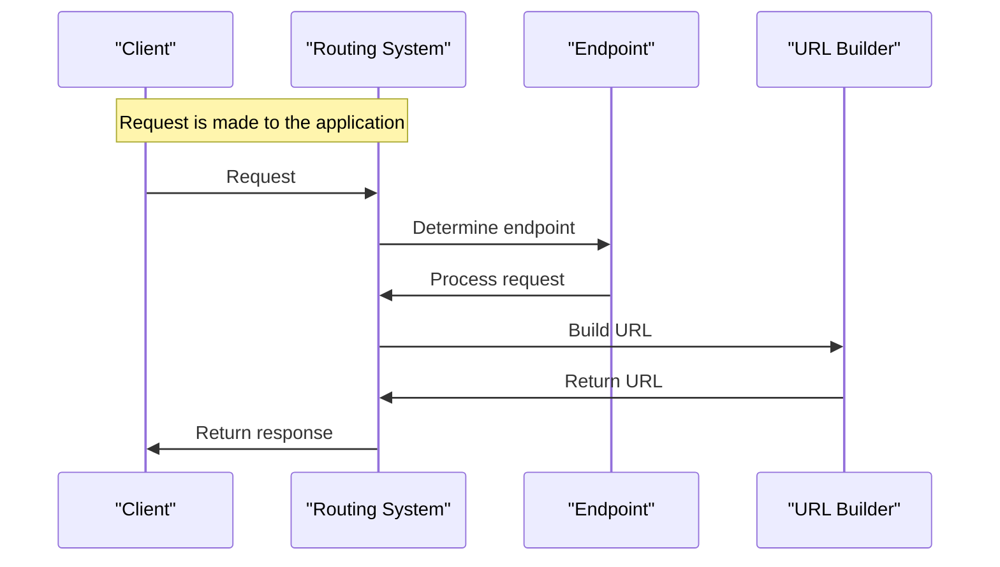

# Routing and URL Building
## Overview
Flask provides a flexible routing system and a URL builder to handle URLs. The routing system allows developers to map URLs to specific application endpoints, while the URL builder enables the construction of URLs for these endpoints. This section will delve into the details of how routing and URL building work in Flask, including the key components, how they work, and examples of their usage. The routing system is a crucial part of any web application, as it determines how the application responds to different URLs. In Flask, the routing system is based on a concept called routes, which are mappings between URLs and application endpoints.

## Key Components / Concepts
The key components involved in routing and URL building in Flask include:
- **Routes**: These are the mappings between URLs and application endpoints. Routes are defined using the `@app.route()` decorator, where `app` is an instance of the Flask application. Routes can be defined with various options, such as methods (e.g., GET, POST, PUT, DELETE), path parameters, and converters.
- **Endpoints**: These are the functions that handle requests to specific URLs. Endpoints are defined as functions within the application, and they are associated with routes using the `@app.route()` decorator. Endpoints can return various types of responses, such as strings, templates, or JSON data.
- **URL Builders**: These are functions that construct URLs for application endpoints. The most commonly used URL builder in Flask is `flask.url_for()`, which generates URLs based on endpoint names and other parameters. URL builders can be used to build internal URLs (i.e., URLs that point to endpoints within the application) and external URLs (i.e., URLs that point to external resources).

## How it Works
When a request is made to a Flask application, the routing system determines which endpoint should handle the request based on the URL. The endpoint then processes the request and returns a response. The URL builder is used to construct URLs for endpoints, which can be used in templates, redirects, and other parts of the application. The routing system and URL builder work together to provide a flexible and powerful way to handle URLs in Flask applications.

Here is a step-by-step overview of how the routing system and URL builder work:
1. A request is made to the Flask application.
2. The routing system determines which endpoint should handle the request based on the URL.
3. The endpoint processes the request and returns a response.
4. The URL builder is used to construct URLs for endpoints, which can be used in templates, redirects, and other parts of the application.
5. The response is returned to the client.

The `flask.url_for()` function is used to build URLs for endpoints. It takes the endpoint name and any required parameters as arguments, and returns a URL that can be used to access the endpoint. The `flask.url_for()` function can also be used to build external URLs, which include the scheme and hostname of the application.

## Example(s)
Here is an example of how to define a route and an endpoint in Flask:
```python
from flask import Flask, url_for

app = Flask(__name__)

@app.route('/')
def index():
    return 'Hello, World!'

@app.route('/hello/<name>')
def hello(name):
    return 'Hello, %s!' % name

# Build a URL for the index endpoint
index_url = url_for('index')

# Build a URL for the hello endpoint with a name parameter
hello_url = url_for('hello', name='John')
```
In this example, the `index` and `hello` functions are endpoints that handle requests to the `/` and `/hello/<name>` URLs, respectively. The `url_for()` function is used to build URLs for these endpoints.

Here is another example that demonstrates how to use the `url_for()` function to build external URLs:
```python
from flask import Flask, url_for

app = Flask(__name__)

@app.route('/')
def index():
    return 'Hello, World!'

# Build an external URL for the index endpoint
external_url = url_for('index', _external=True)
```
In this example, the `url_for()` function is used to build an external URL for the `index` endpoint. The `_external=True` parameter tells Flask to include the scheme and hostname of the application in the URL.

## Diagram(s)
```mermaid
flowchart LR
    A[Request] -->|URL|> B{Routing System}
    B -->|Endpoint|> C[Endpoint Function]
    C -->|Response|> D[Response]
    B -->|URL Builder|> E[URL Builder]
    E -->|URL|> F[Template/Redirect]
```
This flowchart shows how the routing system and URL builder work together to handle requests and build URLs in a Flask application.


This sequence diagram shows the interaction between the client, routing system, endpoint, and URL builder in a Flask application.

## References
- `tests/test_blueprints.py`: This file contains examples of how to define routes and endpoints in Flask, as well as how to use the `url_for()` function to build URLs.
- `tests/test_basic.py`: This file contains tests for the routing system and URL builder in Flask, including examples of how to define routes and endpoints, and how to use the `url_for()` function to build URLs.
- `tests/test_helpers.py`: This file contains helper functions for testing the routing system and URL builder in Flask, including examples of how to define routes and endpoints, and how to use the `url_for()` function to build URLs.
- `docs/patterns/templateinheritance.rst`: This file contains documentation on how to use template inheritance in Flask, which can be used to build complex templates that include URLs built by the `url_for()` function.
- `docs/patterns/urlprocessors.rst`: This file contains documentation on how to use URL processors in Flask, which can be used to modify URLs built by the `url_for()` function.