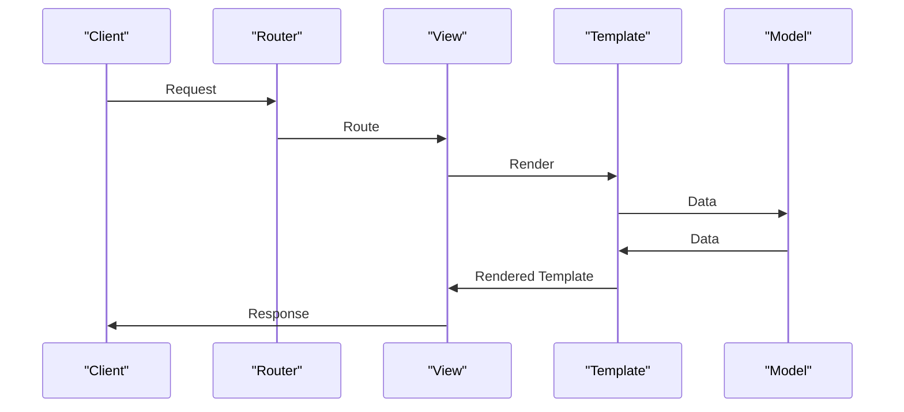

# Common Patterns Index
## Overview
The Common Patterns Index is a comprehensive collection of documentation that demonstrates typical Flask use-cases, providing a detailed overview of the key components, concepts, and workflows involved in building a Flask application. This index serves as a starting point for developers looking to understand the best practices and common patterns used in Flask development. It covers various aspects of Flask, including routing, templating, and database integration, to name a few. By exploring this index, developers can gain a deeper understanding of how to structure and build their Flask applications effectively.

## Key Components / Concepts
Flask is a micro web framework that provides a flexible and modular way to build web applications. The key components of a Flask application include:
* **Routes**: Define the URLs that map to specific views, which handle HTTP requests and return responses.
* **Views**: Handle HTTP requests and return responses. Views can be functions or classes, and they can be used to render templates, return JSON data, or perform other tasks.
* **Templates**: Used to render HTML pages. Flask supports various templating engines, including Jinja2, which is the default templating engine.
* **Models**: Represent the data structures used in the application. Models can be used to interact with databases, perform validation, and enforce business logic.
* **Blueprints**: Self-contained components that define a set of routes and views. Blueprints can be used to break down a large application into smaller, more manageable pieces.
* **Extensions**: Third-party libraries that provide additional functionality to Flask applications. Extensions can be used to handle tasks such as database integration, authentication, and caching.

## How it Works
A Flask application works by defining routes that map to specific views. When a request is made to a URL, the corresponding view is called, and it returns a response. The response can be an HTML page, a JSON object, or any other type of data. Flask also provides a range of tools and libraries to help with tasks such as:
* **Database Integration**: Flask supports various databases, including relational databases such as MySQL and PostgreSQL, and NoSQL databases such as MongoDB.
* **Authentication**: Flask provides various authentication mechanisms, including session-based authentication and token-based authentication.
* **Caching**: Flask provides various caching mechanisms, including in-memory caching and disk-based caching.

## Example(s)
One common pattern in Flask is the use of blueprints to organize routes and views. A blueprint is a self-contained component that defines a set of routes and views. Blueprints can be used to break down a large application into smaller, more manageable pieces.

For example, the `tests/test_blueprints.py` file defines a blueprint that includes an `about` function, which generates a URL for the index page of a Flask application.
```python
def about():
    return flask.url_for(".index")
```
This function takes no inputs and returns a URL string. The key side-effect of this function is that it redirects to the index page when called.

Another example is the use of templates to render HTML pages. The `tests/test_apps/cliapp/inner1/inner2/flask.py` file creates a basic web application using the Flask framework, and it uses templates to render the index page.
```python
from flask import Flask, render_template

app = Flask(__name__)

@app.route("/")
def index():
    return render_template("index.html")
```
This code defines a route for the index page, and it uses the `render_template` function to render the `index.html` template.

## Diagram(s)
```mermaid
flowchart LR
    A[Request] -->|URL|> B{Router}
    B -->|Route|> C[View]
    C -->|Response|> D[Client]
    D -->|Request|> B
```
This flowchart shows the basic workflow of a Flask application. A request is made to a URL, which is routed to a specific view. The view handles the request and returns a response, which is sent back to the client.


This sequence diagram shows the workflow of a Flask application in more detail. The client makes a request to the router, which routes the request to a specific view. The view renders a template, which retrieves data from a model. The model returns the data to the template, which renders the template with the data. The view then returns the rendered template to the client as a response.

## References
* `tests/test_blueprints.py`: This file defines a blueprint that includes an `about` function, which generates a URL for the index page of a Flask application.
* `tests/test_apps/cliapp/inner1/inner2/flask.py`: This file creates a basic web application using the Flask framework.
* `tests/test_basic.py`: This file defines an `index` function that returns an empty HTTP response with a status code of 204.
* `tests/test_views.py`: This file defines an `Index3` class that handles HTTP requests and returns a simple "Hello World!" string as output.
* `docs/patterns/index.rst`: This file provides an overview of the common patterns used in Flask development.