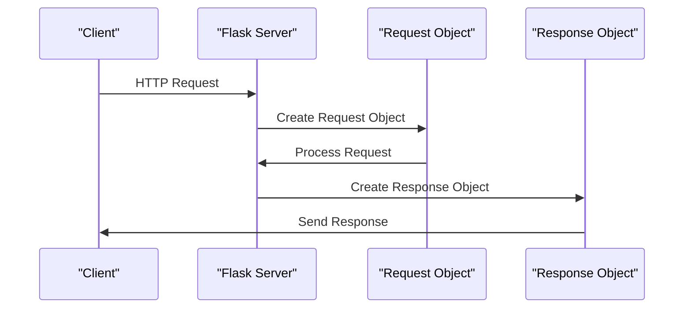

# Request and Response Objects
## Overview
Flask provides a request object to handle HTTP requests and a response object to handle HTTP responses. These objects are crucial in building web applications as they enable the interaction between the client and the server. The request object contains information about the HTTP request, such as the method, headers, and data, while the response object contains the data to be sent back to the client. Understanding how to work with these objects is essential for any Flask developer, as it allows them to handle various HTTP requests, process data, and return appropriate responses.

The request object in Flask is an instance of the `Request` class, which is a wrapper around the WSGI request object. It provides a more convenient and Pythonic way of accessing the request data. On the other hand, the response object is an instance of the `Response` class, which is a wrapper around the WSGI response object. It provides a more convenient way of creating and manipulating HTTP responses.

## Key Components / Concepts
The key components of the request and response objects in Flask are:
- `flask.request`: This object contains information about the current HTTP request. It has several attributes, such as `method`, `headers`, `data`, and `args`, which provide access to the request data.
- `flask.Response`: This object represents the HTTP response to be sent back to the client. It has several attributes, such as `status_code`, `headers`, and `data`, which can be used to customize the response.
- `flask.jsonify`: This function generates a response with a JSON payload. It is a convenient way to return JSON data in a response.

In addition to these key components, there are several other important concepts related to request and response objects in Flask. These include:
- **Request Context**: The request context is an object that stores information about the current request. It is used to access the request object and other request-related data.
- **Response Status Codes**: HTTP responses have status codes that indicate the outcome of the request. Flask provides a way to set the status code of a response using the `status_code` attribute of the `Response` object.
- **HTTP Methods**: HTTP requests can have different methods, such as GET, POST, PUT, and DELETE. Flask provides a way to handle different HTTP methods using the `request.method` attribute.

## How it Works
When a client sends an HTTP request to the server, Flask creates a request object that contains information about the request. The developer can then access this information using the `flask.request` object. After processing the request, the developer creates a response object using the `flask.Response` class or the `flask.jsonify` function. The response object is then sent back to the client.

Here is a step-by-step overview of how Flask handles HTTP requests and responses:
1. The client sends an HTTP request to the server.
2. Flask creates a request object that contains information about the request.
3. The developer accesses the request data using the `flask.request` object.
4. The developer processes the request data and creates a response object.
5. The response object is sent back to the client.

## Example(s)
Here is an example of how to use the request and response objects in Flask:
```python
from flask import Flask, request, jsonify

app = Flask(__name__)

@app.route('/example', methods=['GET', 'POST'])
def example():
    if request.method == 'GET':
        # Handle GET request
        return jsonify({'message': 'This is a GET request'})
    elif request.method == 'POST':
        # Handle POST request
        data = request.get_json()
        return jsonify({'message': 'This is a POST request', 'data': data})

if __name__ == '__main__':
    app.run()
```
In this example, the `example` function handles both GET and POST requests. It uses the `flask.request` object to determine the request method and the `flask.jsonify` function to create a response with a JSON payload.

Another example is handling file uploads using the `request.files` attribute:
```python
from flask import Flask, request, jsonify

app = Flask(__name__)

@app.route('/upload', methods=['POST'])
def upload():
    file = request.files['file']
    # Process the file
    return jsonify({'message': 'File uploaded successfully'})

if __name__ == '__main__':
    app.run()
```
In this example, the `upload` function handles file uploads using the `request.files` attribute.

## Diagram(s)
```mermaid
flowchart LR
    A[Client] -->|HTTP Request|> B[Flask Server]
    B -->|Create Request Object|> C[Request Object]
    C -->|Process Request|> D[Response Object]
    D -->|Send Response|> A
```
This flowchart shows the interaction between the client and the Flask server. The client sends an HTTP request to the server, which creates a request object and processes the request. The server then creates a response object and sends it back to the client.

Another diagram shows the request and response object lifecycle:

This sequence diagram shows the request and response object lifecycle. The client sends an HTTP request to the Flask server, which creates a request object. The request object is then processed, and a response object is created. The response object is sent back to the client.

## References
- `tests/test_basic.py`: This file contains examples of how to use the request and response objects in Flask.
- `tests/test_views.py`: This file contains examples of how to handle different HTTP request methods using the request object.
- `src/flask/wrappers.py`: This file contains the implementation of the `Response` class in Flask.
- `src/flask/helpers.py`: This file contains the implementation of the `jsonify` function in Flask.
- `src/flask/ctx.py`: This file contains the implementation of the request context in Flask.