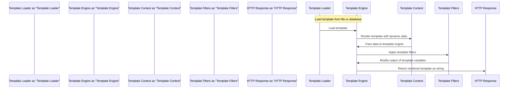

# Template Engine
## Overview
The template engine is a crucial component of the Flask web framework, responsible for rendering templates with dynamic data. Flask uses the Jinja2 template engine, which provides a powerful and flexible way to generate HTML templates. In this section, we will delve into the details of the template engine, its key components, and how it works. The template engine allows developers to separate presentation logic from application logic, making it easier to maintain and update web applications.

The Jinja2 template engine is a popular choice among web developers due to its simplicity, flexibility, and extensibility. It provides a wide range of features, including template inheritance, macros, and filters, which make it easy to generate complex HTML templates. In addition, Jinja2 is highly customizable, allowing developers to extend its functionality with custom filters, tests, and functions.

## Key Components / Concepts
The template engine consists of several key components, including:
* **Jinja2**: The templating engine used by Flask to render templates. Jinja2 is a standalone templating engine that can be used with any web framework.
* **Template Loader**: Responsible for loading templates from various sources, such as files or databases. The template loader is used to load templates from the file system or other sources, such as databases or memory.
* **Template Context**: The data passed to the template engine to render the template. The template context is a dictionary that contains the data used to render the template, such as variables, functions, and objects.
* **Template Filters**: Functions that can be applied to template variables to modify their output. Template filters are used to format, transform, or manipulate template variables, such as converting a string to uppercase or formatting a date.

## How it Works
The template engine works by rendering templates with dynamic data. Here's a step-by-step overview of the process:
1. The template loader loads the template from a file or database. The template loader uses the `load` method to load the template from the file system or other sources.
2. The template context is passed to the template engine, which replaces placeholders in the template with actual data. The template engine uses the `render` method to replace placeholders in the template with actual data from the template context.
3. The template engine applies template filters to modify the output of template variables. The template engine uses the `filter` method to apply template filters to template variables, such as formatting a string or converting a date.
4. The rendered template is returned as a string, which is then sent to the client as an HTTP response. The rendered template is returned as a string, which is then sent to the client as an HTTP response using the `response` object.

The template engine also provides a number of features that make it easy to generate complex HTML templates, such as template inheritance, macros, and blocks. Template inheritance allows developers to create a base template that can be extended by other templates, while macros provide a way to define reusable blocks of code that can be used in multiple templates. Blocks provide a way to define sections of a template that can be overridden by child templates.

## Example(s)
Here's an example of how to use the template engine in Flask:
```python
from flask import Flask, render_template

app = Flask(__name__)

@app.route("/")
def index():
    return render_template("index.html", name="John Doe")

if __name__ == "__main__":
    app.run()
```
In this example, the `render_template` function is used to render the `index.html` template with the `name` variable set to "John Doe". The `render_template` function takes two arguments: the name of the template to render, and a dictionary of variables to pass to the template.

Here's an example of how to use template filters in Flask:
```python
from flask import Flask, render_template

app = Flask(__name__)

@app.route("/")
def index():
    return render_template("index.html", name="John Doe", age=30)

if __name__ == "__main__":
    app.run()
```
In this example, the `render_template` function is used to render the `index.html` template with the `name` variable set to "John Doe" and the `age` variable set to 30. The template can then use template filters to format the `age` variable, such as converting it to a string or formatting it as a date.

## Diagram(s)
```mermaid
flowchart LR
    A[Template Loader] -->|loads template|> B[Template Engine]
    B -->|renders template|> C[Template Context]
    C -->|passes data|> B
    B -->|applies filters|> D[Template Filters]
    D -->|modifies output|> B
    B -->|returns rendered template|> E[HTTP Response]
```
This flowchart illustrates the process of rendering a template with the template engine. The template loader loads the template from a file or database, and the template engine renders the template with dynamic data from the template context. The template engine then applies template filters to modify the output of template variables, and returns the rendered template as a string.


This sequence diagram illustrates the process of rendering a template with the template engine. The template loader loads the template from a file or database, and the template engine renders the template with dynamic data from the template context. The template engine then applies template filters to modify the output of template variables, and returns the rendered template as a string.

## References
* `tests/test_templating.py`: This file contains tests for the template engine, including examples of how to use the `render_template` function.
* `src/flask/templating.py`: This file contains the implementation of the template engine, including the `Template` class and the `render_template` function.
* `src/flask/helpers.py`: This file contains helper functions for working with templates, including the `url_for` function.
* `tests/test_blueprints.py`: This file contains tests for blueprints, including examples of how to use the `render_template` function with blueprints.
* `docs/templates.rst`: This file contains documentation for the template engine, including examples of how to use the `render_template` function and how to create custom template filters.