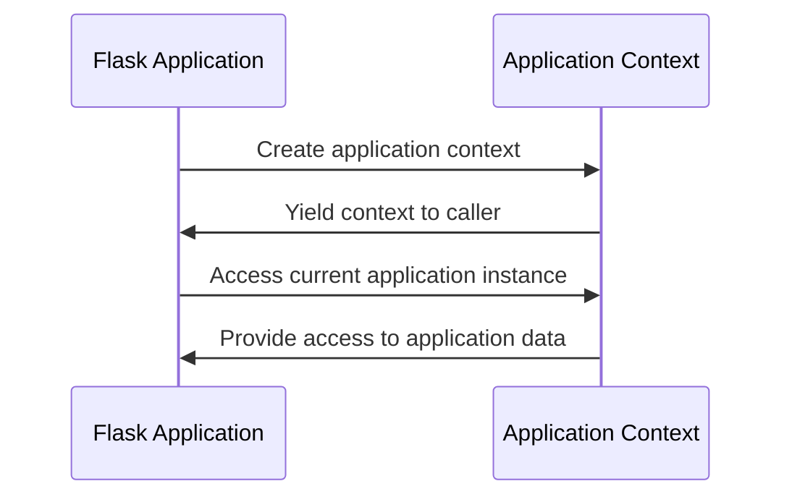

# Application Context
## Overview
The application context in Flask is used to handle requests and responses. It provides access to the current application instance and is required for URL generation, among other things.

## Key Components / Concepts
The application context is created using the `app_context` function, which yields the context to the caller. The context is then used to access the current application instance and other relevant data.

## How it Works
The application context is used to manage the application's state and provide access to the current application instance. It is created when the application is initialized and is used throughout the application's lifetime.

## Example(s)
Here is an example of how to use the application context:
```python
from flask import Flask

app = Flask(__name__)

with app.app_context():
    # Access the current application instance
    print(app.name)
```

## Diagram(s)

Application context sequence diagram.

## References
* `tests/test_appctx.py`
* `tests/test_cli.py`
* `src/flask/app.py`
* `src/flask/ctx.py`