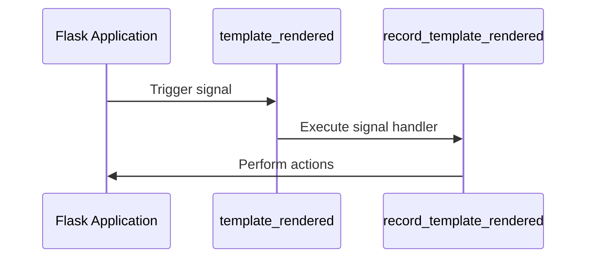

# Signals
## Overview
Flask provides a signal system to handle events, allowing developers to hook into various events in the application lifecycle, such as template rendering or request handling, which are defined in files like `src/flask/app.py` and `src/flask/signals.py`.

## Key Components / Concepts
The key components of Flask's signal system are:
- **Signals**: These are events that are triggered at specific points in the application lifecycle, such as `template_rendered` or `request_started`.
- **Signal handlers**: These are functions that are connected to signals and are executed when the signal is triggered, as seen in `tests/test_signals.py`.

## How it Works
Here's a high-level overview of how Flask's signal system works:
1. A signal is triggered at a specific point in the application lifecycle, such as when a template is rendered.
2. The signal handler connected to the signal is executed, allowing for custom actions to be performed.
3. The signal handler can perform any necessary actions, such as logging or modifying the application state, as defined in `src/flask/app.py`.

## Example(s)
Here's an example of how to use Flask's signal system:
```python
from flask import Flask, template_rendered

app = Flask(__name__)

def record_template_rendered(sender, template, context):
    print(f"Template {template.name} rendered with context {context}")

template_rendered.connect(record_template_rendered, app)
```
In this example, the `record_template_rendered` function is connected to the `template_rendered` signal. When a template is rendered, the `record_template_rendered` function will be executed and will print a message indicating which template was rendered and with what context.

## Diagram(s)

This sequence diagram shows the interaction between the Flask application, the signal, and the signal handler.

## References
- `tests/test_signals.py`
- `src/flask/app.py`
- `src/flask/signals.py`