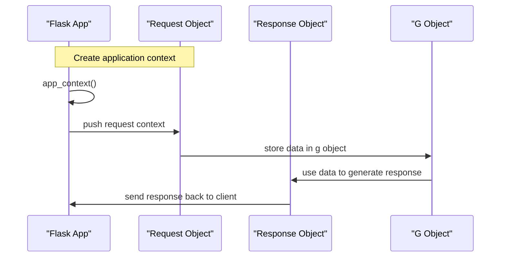

# Application Context
## Overview
The application context in Flask is a crucial concept that allows the framework to handle requests and responses in a flexible and efficient manner. It provides a way to access the current application instance and its configuration, as well as to manage the request and response objects. In this section, we will delve into the details of the application context, its key components, and how it works.

## Key Components / Concepts
The application context is composed of several key components, including:

* The `app` object, which represents the current application instance
* The `request` object, which represents the current request being handled
* The `response` object, which represents the response being sent back to the client
* The `g` object, which is a special object that is used to store data that should be available for the duration of the request

These components are all accessible through the `flask` module, which provides a set of proxies that allow you to access the current application context.

## How it Works
When a request is made to a Flask application, the framework creates a new application context for that request. This context is used to manage the request and response objects, as well as to provide access to the current application instance and its configuration.

The application context is created using the `app_context` method of the `app` object. This method returns a context manager that can be used to push the application context onto the stack.

```python
with app.app_context():
    # code to be executed within the application context
```

Once the application context is created, it can be used to access the current request and response objects, as well as the `g` object.

## Example(s)
Here is an example of how to use the application context to access the current request object:
```python
from flask import Flask, request

app = Flask(__name__)

with app.app_context():
    print(request.method)  # prints the current request method
```

## Diagram(s)

This sequence diagram shows the flow of events when a request is made to a Flask application. The application context is created, and the request and response objects are managed within that context.

## References
* `tests/conftest.py`: This file contains the `app_ctx` function, which is a small generator-based context manager that temporarily pushes a Flask application's context onto the stack.
* `tests/test_signals.py`: This file contains the `test_appcontext_signals` function, which verifies that Flask's app-context lifecycle signals fire correctly during a request.
* `src/flask/app.py`: This file contains the implementation of the `app` object, which represents the current application instance.
* `src/flask/ctx.py`: This file contains the implementation of the application context, including the `app_context` method.
* `src/flask/globals.py`: This file contains the implementation of the `g` object, which is used to store data that should be available for the duration of the request.