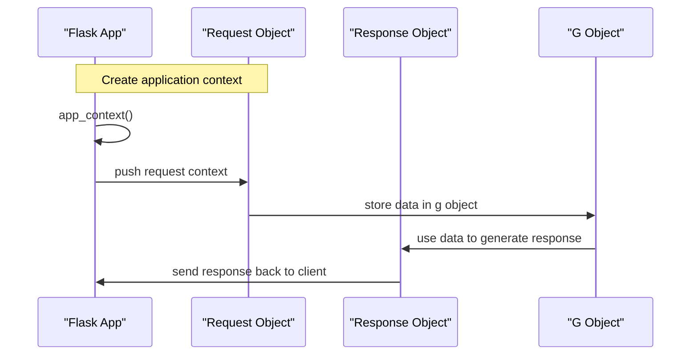

# Application Context
## Overview
The application context in Flask is a crucial concept that allows the framework to handle requests and responses in a flexible and efficient manner. It provides a way to access the current application instance and its configuration, as well as to manage the request and response objects. In this section, we will delve into the details of the application context, its key components, and how it works. The application context is essential for building robust and scalable Flask applications, as it enables developers to access and manipulate the application's state and configuration in a thread-safe and efficient manner.

The application context is created when a request is made to a Flask application, and it is used to manage the request and response objects, as well as to provide access to the current application instance and its configuration. The application context is a critical component of the Flask framework, and it plays a central role in the request-response cycle.

## Key Components / Concepts
The application context is composed of several key components, including:

* The `app` object, which represents the current application instance. The `app` object is an instance of the `Flask` class, and it provides access to the application's configuration, routes, and other components.
* The `request` object, which represents the current request being handled. The `request` object provides access to the request's metadata, such as the method, URL, and headers.
* The `response` object, which represents the response being sent back to the client. The `response` object provides access to the response's metadata, such as the status code, headers, and body.
* The `g` object, which is a special object that is used to store data that should be available for the duration of the request. The `g` object is a dictionary-like object that can be used to store arbitrary data, and it is accessible from anywhere within the application context.

These components are all accessible through the `flask` module, which provides a set of proxies that allow you to access the current application context. The `flask` module provides a convenient way to access the application context, without having to manually manage the context stack.

In addition to these components, the application context also provides access to other important objects and functions, such as the `config` object, which provides access to the application's configuration, and the `url_for` function, which can be used to generate URLs for routes.

## How it Works
When a request is made to a Flask application, the framework creates a new application context for that request. This context is used to manage the request and response objects, as well as to provide access to the current application instance and its configuration.

The application context is created using the `app_context` method of the `app` object. This method returns a context manager that can be used to push the application context onto the stack. The context manager ensures that the application context is properly cleaned up when the request is finished, regardless of whether an exception is thrown or not.

```python
with app.app_context():
    # code to be executed within the application context
```

Once the application context is created, it can be used to access the current request and response objects, as well as the `g` object. The application context can also be used to access other important objects and functions, such as the `config` object and the `url_for` function.

The application context is a critical component of the Flask framework, and it plays a central role in the request-response cycle. It provides a way to access and manipulate the application's state and configuration in a thread-safe and efficient manner, and it enables developers to build robust and scalable Flask applications.

## Example(s)
Here is an example of how to use the application context to access the current request object:
```python
from flask import Flask, request

app = Flask(__name__)

with app.app_context():
    print(request.method)  # prints the current request method
```

This example demonstrates how to use the `app_context` method to create an application context, and how to access the current request object within that context.

Another example of how to use the application context is to store data in the `g` object:
```python
from flask import Flask, g

app = Flask(__name__)

with app.app_context():
    g.user_id = 123
    print(g.user_id)  # prints 123
```

This example demonstrates how to use the `g` object to store data that should be available for the duration of the request.

## Diagram(s)


This sequence diagram shows the flow of events when a request is made to a Flask application. The application context is created, and the request and response objects are managed within that context.

In addition to this sequence diagram, the following flowchart shows the steps involved in creating and using an application context:
```mermaid
flowchart
    start([Start])
    --> create_context[Create application context]
    --> push_context[Push context onto stack]
    --> access_request[Access request object]
    --> access_response[Access response object]
    --> access_g[Access g object]
    --> cleanup[Cleanup context]
    --> end([End])
```

This flowchart demonstrates the steps involved in creating and using an application context, including creating the context, pushing it onto the stack, accessing the request and response objects, accessing the `g` object, and cleaning up the context.

## References
* `tests/conftest.py`: This file contains the `app_ctx` function, which is a small generator-based context manager that temporarily pushes a Flask application's context onto the stack.
* `tests/test_signals.py`: This file contains the `test_appcontext_signals` function, which verifies that Flask's app-context lifecycle signals fire correctly during a request.
* `src/flask/app.py`: This file contains the implementation of the `app` object, which represents the current application instance.
* `src/flask/ctx.py`: This file contains the implementation of the application context, including the `app_context` method.
* `src/flask/globals.py`: This file contains the implementation of the `g` object, which is used to store data that should be available for the duration of the request.