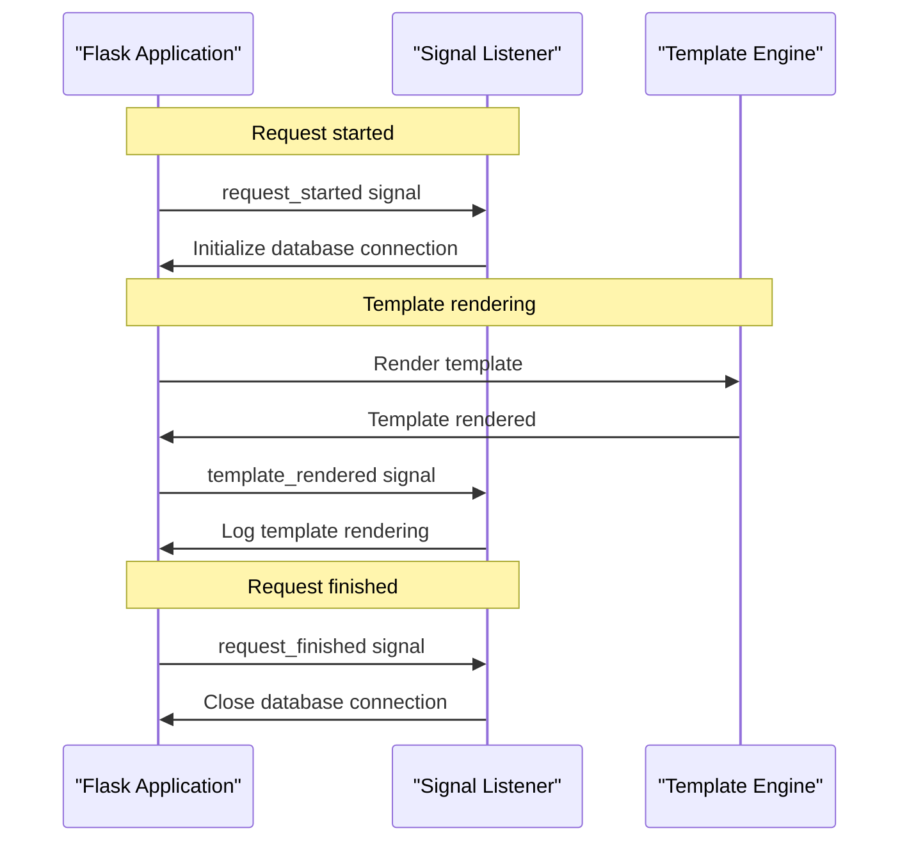

# Signals
## Overview
Flask provides a signal system to handle events that occur during the execution of a Flask application. This system allows developers to execute custom code in response to specific events, such as when a request is started or finished, or when a template is rendered.

## Key Components / Concepts
The signal system in Flask is based on the concept of signals and listeners. A signal is an event that is emitted by Flask at a specific point during the execution of the application, while a listener is a function that is executed in response to a signal. Listeners can be connected to signals using the `connect` method, and disconnected using the `disconnect` method.

Some of the key signals that are emitted by Flask include:
* `request_started`: emitted when a request is started
* `request_finished`: emitted when a request is finished
* `template_rendered`: emitted when a template is rendered
* `before_render_template`: emitted before a template is rendered
* `appcontext_pushed`: emitted when an application context is pushed
* `appcontext_popped`: emitted when an application context is popped
* `message_flashed`: emitted when a message is flashed
* `got_request_exception`: emitted when an exception occurs during a request

## How it Works
The signal system in Flask works by allowing developers to connect listeners to specific signals. When a signal is emitted, all connected listeners are executed in the order that they were connected. Listeners can modify the application's state, or perform other actions in response to the signal.

For example, a listener connected to the `request_started` signal might initialize a database connection, while a listener connected to the `request_finished` signal might close the database connection.

## Example(s)
Here is an example of how to connect a listener to the `template_rendered` signal:
```python
from flask import Flask, render_template

app = Flask(__name__)

def template_rendered_listener(sender, template, context):
    print(f"Template {template.name} rendered with context {context}")

app.template_rendered.connect(template_rendered_listener, app)

@app.route("/")
def index():
    return render_template("index.html")
```
In this example, the `template_rendered_listener` function is connected to the `template_rendered` signal, and will be executed whenever a template is rendered.

## Diagram(s)

This sequence diagram shows the interaction between the Flask application, a signal listener, and the template engine. The listener is connected to the `request_started`, `template_rendered`, and `request_finished` signals, and performs actions in response to each signal.

## References
* `tests/test_signals.py`: This file contains a suite of tests for the signal system in Flask, including tests for the `request_started`, `request_finished`, `template_rendered`, and `before_render_template` signals.
* `src/flask/app.py`: This file contains the implementation of the Flask application class, which includes the signal system.
* `src/flask/signals.py`: This file contains the implementation of the signal system in Flask, including the `Signal` class and the `connect` and `disconnect` methods.