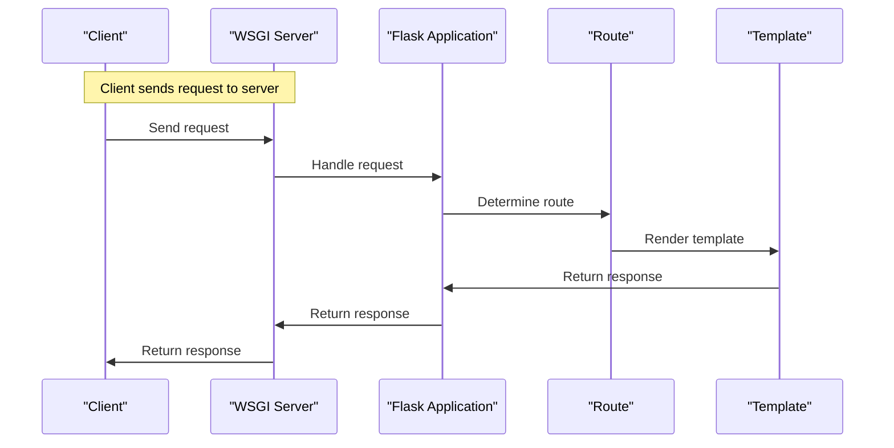

# License and Community
## Overview
Flask is a lightweight web application framework designed to make getting started quick and easy, with the ability to scale up to complex applications. It takes in Python code as input and outputs a web application, allowing developers to choose their own tools and libraries. A key behavior of Flask is its flexibility, offering suggestions but not enforcing dependencies or project layout, and its extensibility through community-provided extensions. The Flask framework is licensed under the BSD license, which allows for free use, modification, and distribution of the software. The community-driven development of Flask ensures that the framework is constantly evolving and improving, with new features and bug fixes being added regularly.

The community plays a vital role in the development and maintenance of Flask. The framework's extensibility is largely due to the contributions of the community, who provide extensions and plugins to add new functionality to the framework. The community also provides support and guidance to new users, through various channels such as the Flask mailing list, IRC channel, and online forums. The community-driven development of Flask ensures that the framework is tailored to the needs of its users, and that it continues to evolve and improve over time.

## Key Components / Concepts
The Flask framework is built around several key components, including the application instance, routes, templates, and extensions. The application instance is the core of the Flask application, and is created using the `Flask` class. Routes are used to map URLs to specific functions or methods, and are defined using the `@app.route` decorator. Templates are used to render dynamic content, and are defined using the Jinja2 templating engine. Extensions are used to add additional functionality to the Flask application, and are provided by the community.

The application instance is the central component of the Flask framework, and is responsible for managing the application's configuration, routes, and templates. The application instance is created by instantiating the `Flask` class, and passing in the name of the current module. The application instance provides a number of methods and attributes that can be used to configure and customize the application, such as the `config` attribute, which allows you to set configuration values for the application.

Routes are a key component of the Flask framework, and are used to map URLs to specific functions or methods. Routes are defined using the `@app.route` decorator, which takes a URL pattern and a function or method as arguments. The `@app.route` decorator is used to register the function or method with the application instance, and to specify the URL pattern that should be used to invoke the function or method.

Templates are used to render dynamic content in Flask applications, and are defined using the Jinja2 templating engine. The Jinja2 templating engine provides a number of features and tools that can be used to render dynamic content, such as variables, conditionals, and loops. Templates are rendered using the `render_template` function, which takes a template name and a number of keyword arguments as input.

Extensions are used to add additional functionality to the Flask application, and are provided by the community. Extensions can be used to add new features and functionality to the framework, such as support for databases, authentication, and caching. Extensions are installed using pip, and are imported into the application using the `import` statement.

## How it Works
The Flask framework works by creating a web application instance, defining routes and templates, and running the application using a WSGI server. The application instance is created by instantiating the `Flask` class, and passing in the name of the current module. Routes are defined using the `@app.route` decorator, which maps a URL to a specific function or method. Templates are defined using the Jinja2 templating engine, and are rendered using the `render_template` function. The application is run using a WSGI server, such as the built-in development server or a production server like Gunicorn.

When a request is made to the application, the WSGI server receives the request and passes it to the application instance. The application instance then uses the routes to determine which function or method should be invoked to handle the request. The function or method is then called, and the response is returned to the WSGI server. The WSGI server then returns the response to the client, which can be a web browser or another application.

The Flask framework also provides a number of tools and features that can be used to debug and test the application, such as the built-in debugger and the `test_client` object. The built-in debugger provides a number of features and tools that can be used to debug the application, such as breakpoints and variable inspection. The `test_client` object provides a number of methods and attributes that can be used to test the application, such as the `get` and `post` methods.

## Example(s)
Here is an example of a simple Flask application:
```python
from flask import Flask

app = Flask(__name__)

@app.route("/")
def hello():
    return "Hello, World!"

if __name__ == "__main__":
    app.run()
```
This application creates a web server that listens on port 5000, and responds to requests to the root URL ("/") with the string "Hello, World!".

Here is an example of a more complex Flask application that uses routes, templates, and extensions:
```python
from flask import Flask, render_template
from flask_sqlalchemy import SQLAlchemy

app = Flask(__name__)
app.config["SQLALCHEMY_DATABASE_URI"] = "sqlite:///example.db"
db = SQLAlchemy(app)

class User(db.Model):
    id = db.Column(db.Integer, primary_key=True)
    name = db.Column(db.String(100), nullable=False)

@app.route("/")
def index():
    users = User.query.all()
    return render_template("index.html", users=users)

if __name__ == "__main__":
    app.run()
```
This application creates a web server that listens on port 5000, and responds to requests to the root URL ("/") with a template that displays a list of users. The application uses the Flask-SQLAlchemy extension to interact with a database, and the Jinja2 templating engine to render the template.

## Diagram(s)
```mermaid
flowchart
    participant Flask as "Flask Framework"
    participant App as "Flask Application"
    participant Route as "Route"
    participant Template as "Template"
    participant Server as "WSGI Server"
    participant Client as "Client"

    note "Create Flask application instance"
    Flask->>App: Create instance
    note "Define routes and templates"
    App->>Route: Define route
    App->>Template: Define template
    note "Run application using WSGI server"
    App->>Server: Run application
    Server->>Client: Handle request
    Client->>Server: Send request
    Server->>Route: Handle request
    Route->>Template: Render template
    Template->>Server: Return response
    Server->>Client: Return response
```
This diagram shows the flow of a Flask application, from creating the application instance to running the application using a WSGI server.


This sequence diagram shows the flow of a request through a Flask application, from the client sending the request to the server returning the response.

## References
* [README.md](README.md)
* [LICENSE.txt](LICENSE.txt)
* [docs/contributing.rst](docs/contributing.rst)
* [tests/test_blueprints.py](tests/test_blueprints.py)