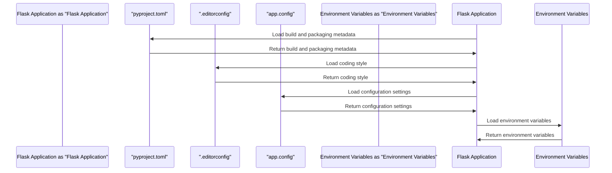

# Project Configuration
## Overview
The project configuration is a crucial aspect of the Flask Wiki application, as it determines how the application behaves and interacts with its environment. In this section, we will delve into the configuration files used by the application, including `pyproject.toml` and `.editorconfig`. These files play a vital role in defining the build and packaging metadata, coding style, and configuration settings for the application.

The `pyproject.toml` file is used to define the build and packaging metadata for the Flask web framework, including dependencies, entry points, and other configuration settings. This file is essential for managing the application's dependencies and ensuring that the correct versions are installed.

The `.editorconfig` file, on the other hand, establishes the coding style for the project, including indentation, line endings, and encoding. This file helps maintain consistency in the codebase and ensures that all developers are following the same coding standards.

## Key Components / Concepts
The project configuration consists of several key components and concepts, including:

* `pyproject.toml`: This file defines the build and packaging metadata for the Flask web framework, including dependencies, entry points, and other configuration settings. The `pyproject.toml` file is written in TOML (Tom's Obvious, Minimal Language) format, which is easy to read and write.
* `.editorconfig`: This file establishes the coding style for the project, including indentation, line endings, and encoding. The `.editorconfig` file is used by most code editors and IDEs to maintain consistency in the codebase.
* Configuration loading: The application uses various methods to load configuration settings, including `app.config.from_pyfile`, `app.config.from_object`, and `app.config.from_file`. These methods allow the application to load configuration settings from different sources, such as Python files, objects, and environment variables.
* Environment variables: The application uses environment variables to store sensitive information, such as database credentials and API keys. Environment variables are stored outside of the codebase and are not committed to version control, ensuring that sensitive information is not exposed.

## How it Works
The project configuration works as follows:

1. The `pyproject.toml` file is used to define the build and packaging metadata for the application. This file is read by the `pip` package manager to install the required dependencies.
2. The `.editorconfig` file is used to establish the coding style for the project. This file is read by code editors and IDEs to maintain consistency in the codebase.
3. The application loads configuration settings using various methods, such as `app.config.from_pyfile` and `app.config.from_object`. These methods allow the application to load configuration settings from different sources.
4. The loaded configuration settings are used to determine the behavior of the application, including settings such as database connections, authentication, and caching. The application uses these settings to connect to databases, authenticate users, and cache frequently accessed data.

The configuration loading process is as follows:

* The application loads the `pyproject.toml` file to determine the build and packaging metadata.
* The application loads the `.editorconfig` file to establish the coding style for the project.
* The application loads configuration settings from environment variables, Python files, and objects using the `app.config.from_pyfile`, `app.config.from_object`, and `app.config.from_file` methods.
* The loaded configuration settings are used to determine the behavior of the application.

## Example(s)
Here is an example of how to load configuration settings from a Python file using `app.config.from_pyfile`:
```python
app = flask.Flask(__name__)
app.config.from_pyfile('config.py')
```
This code loads the configuration settings from a file named `config.py` in the current working directory.

Here is an example of how to load configuration settings from an object using `app.config.from_object`:
```python
app = flask.Flask(__name__)
config = {
    'DEBUG': True,
    'SECRET_KEY': 'secret_key'
}
app.config.from_object(config)
```
This code loads the configuration settings from an object named `config`.

## Diagram(s)
```mermaid
flowchart
    A[pyproject.toml] -->|defines build and packaging metadata|> B[Flask Application]
    B -->|loads configuration settings|> C[app.config]
    C -->|uses configuration settings|> D[Application Behavior]
    D -->|determines application behavior|> E[Database Connections, Authentication, Caching]
    E -->|uses environment variables|> F[Environment Variables]
    F -->|stores sensitive information|> G[Sensitive Information]
```
This diagram illustrates the flow of configuration settings from the `pyproject.toml` file to the application behavior, including the use of environment variables to store sensitive information.


This sequence diagram illustrates the interaction between the Flask application, `pyproject.toml` file, `.editorconfig` file, `app.config`, and environment variables.

## References
* `pyproject.toml`: [pyproject.toml](pyproject.toml)
* `.editorconfig`: [.editorconfig](.editorconfig)
* `tests/test_config.py`: [tests/test_config.py](tests/test_config.py)
* `tests/test_templating.py`: [tests/test_templating.py](tests/test_templating.py)
* `config.py`: [config.py](config.py)