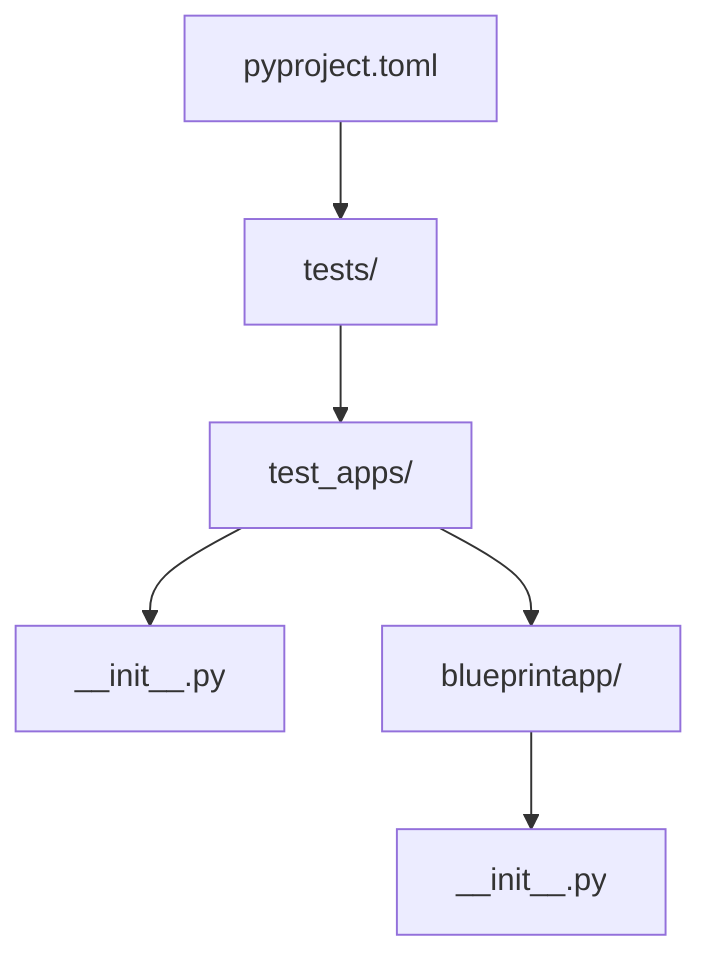

# Project Structure
The project structure is defined in the `pyproject.toml` file, which is a configuration file for a Python project. This file specifies the project's metadata, dependencies, and build settings.

## Overview
The `pyproject.toml` file contains information about the project, including its name, version, description, and license. It also defines the project's dependencies, including required and optional dependencies, as well as tools and plugins for testing, documentation, and code analysis.

## Key Components / Concepts
The project structure consists of several key components, including:
* `pyproject.toml`: The configuration file for the project.
* `tests/`: A directory containing test files for the project.
* `README.md`: A file containing information about the project.

## How it Works
The project structure is used to organize and manage the project's code, tests, and documentation. The `pyproject.toml` file is used to specify the project's dependencies and build settings, while the `tests/` directory contains test files that are used to verify the project's functionality.

## Example(s)
An example of a project structure can be seen in the `tests/test_apps/` directory, which contains several subdirectories, each representing a different test application.

## Diagram(s)

This diagram shows the project structure, with the `pyproject.toml` file at the root, and the `tests/` directory containing several subdirectories, including `test_apps/`, which contains `__init__.py` and `blueprintapp/` subdirectories.

## References
* `pyproject.toml`
* `tests/test_config.py`
* `tests/test_apps/blueprintapp/__init__.py`
* `README.md`