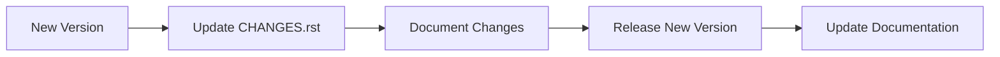

# Release History
## Overview
The release history of Flask is a crucial aspect of understanding the framework's evolution and maintenance. It provides insights into new features, bug fixes, and deprecated code, allowing developers to make informed decisions about their projects. The CHANGES.rst file serves as a comprehensive changelog, documenting the changes made to the Flask web framework across various versions.

## Key Components / Concepts
The release history of Flask involves several key components and concepts, including versioning, changelogs, and deprecation notices. Each version of Flask is associated with a unique version number, which follows the semantic versioning scheme. The CHANGES.rst file contains a detailed list of changes, including new features, bug fixes, and deprecated code, for each version of Flask.

## How it Works
The release history of Flask is maintained through a combination of automated and manual processes. When a new version of Flask is released, the changes are documented in the CHANGES.rst file, which is then updated to reflect the new version number and changes. The file is written in reStructuredText format, which allows for easy parsing and rendering of the content.

## Example(s)
For example, the CHANGES.rst file contains the following entry for version 3.2.0:
```
Version 3.2.0
-------------
Unreleased

-   Drop support for Python 3.9. :pr:`5730`
-   Remove previously deprecated code: ``__version__``. :pr:`5648`
-   ``RequestContext`` has merged with ``AppContext``. ``RequestContext`` is now
    a deprecated alias. If an app context is already pushed, it is not reused
    when dispatching a request. This greatly simplifies the internal code for tracking
    the active context. :issue:`5639`
-   ``template_filter``, ``template_test``, and ``template_global`` decorators
    can be used without parentheses. :issue:`5729`
```
This entry provides a summary of the changes made in version 3.2.0, including the removal of support for Python 3.9 and the deprecation of previously deprecated code.

## Diagram(s)

This flowchart illustrates the process of maintaining the release history of Flask, from creating a new version to updating the documentation.

## References
* [CHANGES.rst](CHANGES.rst)
* [tests/test_basic.py](tests/test_basic.py)
* [tests/test_apps/cliapp/message.txt](tests/test_apps/cliapp/message.txt)
* [LICENSE.txt](LICENSE.txt)
* [pyproject.toml](pyproject.toml)